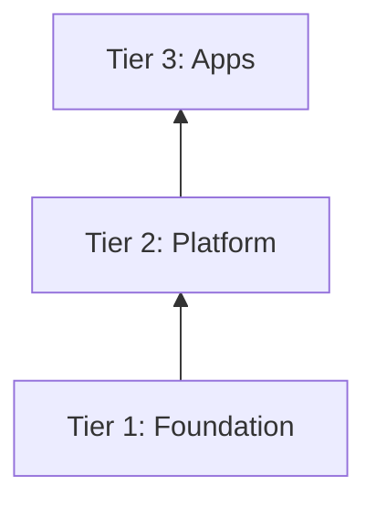

# GDD Doc Writing

Conventions for documentation written in this ecosystem. Apply these rules to every file you create or edit that contains Mermaid diagrams or lives in a Yggdrasil-family repo (yggdrasil, refr-k8s, nidavellir, mimir, heimdall, etc.).

## Prose Line Wrapping

**Don't hard-wrap prose paragraphs.** Write each paragraph as a single line. The editor or renderer handles word wrap.

Why: hard-wrapped markdown renders as line breaks in some GitHub contexts (issue bodies, comment threads), and reflowing after every edit is unnecessary friction.

This applies to: markdown documents, READMEs, issue/PR bodies, commit messages, hoard notes, design docs.

It does *not* apply to:

- Code blocks (follow the language's conventions)
- Tables (one row per line)
- Lists (one bullet per line — bullet points are list items, not prose paragraphs)
- YAML frontmatter
- Mermaid diagrams (governed by the rules below)

"One bullet per line" means literally one line per bullet — a bullet whose text breaks across several physical lines counts as hard-wrapped prose and is to be avoided.

If a file already uses hard-wrapped prose throughout, the existing wrapped content stays wrapped — don't reflow it as a side-effect of unrelated edits. But **new content added to such a file still uses the don't-wrap convention**, even when the surrounding prose is wrapped. New files always use the don't-wrap convention.

## Describe current state, not history

User-facing and reference docs (READMEs, runbooks, `docs/ws-cli-guide.md`, `docs/gdd/permissions.md`, and the like) describe how things work **now** — not how they used to work, what was removed, or what a feature replaced. Cut "there is no longer X", "this used to Y", "X was removed", "no longer need to", and "History —" framing; just state the current behavior. Don't name superseded approaches (e.g. a retired env var) to contrast against, and don't describe the tests that cover a behavior — a reference doc is the contract, not the test suite.

Why: a reader wants today's contract, stated plainly. The same principle governs code comments and test names — see [`docs/code-style.md`](../../docs/code-style.md).

The record of change lives elsewhere, and that is where history belongs:

- **Commit messages and CR/PR descriptions** — the per-change narrative.
- **Design / plan docs under `docs/plans/`** — these *are* the historical record: Revision notes, "superseded by", and the rationale for a pivot stay here, not in the reference docs.

## Mermaid Rules

### Rule 1: Never use `\n` in node labels

`\n` does NOT render as a newline in Mermaid in most contexts (GitHub, VS Code, many
preview tools). Use `<br/>` instead.

```
WRONG: NODE["Title\nSubtitle"]
RIGHT: NODE["Title<br/>Subtitle"]
```

### Rule 2: No background fill colors

Never use `style` declarations with `fill:` color values. They render inconsistently
across dark/light themes and break in many Mermaid renderers.

```
WRONG: style NodeA fill:#f9d0d0
WRONG: style NodeA fill:#d0f0d0,color:#000
RIGHT: (omit the style declaration entirely)
```

If you need to visually distinguish nodes, use shape variants (`([...])`, `{...}`, etc.)
or subgraph grouping — not fill colors.

### Rule 3: Layer cake diagrams use `graph BT`

For hierarchy diagrams where a foundation layer sits at the bottom (e.g., the three
Yggdrasil platform tiers), use `graph BT` (bottom-to-top). Arrows go from the
lower/foundation tier to the upper tier it supports.



This puts the Foundation subgraph at the bottom of the rendered diagram.

### Rule 4: Multi-word subgraph labels use em dashes

For subgraph title strings with multiple logical parts, use ` — ` (em dash, not double
hyphen) as the separator. This renders cleanly as plain text.

```
subgraph T1["Tier 1 — Nordri — Cluster Substrate"]
```

### Rule 5: Test the diagram mentally before writing

Re-check each node label against Rules 1–4 before committing: no `\n` (use `<br/>`), no `style X fill:` lines, hierarchy diagrams use `graph BT`.

## Component Documentation Convention

Component narrative content scales through four shapes. A component picks the shape that fits its current content volume; graduation is propose-then-confirm during ceremony, never automated.

| Shape | Structure | When |
|---|---|---|
| **1. Loose root Markdown** | `README.md` (required) + optional root companions: `AGENTS.md`, `CONTRIBUTING.md`, `CHANGELOG.md`, etc. No `docs/`. | Brand new through small-but-focused — everything fits in a handful of root files. |
| **2. Plainly structured `/docs`** | Shape 1 + `docs/README.md` as the index + topic files at `docs/<topic>.md`. Plain CommonMark + GitHub-flavored extensions. No site config. | Real documentation needs — multiple distinct topics warrant their own files. |
| **3. Themed docs site** | Shape 2 + a site config (`mkdocs.yml` / `_config.yml` / equivalent) + theme + nav. Deploys to GitHub Pages. | Navigation and search become useful; audience extends beyond developers reading on GitHub. Includes site-flavored components whose purpose is the site itself. |
| **4. Custom site** *(sketched, future)* | Beyond MkDocs/Jekyll — Zensical or a hand-rolled framework. | When the standard frameworks hit their limits. Named only so the ladder is finite. |

### Shape 2 — the convention

Shape 2 is the new middle this skill defines. Shape 1 needs no convention beyond "have a README"; Shape 3 inherits conventions from its chosen framework.

Required structure:

```text
<component-root>/
  README.md                       # independent intro — purpose, tech stack, entry points
  ...optional root companions (AGENTS.md, CONTRIBUTING.md, etc.)
  docs/
    README.md                     # the docs index — first stop when browsing docs/
    <topic-1>.md
    <topic-2>.md
```

**Root `README.md` once `/docs` exists** is the *independent intro*, not the doc site's front door. It carries the component's purpose, a tech-stack overview, top-level entry points (install, run, contribute), a one-line pointer into `docs/README.md`, and optionally a "For contributors / agents" footer with links to higher-level workspace docs.

**`docs/README.md` (the index)** is the first stop on GitHub (GitHub auto-renders `README.md` at directory level). Contains a short orientation paragraph + a list of topic files with one-line descriptions + an optional "where to start" recommendation.

**Topic files (`docs/<topic>.md`)** — one focused concept per file. First heading is `# Topic Title` matching the slugified filename. Cross-reference other topic files with relative links; cross-reference ecosystem docs by absolute URL. Plain CommonMark + GitHub-flavored extensions only (no mkdocs/Jekyll-specific syntax). If a topic file grows to cover multiple distinct concepts, that is the signal to split it.

### Graduation triggers

Driven by content needs, propose-then-confirm during ceremony:

- Shape 1 → 2: a single root file holds multiple distinct concepts, *or* arc-graduated knowledge would otherwise pile into the root README.
- Shape 2 → 3: roughly ~10+ topic files, or the audience extends beyond developers reading on GitHub.
- Shape 3 → 4: MkDocs/Jekyll hit a wall on layout, theming, or build behavior. Most components will not reach this.

### Anti-patterns to avoid in Shape 2

- A single file holding multiple distinct concepts that should each have their own page.
- No index — a user landing in `docs/` sees a flat directory listing of filenames with no orientation.
- Hard-wrapped prose — the no-hard-wrap rule applies to component docs the same as everywhere; they render both directly on GitHub and via Shape 3+ site renderers, where hard wraps render inconsistently.

### What this convention does NOT dictate

- Shape 3 toolchain choice (mkdocs vs. Jekyll vs. Just-the-Docs — per-component decision).
- The presence or content of root-level agent-context files (`AGENTS.md`, `CLAUDE.md`). Those are separate workspace conventions — but they must not hold general developer content that belongs in `/docs`.

## Terminology

### Bootstrap Layers vs Platform Tiers

These are two distinct numbering schemes. Use the correct term to avoid confusion:

| Term | Meaning | Where used |
|------|---------|-----------|
| **Layer** (with number: L2, L2.5, L3, L4...) | Bootstrap sequence step | `bootstrap.sh` comments, runbooks |
| **Tier** (1/2/3) | App-of-apps deployment group | Architecture docs, diagrams |

Example:
- "Layer 2.6 installs Traefik" (bootstrap step)
- "Nordri is Tier 1; Nidavellir is Tier 2" (app-of-apps group)

### Cluster Layer (L1) Naming

The pre-bootstrap Kubernetes cluster (GKE or k3d) is called **"The Cluster"** — not
"the metal" (the backing infrastructure varies — cloud, VMs, containers via k3d, or genuinely bare metal). Refer to it as:
- "The Cluster" in prose
- "L1: The Cluster" in layer sequence tables
- `Kubernetes Cluster — GKE or k3d/k3d` in diagram subgraph labels

## App-of-Apps Reference Chain

Each platform tier owns the reference to the tier above it — not the bootstrap layer:

```
Nordri (platform/argocd/) → references Nidavellir app-of-apps
Nidavellir (apps/) → references Demicracy app-of-apps
Demicracy (apps/) → references its own components
```

**Never** put a Demicracy Application in Nordri's `platform/argocd/`. Nordri only knows
about Nidavellir. Nidavellir is the forge that deploys Demicracy.
