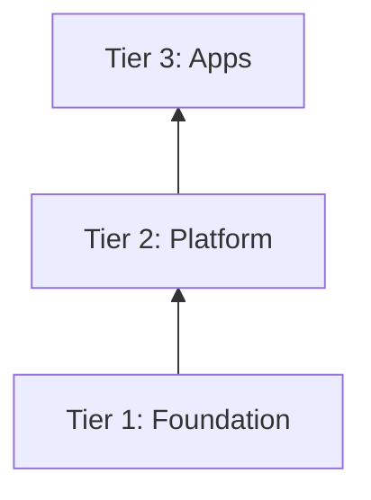

# Writing Yggdrasil Docs

Conventions for documentation written in this ecosystem. Apply these rules to every
file you create or edit that contains Mermaid diagrams or lives in a Yggdrasil-family
repo (yggdrasil, refr-k8s, nidavellir, mimir, heimdall, etc.).

## Mermaid Rules

### Rule 1: Never use `\n` in node labels

`\n` does NOT render as a newline in Mermaid in most contexts (GitHub, VS Code, many
preview tools). Use `<br/>` instead.

```
WRONG: NODE["Title\nSubtitle"]
RIGHT: NODE["Title<br/>Subtitle"]
```

### Rule 2: No background fill colors

Never use `style` declarations with `fill:` color values. They render inconsistently
across dark/light themes and break in many Mermaid renderers.

```
WRONG: style NodeA fill:#f9d0d0
WRONG: style NodeA fill:#d0f0d0,color:#000
RIGHT: (omit the style declaration entirely)
```

If you need to visually distinguish nodes, use shape variants (`([...])`, `{...}`, etc.)
or subgraph grouping — not fill colors.

### Rule 3: Layer cake diagrams use `graph BT`

For hierarchy diagrams where a foundation layer sits at the bottom (e.g., the three
Yggdrasil platform tiers), use `graph BT` (bottom-to-top). Arrows go from the
lower/foundation tier to the upper tier it supports.



This puts the Foundation subgraph at the bottom of the rendered diagram.

### Rule 4: Multi-word subgraph labels use em dashes

For subgraph title strings with multiple logical parts, use ` — ` (em dash, not double
hyphen) as the separator. This renders cleanly as plain text.

```
subgraph T1["Tier 1 — Nordri — Cluster Substrate"]
```

### Rule 5: Test the diagram mentally before writing

Read each node label and check:
- Does it contain `\n`? → Replace with `<br/>`
- Does it use a `style X fill:` line? → Remove it
- Is it a hierarchy diagram? → Use `graph BT`

## Terminology

### Bootstrap Layers vs Platform Tiers

These are two distinct numbering schemes. Use the correct term to avoid confusion:

| Term | Meaning | Where used |
|------|---------|-----------|
| **Layer** (with number: L2, L2.5, L3, L4...) | Bootstrap sequence step | `bootstrap.sh` comments, runbooks |
| **Tier** (1/2/3) | App-of-apps deployment group | Architecture docs, diagrams |

Example:
- "Layer 2.6 installs Traefik" (bootstrap step)
- "Nordri is Tier 1; Nidavellir is Tier 2" (app-of-apps group)

### Cluster Layer (L1) Naming

The pre-bootstrap Kubernetes cluster (GKE or k3d) is called **"The Cluster"** — not
"the metal" (implies bare metal, which is inaccurate; both GKE and homelab use
virtualization). Refer to it as:
- "The Cluster" in prose
- "L1: The Cluster" in layer sequence tables
- `Kubernetes Cluster — GKE or k3d/k3d` in diagram subgraph labels

## App-of-Apps Reference Chain

Each platform tier owns the reference to the tier above it — not the bootstrap layer:

```
Nordri (platform/argocd/) → references Nidavellir app-of-apps
Nidavellir (apps/) → references Demicracy app-of-apps
Demicracy (apps/) → references its own components
```

**Never** put a Demicracy Application in Nordri's `platform/argocd/`. Nordri only knows
about Nidavellir. Nidavellir is the forge that deploys Demicracy.
