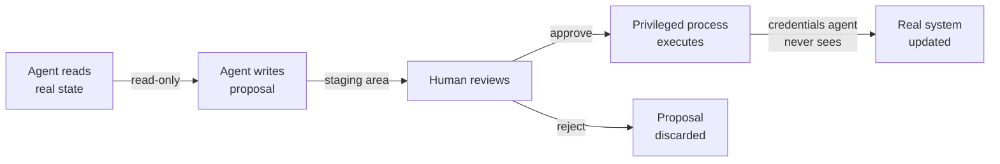
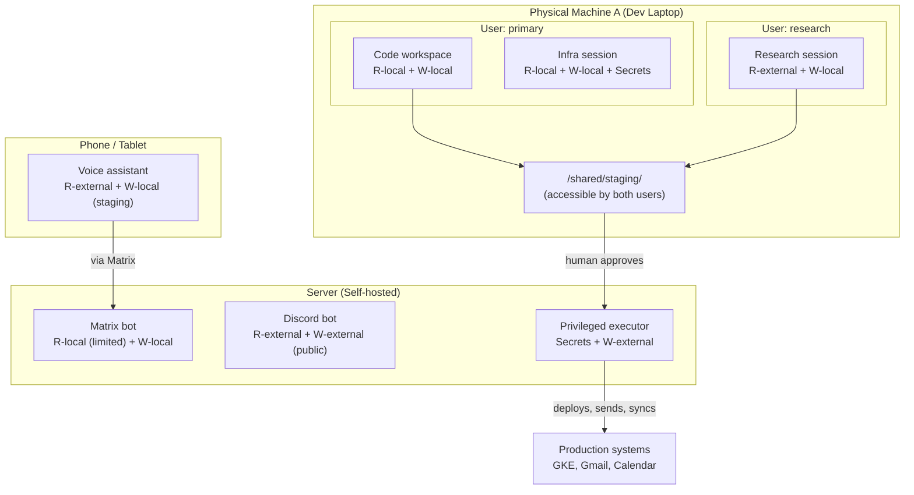
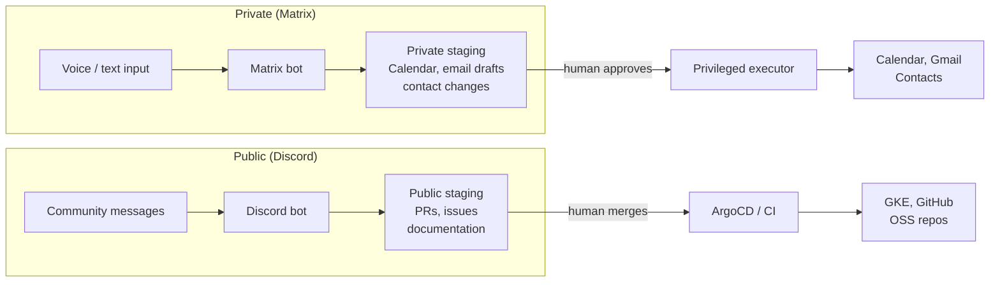
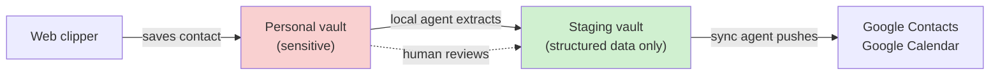
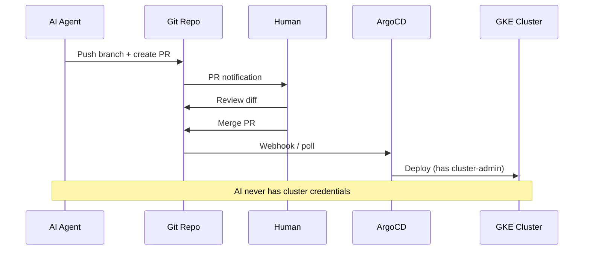
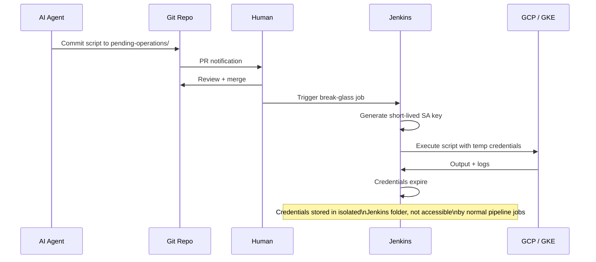
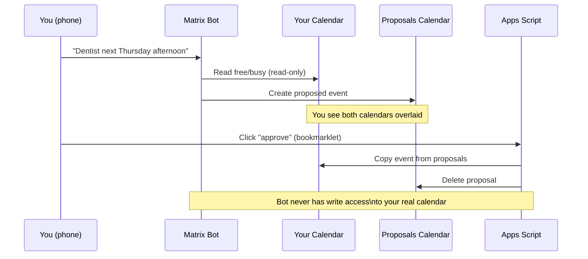
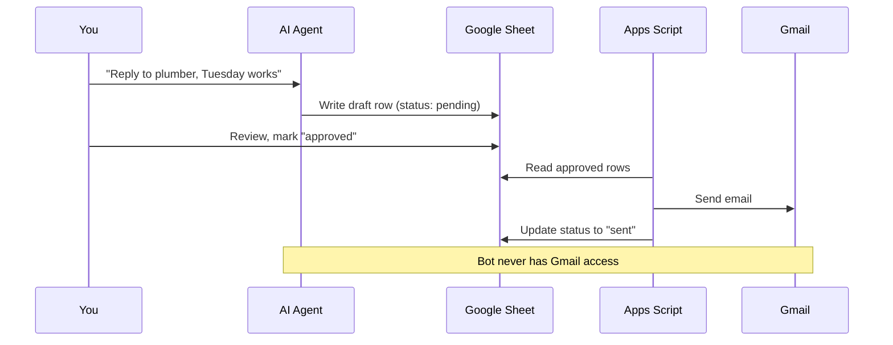
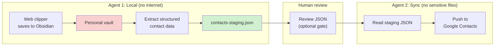
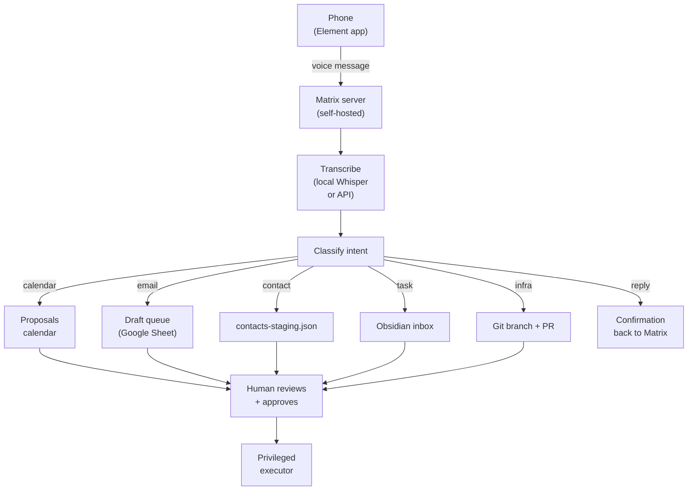

# AI Agent Security Patterns

Practical patterns for working safely with AI agents that need access to personal data, cloud infrastructure, and communication tools. Designed for solo developers and small teams who want the productivity of AI without handing over the keys to everything.

## The Problem

AI agents are most useful when they can see your data and take actions on your behalf. But giving an agent full access to your calendar, email, cloud accounts, and file system creates a single point of failure where a hallucination, prompt injection, or compromised plugin can cause real damage.

The goal isn't perfect security (that would mean not using agents at all). It's raising the bar so that mistakes are recoverable and damage is contained.

## Core Principle: The Staging Queue

Every interaction between an AI agent and a real system should flow through a staging area where a human can review before changes take effect.

The agent never has write access to the real system. The credentials that can write live in a separate execution context the agent cannot reach.

This is the pull request workflow generalized beyond code. A PR is a staging area. Merging is approval. CI/CD is the privileged executor. The developer who opened the PR never needs production credentials.

## Core Principle: Capability Bounding

### The Five Capabilities

The original "two-of-three" framing (read data / take actions / access internet) is too coarse. "Taking actions" and "accessing the internet" overlap in practice — sending an email is both an external action and internet access, and an agent with internet read access could exfiltrate data by encoding it into an API call. A more precise model:

| # | Capability | Symbol | Examples |
|---|-----------|--------|----------|
| 1 | **Read sensitive local data** | `R-local` | Files, Obsidian vault, credentials, config, personal notes |
| 2 | **Write to local systems** | `W-local` | Edit files, run shell commands, modify local databases |
| 3 | **Read from external systems** | `R-external` | Web search, fetch URLs, read APIs, pull email |
| 4 | **Write to external systems** | `W-external` | Send emails, push to APIs, deploy, post messages |
| 5 | **Access credentials/secrets** | `Secrets` | API keys, OAuth tokens, service account keys, passwords |

### Why Read-External is Riskier Than it Looks

An agent with `R-external` (internet read) is exposed to **prompt injection**: a malicious website can include hidden instructions that the agent follows. If that agent also has `R-local` (sensitive data), a crafted web page could instruct it to summarize your secrets into its next web request (exfiltrating via the read channel itself, e.g., DNS lookups, URL parameters in subsequent fetches).

This means **`R-local` + `R-external`** is a higher-risk combination than it first appears. It's safer than `R-local` + `W-external` (which can directly exfiltrate), but still requires caution.

### Why Write-External is the Most Dangerous Capability

`W-external` is the one capability that enables irreversible damage to the outside world: sent emails can't be unsent, deployed code is live, posted messages are public. Every pattern in this document aims to replace direct `W-external` access with writing to a staging area (`W-local` to a designated directory), where a separate privileged process handles the actual external write.

### The Bounding Rule

**An agent session should never have both `R-local` (sensitive data) and `W-external` (write to internet) simultaneously.** This is the most dangerous pair because it enables direct exfiltration.

Beyond that rule, minimize the total number of capabilities per session. The staging queue pattern lets you substitute `W-external` with `W-local` (write to staging) in almost every case.

### Risk Matrix

| Combination | Risk | Scenario |
|------------|------|----------|
| `R-local` + `W-local` | **Low** | Agent edits local files. No data leaves the machine. |
| `R-local` + `R-external` | **Medium** | Agent could be prompt-injected into encoding data into requests. Mitigate with request logging. |
| `R-external` + `W-local` | **Low** | Agent researches and saves findings. No sensitive data at risk. |
| `R-external` + `W-external` | **Medium** | Agent can interact with external services but has no sensitive data to leak. |
| `R-local` + `W-external` | **CRITICAL** | Direct exfiltration path. Never allow this combination. |
| `W-local` + `W-external` | **Medium** | Agent can modify local and remote systems but has no data to read. Damage is possible but not theft. |
| Any + `Secrets` | **Elevated** | Credentials amplify whatever other capabilities exist. Minimize. |

### Capability Modes by Workstation

Different machines or user sessions enforce different capability sets. The key question: **can isolation be achieved with OS user accounts, or does it require separate physical machines?**

**User sessions** (different OS accounts on one machine) are sufficient when:
- The sensitive data lives in user-specific home directories
- The agent tooling respects OS file permissions
- Sessions share a staging directory (e.g., `/shared/staging/`) with appropriate permissions

**Separate machines** are better when:
- You need network-level isolation (no internet for sensitive work)
- The agent tooling or plugins could bypass OS permissions
- You want physical certainty (air-gap for the most sensitive contexts)

**Practical compromise**: Use user sessions for most isolation, with a shared staging directory. Reserve a separate machine (or VM) for the rare case where you need both sensitive data access and full internet (research mode with careful oversight).

| Mode | Machine / Session | Capabilities | Lacks | Use Case |
|------|-------------------|-------------|-------|----------|
| **Code workspace** | Dev laptop, primary user | `R-local` + `W-local` | `R-external`, `W-external` | Editing code with secrets in config files |
| **Research session** | Same laptop, restricted user OR browser-only | `R-external` + `W-local` (blank workspace) | `R-local` (no sensitive files) | Exploring solutions, reading docs |
| **Infra session** | Dev laptop, primary user | `R-local` + `W-local` + `Secrets` (scoped) | `R-external`, `W-external` | kubectl, helm, local cluster work |
| **Communication assistant** | Phone or separate user session | `R-external` + `W-local` (staging only) | `R-local`, `W-external`, `Secrets` | Drafting emails, proposing calendar events |
| **Sensitive chat** | Self-hosted Matrix, restricted session | `R-local` (limited) + `W-local` | `R-external`, `W-external` | Personal planning, private discussions |
| **Community bot** | Public Discord, restricted workspace | `R-external` + `W-external` (public only) | `R-local`, `Secrets` | OSS community utility, public Q&A |

## Chat Context Segmentation

Different chat interfaces should map to different capability profiles:

### Self-hosted Matrix (Sensitive Context)

- Runs on your own server — messages never leave your infrastructure
- Bot has access to personal context (calendar, tasks, limited local files)
- No public internet access for the bot (or heavily restricted)
- E2E encrypted — even a server compromise doesn't expose content
- Use for: personal planning, health/finance discussions, private scheduling

### Public Discord (Community Context)

- Runs in a restricted workspace — no access to personal files or credentials
- Bot has internet access + write to public channels (both expected and visible)
- Skills can be developed and improved over time (version-controlled skill files)
- Token optimization: convert commonly repeated workflows into literal scripts
  - First time: AI reasons through the problem (~5000 tokens)
  - Second time: AI recognizes the pattern, writes a script (~2000 tokens)
  - Third time onwards: AI runs the script (~200 tokens)
- Use for: OSS community support, public project utilities, documentation help

### The Bridge

Both bots can write to the same staging directory format, but only the Matrix bot handles sensitive proposals. The Discord bot's staging area is the public repo (PRs, issues).

## Data Segmentation with Obsidian

If your Obsidian vault contains both sensitive personal data and shareable project notes, consider splitting into multiple vaults:

| Vault | Contains | Agent Access | Internet |
|-------|----------|-------------|----------|
| **Personal** | Finances, health, private contacts, journals | Local-only agent (`R-local` + `W-local`) | Never |
| **Projects** | OSS notes, technical docs, public-safe content | Research agent (`R-local` + `R-external`) | Yes (for research) |
| **Staging** | Structured extracts for sync (contacts JSON, task exports) | Sync agent (`R-external` + `W-external`) | Yes (for sync) |

The Personal vault agent extracts structured data to the Staging vault. The Sync agent reads Staging and pushes to external services. Neither agent crosses the boundary.

## Pattern: GitOps as Staging Queue (Infrastructure)

This is the most mature version of the staging queue. If you already use GitOps (ArgoCD, Flux), you already have this.

**What the AI needs**: Git push access to the repo. Read-only cluster access (`roles/container.viewer`) for observing current state.

**What the AI never gets**: cluster-admin, cloud provider credentials, or ArgoCD's service account.

### Break-Glass for Non-GitOps Operations

Some operations can't flow through GitOps: initial cluster creation, emergency debugging, one-off migrations.

**Jenkins implementation:**
- A dedicated Jenkins job (`break-glass-executor`) in its own folder
- Reads a script from `pending-operations/` in the repo
- Generates a short-lived GCP service account key (or uses workload identity)
- Executes the script, logs full output for audit
- Credentials expire after execution (1 hour max)
- The live GCP credentials are in a **dedicated Jenkins credentials folder** — normal pipeline jobs in other folders cannot access them, so a malicious Jenkinsfile edit elsewhere cannot grab unrelated prod credentials

**GKE-specific roles for the break-glass service account:**
- `roles/container.admin` (manage clusters)
- `roles/storage.admin` (for Velero/backups)
- `roles/iam.serviceAccountUser` (to bind workload identity)
- NOT `roles/owner` or `roles/editor`

## Pattern: Calendar Management

| Component | Owner | Access |
|-----------|-------|--------|
| Real calendar | You | Full control |
| Shared view | Bot's Google account | Read-only (shared by you) |
| Proposals calendar | Bot's Google account | Bot writes here freely |
| Approval script | Google Apps Script on YOUR account | Has write to your real calendar |

**Why this is safe:**
- The bot can never delete or modify your real events (read-only share)
- Worst case: the proposals calendar fills up with bad suggestions (easily cleared)
- The approval script runs with your credentials but only does one thing: copy approved events
- The bot never sees the approval script's credentials

## Pattern: Email Drafting

### Option A: Google Sheet Queue (Safest)

Bot writes to a Google Sheet (recipient, subject, body, status). You review rows, mark "approved", and a separate Apps Script sends via Gmail API.

### Option B: Gmail Drafts (Simpler, Slightly More Access)

Google's OAuth scopes allow fine-grained Gmail access:

| OAuth Scope | Allows | Risk |
|------------|--------|------|
| `gmail.readonly` | Read emails (like a shared read-only calendar) | Bot can see email content |
| `gmail.compose` | Create drafts, but NOT send | Bot can stage but not execute |
| `gmail.send` | Actually send emails | Do NOT grant this to the bot |

With `gmail.compose`, the bot creates actual Gmail drafts that appear in your Drafts folder. You review in your normal Gmail interface and click Send yourself. This is the email equivalent of a read-only calendar share + proposals calendar.

**Key insight**: Gmail's `gmail.compose` scope without `gmail.send` is the "staging area" built into Gmail itself. The bot can propose but not execute.

### Option C: Email as Exfiltration Vector

Note that even draft staging can be a risk if the bot has `R-local` (sensitive data) — it could encode secrets into a draft email body intended for an attacker's address. Mitigations:
- Only grant `gmail.compose` in sessions that do NOT have `R-local`
- Or use the Google Sheet approach (bot never touches Gmail at all)
- Log all draft content for audit

## Pattern: Contact Management

**Agent 1** (has: `R-local` + `W-local`, lacks: `R-external`, `W-external`):
- Reads Obsidian vault for new/updated contact notes
- Extracts structured data (name, email, phone, company)
- Writes to `contacts-staging.json`
- Cannot exfiltrate because it has no internet access

**Agent 2** (has: `R-external` + `W-external`, lacks: `R-local` to sensitive files):
- Reads ONLY `contacts-staging.json` (not the full Obsidian vault)
- Pushes contacts to Google Contacts API
- Cannot steal sensitive data because it never sees it

## Pattern: Voice-to-Action Pipeline

### Why Matrix over WhatsApp/Discord for Sensitive Input

- **Self-hosted**: Messages stay on your infrastructure
- **E2E encrypted**: Even the server admin can't read messages
- **Bot-friendly**: Well-documented bot SDK, no Terms of Service risk
- **Bridgeable**: Can bridge to other platforms if needed
- **No vendor lock-in**: Standards-based protocol (unlike proprietary APIs)

### Voice Transcription Trade-off

| Method | Capability Cost | Latency | Accuracy |
|--------|----------------|---------|----------|
| Local Whisper | No internet needed (`R-local` only) | Higher | Good |
| Cloud API (OpenAI, Google) | Voice content sent to internet (`R-external`) | Lower | Better |

For sensitive dictation (personal plans, health, finance), prefer local transcription. For routine scheduling or community interactions, cloud APIs are fine.

## Skill-Based Token Optimization

Both Matrix and Discord bots can improve over time by converting repeated workflows into reusable scripts:

| Iteration | What Happens | Token Cost |
|-----------|-------------|------------|
| First time | AI reasons through the full problem | ~5,000 tokens |
| AI writes a skill/script | Captures the workflow as code | One-time cost |
| Subsequent times | AI recognizes pattern, runs the script | ~200 tokens |

Skills can be versioned in git, shared between bots (Matrix and Discord use the same skill format), and specialized per context (private skills for Matrix, public skills for Discord).

## Implementation Priority

| Priority | Pattern | Effort | Value | Prerequisite |
|----------|---------|--------|-------|-------------|
| 1 | GitOps staging queue | Already done (Nordri) | High | ArgoCD deployed |
| 2 | Dedicated service accounts | 30 min | High | GCP project |
| 3 | Capability mode awareness | Zero (just discipline) | High | Understanding this document |
| 4 | Break-glass Jenkins job | 1-2 hours | Medium | Jenkins instance |
| 5 | Calendar proposals | 1-2 hours | Medium | Bot Google account |
| 6 | Gmail `compose`-only drafts | 30 min | Medium | OAuth setup |
| 7 | Obsidian vault segmentation | 1 hour | Medium | Multiple vaults |
| 8 | Contact sync pipeline | 2-3 hours | Lower | Staging JSON + sync script |
| 9 | Matrix self-hosted bot | Half day | High | Matrix server (homelab) |
| 10 | Discord community bot | 2-3 hours | Medium | Discord server |
| 11 | Voice-to-Matrix pipeline | Half day | High | Matrix bot + Whisper |

## Summary

### The Staging Queue is Universal

Every pattern in this document follows the same structure:

1. **AI reads real state** (read-only access)
2. **AI writes to a staging area** (the only write access it has)
3. **Human reviews** (staging area is visible and browsable)
4. **Human approves** (one click, low friction)
5. **Privileged process executes** (credentials the AI never sees)

### The Golden Rule

**Never give an agent both read access to sensitive data and write access to external systems in the same session.** Everything else is risk management and convenience trade-offs.

### The Capability Mindset

When setting up any new agent interaction, ask:
1. What does this agent need to **read**? (local vs external)
2. What does this agent need to **write**? (local staging vs external systems)
3. Does it need **credentials**? (almost always: no, use a privileged executor instead)
4. Could a prompt injection in the **read** channel cause damage via the **write** channel?

If the answer to #4 is yes, split into two agents with a staging boundary between them.
