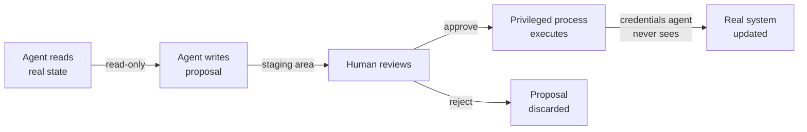
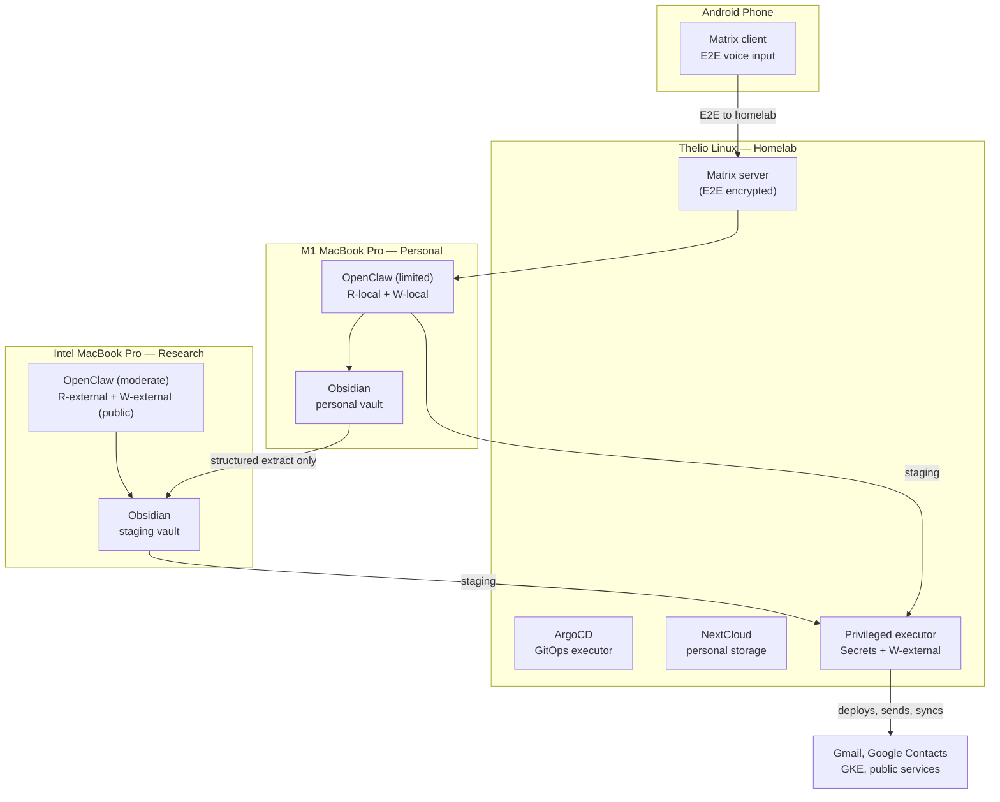

# AI Agent Security Patterns

Practical patterns for working safely with AI agents that need access to personal data, cloud infrastructure, and communication tools. Designed for solo developers and small teams who want the productivity of AI without handing over the keys to everything.

## The Problem

AI agents are most useful when they can see your data and take actions on your behalf. But giving an agent full access to your calendar, email, cloud accounts, and file system creates a single point of failure where a hallucination, prompt injection, or compromised plugin can cause real damage.

The goal isn't perfect security (that would mean not using agents at all). It's raising the bar so that mistakes are recoverable and damage is contained.

## Core Principle: The Staging Queue

Every interaction between an AI agent and a real system should flow through a staging area where a human can review before changes take effect.

The agent never has write access to the real system. The credentials that can write live in a separate execution context the agent cannot reach.

This is the pull request workflow generalized beyond code. A PR is a staging area. Merging is approval. CI/CD is the privileged executor. The developer who opened the PR never needs production credentials.

## Core Principle: Capability Bounding

### The Five Capabilities

The original "two-of-three" framing (read data / take actions / access internet) is too coarse. "Taking actions" and "accessing the internet" overlap in practice — sending an email is both an external action and internet access, and an agent with internet read access could exfiltrate data by encoding it into an API call. A more precise model:

| # | Capability | Symbol | Examples |
|---|-----------|--------|----------|
| 1 | **Read sensitive local data** | `R-local` | Files, Obsidian vault, credentials, config, personal notes |
| 2 | **Write to local systems** | `W-local` | Edit files, run shell commands, modify local databases |
| 3 | **Read from external systems** | `R-external` | Web search, fetch URLs, read APIs, pull email |
| 4 | **Write to external systems** | `W-external` | Send emails, push to APIs, deploy, post messages |
| 5 | **Access credentials/secrets** | `Secrets` | API keys, OAuth tokens, service account keys, passwords |

### Why Read-External is Riskier Than it Looks

An agent with `R-external` (internet read) is exposed to **prompt injection**: a malicious website can include hidden instructions that the agent follows. If that agent also has `R-local` (sensitive data), a crafted web page could instruct it to summarize your secrets into its next web request (exfiltrating via the read channel itself, e.g., DNS lookups, URL parameters in subsequent fetches).

This means **`R-local` + `R-external`** is a higher-risk combination than it first appears. It's safer than `R-local` + `W-external` (which can directly exfiltrate), but still requires caution.

### Why Write-External is the Most Dangerous Capability

`W-external` is the one capability that enables irreversible damage to the outside world: sent emails can't be unsent, deployed code is live, posted messages are public. Every pattern in this document aims to replace direct `W-external` access with writing to a staging area (`W-local` to a designated directory), where a separate privileged process handles the actual external write.

### The Bounding Rule

**An agent session should never have both `R-local` (sensitive data) and `W-external` (write to internet) simultaneously.** This is the most dangerous pair because it enables direct exfiltration.

Beyond that rule, minimize the total number of capabilities per session. The staging queue pattern lets you substitute `W-external` with `W-local` (write to staging) in almost every case.

### Risk Matrix

| Combination | Risk | Scenario |
|------------|------|----------|
| `R-local` + `W-local` | **Low** | Agent edits local files. No data leaves the machine. |
| `R-local` + `R-external` | **Medium** | Agent could be prompt-injected into encoding data into requests. Mitigate with request logging. |
| `R-external` + `W-local` | **Low** | Agent researches and saves findings. No sensitive data at risk. |
| `R-external` + `W-external` | **Medium** | Agent can interact with external services but has no sensitive data to leak. |
| `R-local` + `W-external` | **CRITICAL** | Direct exfiltration path. Never allow this combination. |
| `W-local` + `W-external` | **Medium** | Agent can modify local and remote systems but has no data to read. Damage is possible but not theft. |
| Any + `Secrets` | **Elevated** | Credentials amplify whatever other capabilities exist. Minimize. |

### Capability Modes by Workstation

Different machines or user sessions enforce different capability sets. The key question: **can isolation be achieved with OS user accounts, or does it require separate physical machines?**

**User sessions** (different OS accounts on one machine) are sufficient when:
- The sensitive data lives in user-specific home directories
- The agent tooling respects OS file permissions
- Sessions share a staging directory (e.g., `/shared/staging/`) with appropriate permissions

**Separate machines** are better when:
- You need network-level isolation (no internet for sensitive work)
- The agent tooling or plugins could bypass OS permissions
- You want physical certainty (air-gap for the most sensitive contexts)

**Practical compromise**: Use user sessions for most isolation, with a shared staging directory. Reserve a separate machine (or VM) for the rare case where you need both sensitive data access and full internet (research mode with careful oversight).

| Mode | Machine / Session | Capabilities | Lacks | Use Case |
|------|-------------------|-------------|-------|----------|
| **Code workspace** | Dev laptop, primary user | `R-local` + `W-local` | `R-external`, `W-external` | Editing code with secrets in config files |
| **Research session** | Same laptop, restricted user OR browser-only | `R-external` + `W-local` (blank workspace) | `R-local` (no sensitive files) | Exploring solutions, reading docs |
| **Infra session** | Dev laptop, primary user | `R-local` + `W-local` + `Secrets` (scoped) | `R-external`, `W-external` | kubectl, helm, local cluster work |
| **Communication assistant** | Phone or separate user session | `R-external` + `W-local` (staging only) | `R-local`, `W-external`, `Secrets` | Drafting emails, proposing calendar events |
| **Sensitive chat** | Self-hosted Matrix, restricted session | `R-local` (limited) + `W-local` | `R-external`, `W-external` | Personal planning, private discussions |
| **Community bot** | Public Discord, restricted workspace | `R-external` + `W-external` (public only) | `R-local`, `Secrets` | OSS community utility, public Q&A |

## Your System Inventory

These patterns are written with a specific hardware setup in mind. Adjust for your own.

| Machine | Role | Sensitivity | Agent Profile |
|---------|------|-------------|---------------|
| **Thelio Linux (System76)** | Homelab base | Infrastructure | k3s/k3d, ArgoCD, NextCloud, Matrix server |
| **M1 MacBook Pro** | Personal/sensitive | High | OpenClaw limited: `R-local` + `W-local` only |
| **Intel MacBook Pro** | Research/community | Low | OpenClaw moderate: `R-external` + `W-external` (public) |
| **Win11** | Minimal/TBD | Low | Not yet set up |
| **Win10** | Legacy — migration target | CRITICAL | No agents until data is migrated out |
| **Android phone** | Mobile input | Medium | Matrix E2E voice client → M1 Mac |

### Why Linux for the Homelab Base

Linux (Thelio) can run Kubernetes natively without a VM layer. macOS requires k8s inside
a Linux VM (k3d, Rancher Desktop, etc.) because the kernel is not Linux. Windows is worse.
For services like NextCloud and Matrix that need to run continuously with low overhead, the
Thelio is the right host.

### The Personal–Research Split

The M1 and Intel Macs play complementary roles. The M1 has access to sensitive personal data
(Obsidian vault, email drafts, contacts) but minimal external access. The Intel Mac faces
the internet and external services (web research, Discord, public GitHub) but has no access
to sensitive files. Between them sits an Obsidian staging vault — structured data that is
safe to share because it has already been stripped of raw personal content.

### Win10 Migration Priority

The Win10 system has sensitive data scattered across it from years of accumulation. Until
that data is migrated to encrypted homelab storage (NextCloud on Thelio) or deleted, it
should be treated as quarantined: no AI agent access, no OpenClaw installation.

## Patterns

Each pattern is covered in depth in its own document.

| Pattern | Doc | Key Machines |
|---------|-----|-------------|
| GitOps Staging Queue | [pattern-gitops-staging.md](docs/agent-security/pattern-gitops-staging.md) | Thelio (ArgoCD), any dev machine |
| Calendar Management | [pattern-calendar.md](docs/agent-security/pattern-calendar.md) | M1 Mac, Android phone |
| Email Drafting | [pattern-email.md](docs/agent-security/pattern-email.md) | M1 Mac |
| Contact Management | [pattern-contact-management.md](docs/agent-security/pattern-contact-management.md) | M1 Mac, Intel Mac (staging) |
| Chat Segmentation | [pattern-chat-segmentation.md](docs/agent-security/pattern-chat-segmentation.md) | Thelio (Matrix), Intel Mac (Discord) |
| Voice-to-Action Pipeline | [pattern-voice-pipeline.md](docs/agent-security/pattern-voice-pipeline.md) | Android phone → M1 Mac |
| OpenClaw Security Guide | [openclaw-security.md](docs/agent-security/openclaw-security.md) | M1 Mac, Intel Mac |

## Summary

- **The Staging Queue is Universal**: AI reads real state → writes to staging → human reviews → privileged process executes. The agent never has write access to real systems.
- **The Golden Rule**: Never give an agent both `R-local` (sensitive data) and `W-external` (write to internet) in the same session. This is the direct exfiltration path.
- **Minimize Capabilities**: Each session should have only the capabilities it strictly needs. Use the staging queue to substitute `W-external` with `W-local` in almost every case.
- **The Capability Question**: For any new agent interaction — what does it need to read? Write? Does it need credentials? Could a prompt injection in the read channel cause damage via the write channel?
