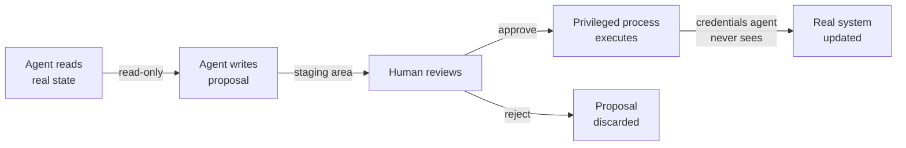
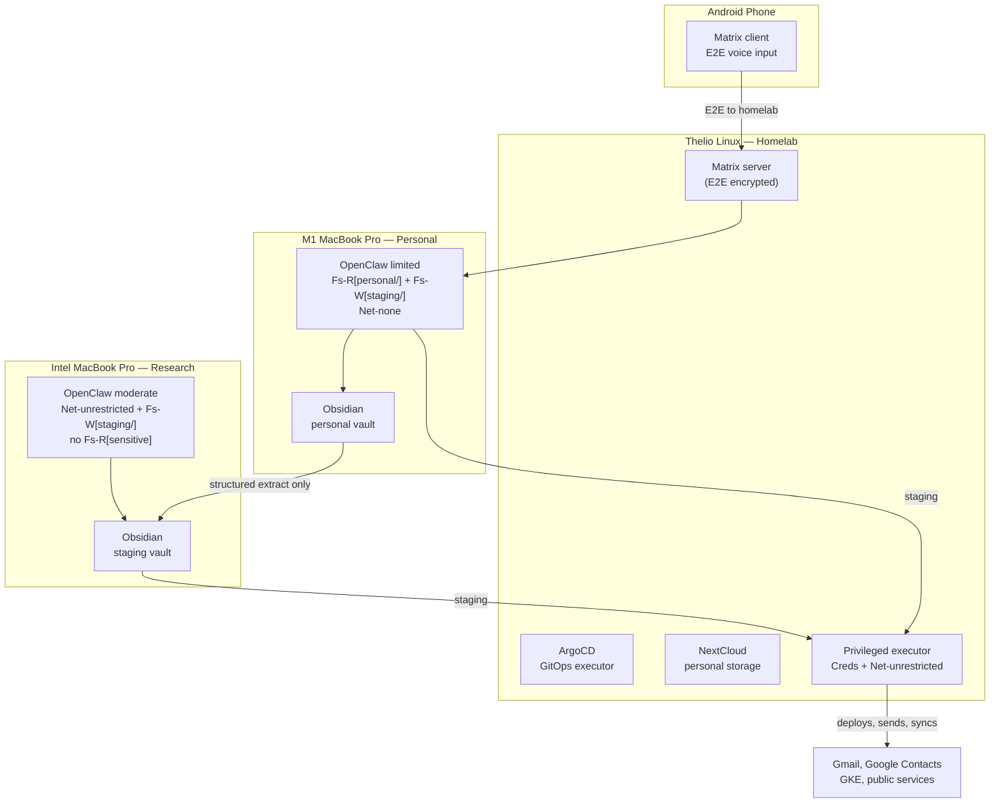

# AI Agent Security Patterns

Practical patterns for working safely with AI agents that need access to personal data, cloud infrastructure, and communication tools. Designed for solo developers and small teams who want the productivity of AI without handing over the keys to everything.

## The Problem

AI agents are most useful when they can see your data and take actions on your behalf. But giving an agent full access to your calendar, email, cloud accounts, and file system creates a single point of failure where a hallucination, prompt injection, or compromised plugin can cause real damage.

The goal isn't perfect security (that would mean not using agents at all). It's raising the bar so that mistakes are recoverable and damage is contained.

Core principles are explained here. Each use-case pattern has its own deep-dive in [`docs/agent-security/`](docs/agent-security/).

## Core Principle: The Staging Queue

Every interaction between an AI agent and a real system should flow through a staging area where a human can review before changes take effect.

The agent never has write access to the real system. The credentials that can write live in a separate execution context the agent cannot reach.

This is the pull request workflow generalized beyond code. A PR is a staging area. Merging is approval. CI/CD is the privileged executor. The developer who opened the PR never needs production credentials.

## Core Principle: Capability Bounding

### The Four-Axis Capability Model

Each agent session is described on four independent axes. The full model — including why read and write external access are not meaningfully different, and how to enforce network scoping per OS and with Kubernetes — is in [advanced-capability-model.md](docs/agent-security/advanced-capability-model.md).

| Axis | Symbols | Scope | Examples |
|------|---------|-------|----------|
| **Filesystem** | `Fs-R[path]`, `Fs-W[path]` | Specific path or subtree | `Fs-R[~/obsidian/personal/]`, `Fs-W[~/staging/]` |
| **Network** | `Net-none` … `Net-unrestricted` | By destination, not HTTP verb | `Net-none`, `Net-allowlist[gmail-api:443]`, `Net-unrestricted` |
| **Credentials** | `Creds[scope]` | Specific OAuth/API scope | `Creds[gmail.compose]`, `Creds[gke-temporary]` |
| **Execution** | `Exec` | Subprocess / shell access | Default denied; grant only when explicitly needed |

**Key insight:** `R-external` and `W-external` are not meaningfully different — any outbound TCP connection is a write channel (DNS lookups, URL parameters, and timing all encode data). The meaningful boundary is *which destinations* can be reached, scoped using `Net-[scope]`.

### The Bounding Rule

**Never grant `Fs-R[sensitive-path]` and `Net-[any outbound]` to the same agent session.** Any outbound network capability combined with sensitive filesystem read is a direct exfiltration path.

Beyond that rule, minimize the total number of capabilities per session. The staging queue pattern lets you substitute network write access with `Fs-W[staging/]` in almost every case.

### Risk Matrix

| Combination | Risk | Scenario |
|------------|------|----------|
| `Fs-R[sensitive]` + `Fs-W[local]` + `Net-none` | **Low** | Agent edits local files. No data can leave the machine. |
| `Fs-R[staging]` + `Net-unrestricted` | **Low** | Agent reads non-sensitive extracts and syncs. No personal data at risk. |
| `Net-unrestricted` + `Fs-W[local]`, no `Fs-R[sensitive]` | **Medium** | Agent researches and saves. Prompt injection risk but no sensitive data to steal. |
| `Fs-R[sensitive]` + `Net-[any outbound]` | **CRITICAL** | Direct exfiltration path. Never allow this combination. |
| Any + `Creds[scope]` | **Elevated** | Credentials amplify whatever other capabilities exist. Minimize and scope tightly. |
| Any + `Exec` | **Elevated** | Process execution can escalate past other constraints. Default deny. |

### Capability Modes by Workstation

Different machines or user sessions enforce different capability sets. The key question: **can isolation be achieved with OS user accounts, or does it require separate physical machines?**

**User sessions** (different OS accounts on one machine) are sufficient when:
- The sensitive data lives in user-specific home directories
- The agent tooling respects OS file permissions
- Sessions share a staging directory (e.g., `/shared/staging/`) with appropriate permissions

**Separate machines** are better when:
- You need network-level isolation (no internet for sensitive work)
- The agent tooling or plugins could bypass OS permissions
- You want physical certainty (air-gap for the most sensitive contexts)

**Practical compromise**: Use user sessions for most isolation, with a shared staging directory. Reserve a separate machine (or VM) for the rare case where you need both sensitive data access and full internet (research mode with careful oversight).

| Mode | Machine / Session | Capabilities | Lacks | Use Case |
|------|-------------------|-------------|-------|----------|
| **Code workspace** | Dev laptop, primary user | `Fs-R/W[~/repos/]` + `Exec` | `Net-[outbound]` | Editing code with secrets in config files |
| **Research session** | Same laptop, restricted user | `Net-unrestricted` + `Fs-W[~/staging/]` | `Fs-R[sensitive]` | Exploring solutions, reading docs |
| **Infra session** | Dev laptop, primary user | `Fs-R/W[~/repos/]` + `Exec` + `Creds[k8s-token]` | `Net-unrestricted` | kubectl, helm, local cluster work |
| **Communication assistant** | Phone or separate user session | `Net-allowlist[LLM-API]` + `Fs-W[~/staging/]` | `Fs-R[sensitive]`, `Creds[send-capable]` | Drafting emails, proposing calendar events |
| **Sensitive chat** | Self-hosted Matrix, restricted session | `Fs-R[~/obsidian/personal/]` + `Fs-W[~/staging/]` | `Net-[outbound]` | Personal planning, private discussions |
| **Community bot** | Public Discord, restricted workspace | `Net-unrestricted` + `Fs-W[~/staging/]` | `Fs-R[sensitive]`, `Creds[sensitive]` | OSS community utility, public Q&A |

## Your System Inventory

These patterns are written with a specific hardware setup in mind. Adjust for your own.

| Machine | Role | Sensitivity | Agent Profile |
|---------|------|-------------|---------------|
| **Thelio Linux (System76)** | Homelab base | Infrastructure | k3s/k3d, ArgoCD, NextCloud, Matrix server |
| **M1 MacBook Pro** | Personal/sensitive | High | OpenClaw limited: `Fs-R[~/obsidian/personal/]` + `Fs-W[~/staging/]`, `Net-none` |
| **Intel MacBook Pro** | Research/community | Low | OpenClaw moderate: `Net-unrestricted` + `Fs-W[~/staging/]`, no sensitive filesystem |
| **Win11** | Minimal/TBD | Low | Not yet set up |
| **Win10** | Legacy — migration target | CRITICAL | No agents until data is migrated out |
| **Android phone** | Mobile input | Medium | Matrix E2E voice client → M1 Mac |

### Why Linux for the Homelab Base

Linux (Thelio) can run Kubernetes natively without a VM layer. macOS requires k8s inside
a Linux VM (k3d, Rancher Desktop, etc.) because the kernel is not Linux. Windows is worse.
For services like NextCloud and Matrix that need to run continuously with low overhead, the
Thelio is the right host.

### The Personal–Research Split

The M1 and Intel Macs play complementary roles. The M1 has access to sensitive personal data
(Obsidian vault, email drafts, contacts) but minimal external access. The Intel Mac faces
the internet and external services (web research, Discord, public GitHub) but has no access
to sensitive files. Between them sits an Obsidian staging vault — structured data that is
safe to share because it has already been stripped of raw personal content.

### Win10 Migration Priority

The Win10 system has sensitive data scattered across it from years of accumulation. Until
that data is migrated to encrypted homelab storage (NextCloud on Thelio) or deleted, it
should be treated as quarantined: no AI agent access, no OpenClaw installation.

## Patterns

Each pattern is covered in depth in its own document.

| Pattern | Doc | Key Machines |
|---------|-----|-------------|
| GitOps Staging Queue | [pattern-gitops-staging.md](docs/agent-security/pattern-gitops-staging.md) | Thelio (ArgoCD), any dev machine |
| Calendar Management | [pattern-calendar.md](docs/agent-security/pattern-calendar.md) | M1 Mac, Android phone |
| Email Drafting | [pattern-email.md](docs/agent-security/pattern-email.md) | M1 Mac |
| Contact Management | [pattern-contact-management.md](docs/agent-security/pattern-contact-management.md) | M1 Mac, Intel Mac (staging) |
| Chat Segmentation | [pattern-chat-segmentation.md](docs/agent-security/pattern-chat-segmentation.md) | Thelio (Matrix), Intel Mac (Discord) |
| Voice-to-Action Pipeline | [pattern-voice-pipeline.md](docs/agent-security/pattern-voice-pipeline.md) | Android phone → M1 Mac |
| OpenClaw Security Guide | [openclaw-security.md](docs/agent-security/openclaw-security.md) | M1 Mac, Intel Mac |
| Advanced Capability Model | [advanced-capability-model.md](docs/agent-security/advanced-capability-model.md) | All machines, Thelio (K8s) |
| Implementation Phases | [implementation-phases.md](docs/agent-security/implementation-phases.md) | Phased roadmap, Phase 1 worked example |

## Summary

- **The Staging Queue is Universal**: AI reads real state → writes to staging → human reviews → privileged process executes. The agent never has write access to real systems.
- **The Golden Rule**: Never grant an agent both `Fs-R[sensitive-path]` and `Net-[any outbound]` in the same session. Any outbound network capability combined with sensitive filesystem read is the direct exfiltration path.
- **Minimize Capabilities**: Each session should have only the capabilities it strictly needs. Use the staging queue to substitute network write access with `Fs-W[staging/]` in almost every case.
- **The Capability Question**: For any new agent interaction — what does it need to read? Write? Does it need credentials? Could a prompt injection in the read channel cause damage via the write channel?
