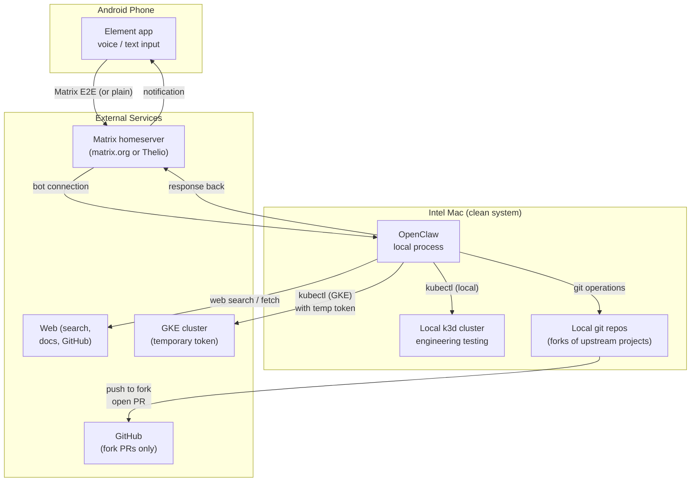
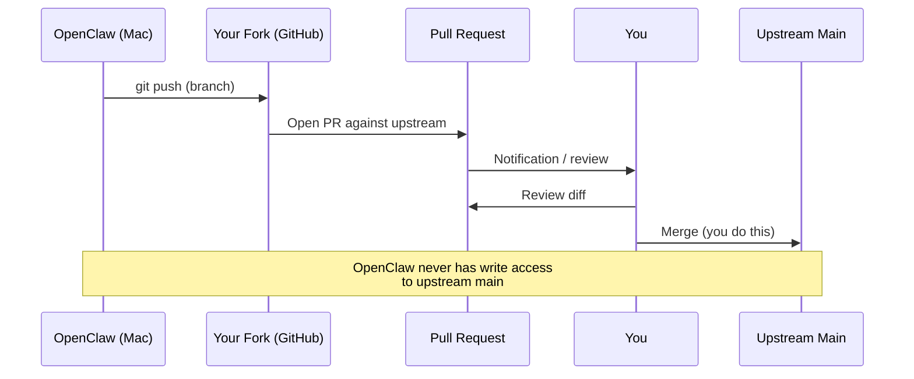

# Implementation Phases

> Part of the [AI Agent Security Patterns](../../ai-agent-security-patterns.md) guide.

The full capability model described in [advanced-capability-model.md](advanced-capability-model.md)
is a target architecture. Getting there is a phased effort. This document maps out the
phases, starting with a short-term goal that is useful today and accumulates no security
debt, up through the full self-hosted sensitive-data architecture.

The core principle throughout: **each phase is safe on its own terms**. Phase 1 doesn't
require any promises about Phase 2. You can stop at any phase and the security posture
is coherent.

---

## Phase 1 (Short–Mid Term): Engineering Assistant on a Clean Mac

### What This Is

A Claude session you can talk into from your phone, connected to a local Kubernetes
cluster for homelab and engineering work. The Mac it runs on is a **clean system with
no sensitive personal data** — this is the key property that makes a relaxed capability
profile safe. There is nothing on this machine worth stealing.

The immediate use case: engineering research, local cluster management, and git operations
via a Matrix interface on your phone. This is largely equivalent to the risk you already
accept by using a browser and terminal today — but with a structured capability profile
you can inspect and tighten over time.

### Hardware

| Device | Role |
|--------|------|
| Intel MacBook Pro (clean) | Runs OpenClaw locally; local k3d cluster for testing |
| Android phone | Matrix client (Element app); voice and text input |
| Thelio Linux (if available) | Can host the Matrix homeserver; otherwise use matrix.org temporarily |
| GKE | Cloud cluster, accessed via temporary service account tokens on demand |

### Architecture

### Capability Profile

Using the refined model from [advanced-capability-model.md](advanced-capability-model.md):

| Capability | Granted | Scope | Rationale |
|-----------|---------|-------|-----------|
| `Fs-R` | Yes | `~/repos/`, `~/staging/` | Source code, staging area — no sensitive data |
| `Fs-W` | Yes | `~/repos/`, `~/staging/` | Write to local repos and staging |
| `Net-unrestricted` | Yes | Full internet | Web search, Matrix server, GitHub, GKE API |
| `Creds[matrix-bot]` | Yes | Matrix bot token | Connect to Matrix homeserver as bot |
| `Creds[github-fork]` | Yes | Push to personal forks only | No write access to upstream main repos |
| `Creds[gke-temporary]` | On demand | Short-lived SA token, read-only by default | Generated when needed, expires after session |
| `Exec` | Yes | Local shell on clean Mac | Run kubectl, git, helm — acceptable on clean system |
| `Fs-R[sensitive]` | **No** | — | Mac has no personal data; this constraint is trivially satisfied |

**Why `Net-unrestricted` is acceptable here:** the clean Mac has no sensitive data to
exfiltrate. The risk of `R-external` (prompt injection from web content) is real but
no greater than the risk you already accept when using a browser to research solutions.
The main blast radius of an injection is bad code committed to your fork, or a bad
kubectl command — both recoverable.

**Why `Exec` is acceptable here:** on a clean system with no sensitive data, process
execution primarily enables the engineering workflows (git, kubectl, helm). The risk
is operational damage (a bad deploy), not data theft.

### The Staging Model for Phase 1

Even with a relaxed capability profile, the staging pattern applies where the action
is hard to reverse:

| Action | Staging approach | Review gate |
|--------|-----------------|-------------|
| Code changes | Local branch → push to fork → open PR | You review PR diff before merging |
| kubectl apply (local k3d) | Run directly (low stakes — local cluster) | Can inspect with `kubectl diff` first |
| kubectl apply (GKE) | Commit script to `pending-operations/` → review → run | Same break-glass pattern |
| Web research | Returned inline to Matrix conversation | No staging needed |
| New feature / refactor | Propose approach in conversation → you approve → implement | The conversation is the review |

### Git Access Model

The fork model limits blast radius: OpenClaw has push access to **your fork** of a
project, but the upstream main repo requires a PR that you review before merging.

For your own repos (Mimir, Nordri, Yggdrasil): the same pattern can apply — OpenClaw
works in a branch, you review and merge. Or for lower-stakes docs changes you can
grant direct push to a non-main branch and self-review.

### GKE: Temporary Service Account Tokens

Phase 1 uses the break-glass pattern from
[pattern-gitops-staging.md](pattern-gitops-staging.md) for GKE access. OpenClaw does
not hold a persistent GKE credential:

1. You generate a short-lived service account token (or use `gcloud auth print-access-token`)
2. Pass it to the session explicitly for the task at hand
3. Token expires — typically 1 hour for SA tokens, configurable

For read-only cluster inspection, a token with `roles/container.viewer` is sufficient.
For applying manifests, a narrower custom role scoped to specific namespaces is preferable
over `roles/container.admin`.

### Risk Summary for Phase 1

| Risk | Severity | Mitigation |
|------|----------|------------|
| Prompt injection via web content → bad code in fork | Low | Fork PR requires your review before merge |
| Prompt injection → bad kubectl on GKE | Medium | Temporary token with narrow role; break-glass pattern |
| Prompt injection → bad kubectl on local k3d | Low | Local cluster; easy to rebuild |
| Web content exfiltration | Low | Mac has no sensitive data to steal |
| Matrix message interception | Low | Use E2E (Element supports it) or accept plain for Phase 1 |
| OpenClaw skill supply chain | Addressed | No ClawHub skills; no third-party plugins |

**The honest comparison:** this risk profile is roughly equivalent to doing the same work
in a browser + terminal today — with the addition of prompt injection as a new attack
surface. That new surface is real, but the blast radius is bounded by the fork model
and the clean-Mac constraint.

---

## Phase 2 (Mid Term): Homelab Integration

Add the Thelio Linux machine as the homelab base. Self-hosted Matrix with E2E encryption.
Begin separating instances by sensitivity.

**Key additions over Phase 1:**
- Matrix server moves to Thelio (k3s deployment); E2E encryption enabled
- Introduce the M1 Mac as a separate, sensitivity-aware instance
- First executor pods: `gmail-compose-pod` and `calendar-propose-pod` on Thelio
- OpenClaw on M1 Mac gets `Net-none` (calls executor pods only); no direct internet
- Obsidian vault segmentation: personal vault on M1, staging vault accessible from Intel Mac
- CNI upgrade on Thelio k3s: Flannel → Cilium (enables full egress NetworkPolicy)

**New capabilities unlocked:**
- Email drafting via `gmail.compose` scope (executor pod holds credential)
- Calendar proposals (executor pod holds credential)
- Sensitive voice input on phone → Thelio Matrix → M1 Mac (E2E throughout)

The Intel Mac from Phase 1 continues its Phase 1 role (engineering assistant, community
Discord, open web research) — unchanged.

---

## Phase 3 (Longer Term): Full Sensitive Data Architecture

Full separation across all machines. Win10 data migrated to NextCloud on Thelio.
All sensitive personal data interactions go through the M1 Mac instance with `Net-none`
and executor pods.

**Key additions over Phase 2:**
- Win10 data migration complete → Win10 quarantine lifted or repurposed
- Win11 added with a defined role (likely similar to Intel Mac community role)
- Full executor pod suite: contacts, tasks, infra scripts
- M1 Mac OpenClaw possibly moves into a pod on Thelio (full Kubernetes enforcement)
- NetworkPolicy enforced via Cilium for all agent pods
- Secrets management: Sealed Secrets or External Secrets Operator for GitOps

See [advanced-capability-model.md](advanced-capability-model.md) for the full target
architecture and capability model that Phase 3 implements.

---

## Phase Comparison

| Aspect | Phase 1 | Phase 2 | Phase 3 |
|--------|---------|---------|---------|
| Machines active | Intel Mac + phone | + Thelio + M1 Mac | + Win11 |
| Matrix hosting | matrix.org or Thelio | Thelio (self-hosted, E2E) | Thelio (E2E) |
| Sensitive data on agent machine | None (clean Mac) | M1 Mac (scoped) | M1 Mac (scoped) |
| Network enforcement | OS-level (light) | Cilium NetworkPolicy (Thelio) | Full K8s enforcement |
| Executor pods | None | gmail, calendar | Full suite |
| OpenClaw instances | 1 (Intel Mac) | 2 (Intel + M1) | 2–3 |
| GKE access | Temp token (break-glass) | Temp token (break-glass) | Workload Identity |
| Human review gates | Fork PR, conversation | + email drafts, calendar | + all sensitive domains |
