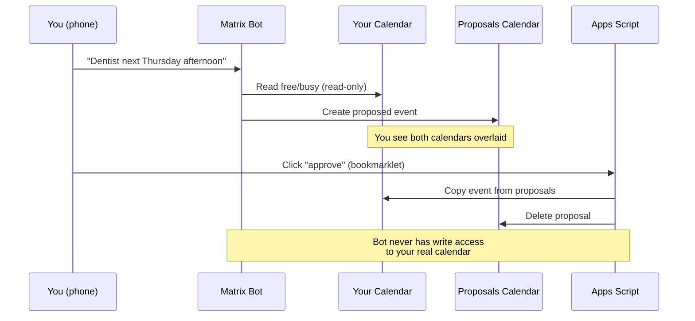

# Pattern: Calendar Management

> Part of the [AI Agent Security Patterns](../../ai-agent-security-patterns.md) guide.

The bot reads your real calendar (read-only share) and writes proposed events to a separate
Proposals calendar you own. You see both overlaid. Approving a proposal runs a lightweight
script under your credentials — the bot never writes to your real calendar.

**Key machines:** M1 MacBook Pro, Android phone (voice input via Matrix)

## The Pattern

| Component | Owner | Access |
|-----------|-------|--------|
| Real calendar | You | Full control |
| Shared view | Bot's Google account | Read-only (shared by you) |
| Proposals calendar | Bot's Google account | Bot writes here freely |
| Approval script | Google Apps Script on YOUR account | Has write to your real calendar |

**Why this is safe:**
- The bot can never delete or modify your real events (read-only share)
- Worst case: the proposals calendar fills up with bad suggestions (easily cleared)
- The approval script runs with your credentials but only does one thing: copy approved events
- The bot never sees the approval script's credentials

## Integration with Voice Pipeline

When using the voice pipeline (Android → Matrix → M1 Mac), calendar proposals are one of
the primary output types. The voice input classifies to "calendar" intent and writes a
proposal to the Proposals calendar. See
[pattern-voice-pipeline.md](pattern-voice-pipeline.md) for the full flow.

## In OpenClaw (M1 Mac)

The calendar integration in OpenClaw should be configured with:
- Google Calendar read scope on your real calendar (shared read-only)
- Google Calendar write scope on the Proposals calendar ONLY
- No access to any other calendar

The approval bookmarklet or Apps Script runs under your Google account — separate from
the OpenClaw OAuth credentials.
