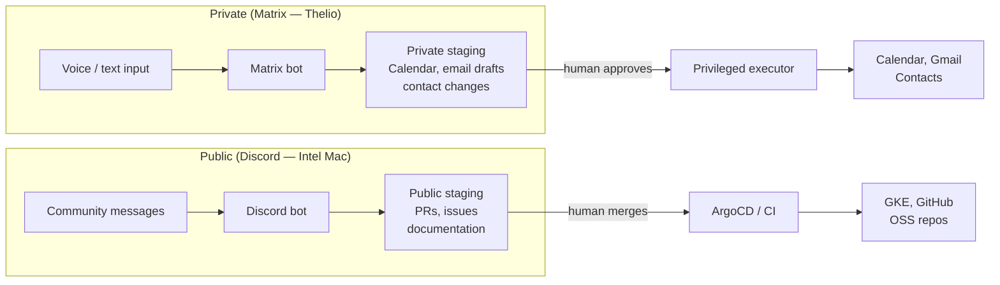

# Pattern: Chat Context Segmentation

> Part of the [AI Agent Security Patterns](../../ai-agent-security-patterns.md) guide.

Different chat interfaces enforce different capability profiles. The Matrix bot runs on
your homelab (Thelio) and handles sensitive personal context. The Discord bot runs in a
restricted workspace on the Intel Mac and handles community/public interactions only.
Neither bot can reach the other's data.

**Key machines:** Thelio Linux (Matrix server), Intel MacBook Pro (Discord bot)

## Self-hosted Matrix (Sensitive Context)

The Matrix server runs in the k3s cluster on Thelio. E2E encryption means the server
(and any attacker who compromises it) cannot read message content — only the endpoints can.

- Runs on your own server — messages never leave your infrastructure
- Bot has access to personal context (calendar, tasks, limited local files)
- No public internet access for the bot (or heavily restricted — LLM API endpoint only)
- E2E encrypted — even a server compromise doesn't expose content
- Android phone connects via Element app with E2E enabled
- Use for: personal planning, health/finance discussions, private scheduling

## Public Discord (Community Context)

The Discord bot runs in an OpenClaw instance on the Intel Mac. It has no access to
the Personal Obsidian vault or any sensitive local files.

- Runs in a restricted workspace — no access to personal files or credentials
- Bot has internet access + write to public channels (both expected and visible)
- Skills can be developed and improved over time (version-controlled in git)
- Only personally vetted skills — source-reviewed, not from ClawHub
- Use for: OSS community support, public project utilities, documentation help

See [openclaw-security.md](openclaw-security.md) for skill safety guidance.

## The Bridge

Both bots write to the same staging directory format, but only the Matrix bot handles
sensitive proposals. The Discord bot's staging area is the public repo (PRs, issues).

## Skill-Based Token Optimization

Both Matrix and Discord bots can improve over time by converting repeated workflows into
reusable scripts:

| Iteration | What Happens | Token Cost |
|-----------|-------------|------------|
| First time | AI reasons through the full problem | ~5,000 tokens |
| AI writes a skill/script | Captures the workflow as code | One-time cost |
| Subsequent times | AI recognizes pattern, runs the script | ~200 tokens |

Skills can be versioned in git, shared between bots (Matrix and Discord use the same skill
format), and specialized per context (private skills for Matrix, public skills for Discord).

The Discord bot's skills should be committed to a public or semi-public repo — they're
community-facing and benefit from peer review. The Matrix bot's skills stay private.

## Capability Comparison

| | Matrix Bot (Thelio) | Discord Bot (Intel Mac) |
|--|---------------------|------------------------|
| `R-local` | Limited (personal context) | None |
| `W-local` | Staging area only | Staging area only |
| `R-external` | None (or LLM API only) | Yes (web, public APIs) |
| `W-external` | None | Public Discord channels |
| `Secrets` | None | None |
| Audience | You only | Public community |
