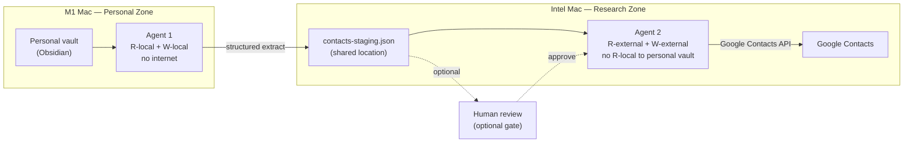
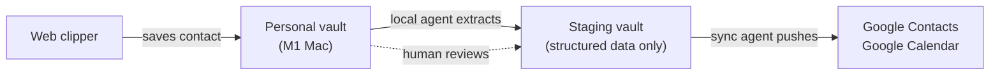

# Pattern: Contact Management via Obsidian

> Part of the [AI Agent Security Patterns](../../ai-agent-security-patterns.md) guide.

Obsidian is the source of truth for personal contacts. The agent that reads your vault
has no internet access. The agent that syncs to Google Contacts has no access to your vault.
A structured staging file (`contacts-staging.json`) is the only crossing point.

**Key machines:** M1 MacBook Pro (personal vault, Agent 1), Intel MacBook Pro (sync, Agent 2)

## Your Obsidian Vault Setup

| Vault | Location | Contains | Agent Access | Network |
|-------|----------|---------|-------------|---------|
| **Personal** | M1 Mac `~/obsidian/personal/` | Contacts, finances, health, journals | Agent 1: R-local only | Never |
| **Staging** | Intel Mac `~/obsidian/staging/` | Structured JSON extracts, contact data, task exports | Agent 2: R-local (staging only) | Yes (for sync) |

The Personal vault is never accessible from the Intel Mac. The Staging vault contains
only structured data that has been explicitly extracted — no raw notes, no free-text.

Agent 1 (M1 Mac, no internet) extracts structured contact fields from Personal vault notes
and writes `contacts-staging.json` to the Staging vault location. Agent 2 (Intel Mac,
no access to Personal vault) reads only that JSON file and pushes to Google Contacts.

## The Two-Agent Pipeline

**Agent 1** (has: `R-local` + `W-local`, lacks: `R-external`, `W-external`):
- Reads Obsidian vault for new/updated contact notes
- Extracts structured data (name, email, phone, company)
- Writes to `contacts-staging.json`
- Cannot exfiltrate because it has no internet access

**Agent 2** (has: `R-external` + `W-external`, lacks: `R-local` to sensitive files):
- Reads ONLY `contacts-staging.json` (not the full Obsidian vault)
- Pushes contacts to Google Contacts API
- Cannot steal sensitive data because it never sees it

## Cross-Machine Flow

## Why the Boundary Holds

The staging area contains only structured, extracted fields — name, email, phone, company —
never the raw Obsidian note that might include personal context ("met at funeral", "owes me
money", "avoid on Tuesdays"). Even if Agent 2 were compromised, the attacker gets contact
metadata, not your personal notes.

The Personal vault agent (Agent 1) has no path to send data anywhere. It can only write to
`contacts-staging.json`. An attacker who injects into Agent 1 via a malicious contact note
can write arbitrary JSON to the staging file — but cannot reach any external system.
