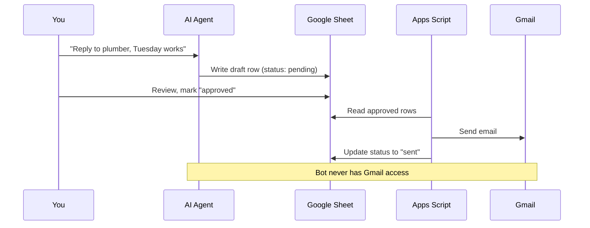
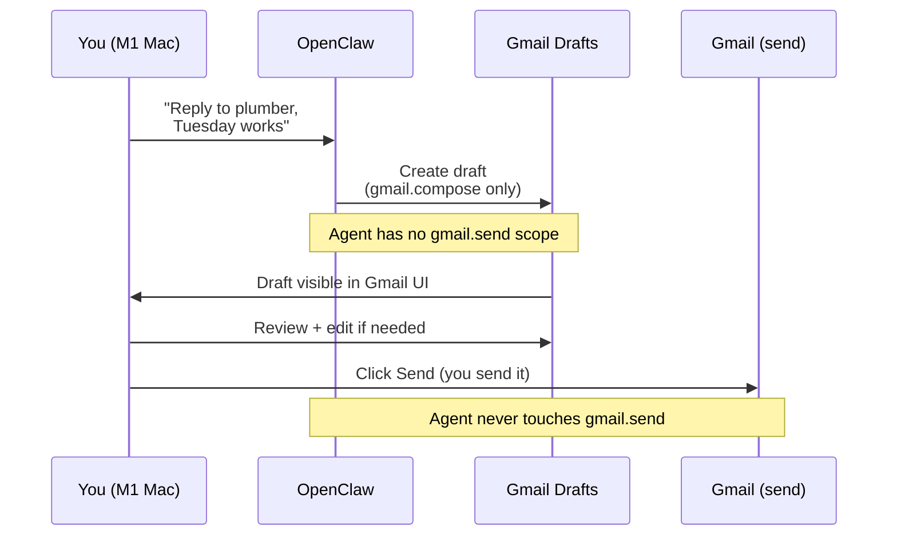

# Pattern: Email Drafting

> Part of the [AI Agent Security Patterns](../../ai-agent-security-patterns.md) guide.

Gmail supports fine-grained OAuth scopes. The `gmail.compose` scope lets an agent create
drafts that appear in your Drafts folder — but cannot send them. You review and click Send.
This is the email equivalent of the proposals calendar: the agent stages, you execute.

**Key machines:** M1 MacBook Pro (personal email, sensitive context)

## Option A: Google Sheet Queue (Safest)

Bot writes to a Google Sheet (recipient, subject, body, status). You review rows, mark
"approved", and a separate Apps Script sends via Gmail API.

## Option B: Gmail Drafts (Recommended — Simpler)

Google's OAuth scopes allow fine-grained Gmail access:

| OAuth Scope | Allows | Risk |
|------------|--------|------|
| `gmail.readonly` | Read emails | Bot can see email content |
| `gmail.compose` | Create drafts, but NOT send | Bot can stage but not execute |
| `gmail.send` | Actually send emails | Do NOT grant this to the bot |

### Recommended Setup: gmail.compose Only

Grant the agent exactly one Gmail scope: `gmail.compose`. This gives it the ability to
create and modify drafts but not to read your inbox or send mail.

**What the agent can do:**
- Create a draft (recipient, subject, body)
- Update a draft it previously created
- List drafts it created (not your full inbox)

**What it cannot do:**
- Read your existing emails
- Send any email (including its own drafts)
- Access your contacts list via Gmail

The draft appears in your normal Gmail Drafts folder. Review it, edit if needed, click Send.

**In OpenClaw (M1 Mac):** Configure the Gmail integration with `gmail.compose` scope only.
Never grant `gmail.send` or `gmail.readonly` to the personal-use OpenClaw instance.
The agent needs no internet read access for email drafting — only W-local (staging) and
the specific Gmail OAuth write for compose.

**Danger check:** This scope should only be active in sessions that do NOT have `R-local`
access to sensitive files. If the agent can read your Obsidian vault AND compose emails,
a prompt injection via an incoming email reply could exfiltrate vault content into a draft
addressed to an attacker. In OpenClaw: use separate integration profiles for the
email-drafting session vs. the Obsidian-reading session.

**Key insight**: Gmail's `gmail.compose` scope without `gmail.send` is the "staging area"
built into Gmail itself. The bot can propose but not execute.

## Option C: Email as Exfiltration Vector

Note that even draft staging can be a risk if the bot has `R-local` (sensitive data) — it
could encode secrets into a draft email body intended for an attacker's address. Mitigations:
- Only grant `gmail.compose` in sessions that do NOT have `R-local`
- Or use the Google Sheet approach (bot never touches Gmail at all)
- Log all draft content for audit

## Capability Profile for Email Sessions

| Capability | Granted | Notes |
|-----------|---------|-------|
| `R-local` | No | Do not read Obsidian vault in the same session |
| `W-local` | Yes | Write staging area if using Google Sheet approach |
| `R-external` | No | Not needed for drafting |
| `W-external` | `gmail.compose` only | Narrowest possible scope |
| `Secrets` | OAuth token only | Stored in system keychain, not accessible to the agent directly |
