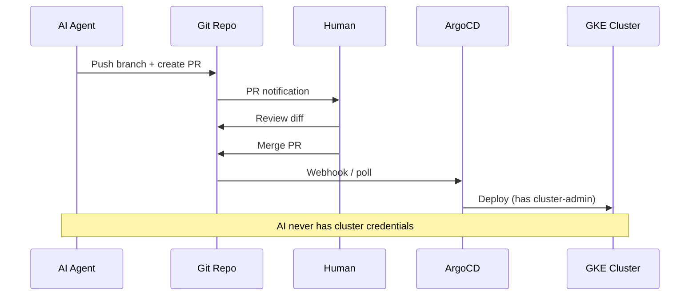
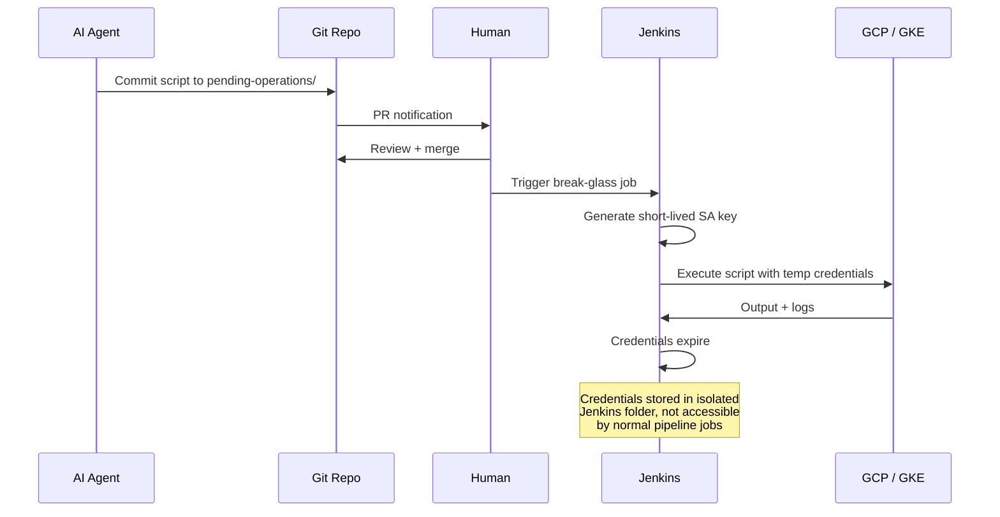

# Pattern: GitOps as Staging Queue

> Part of the [AI Agent Security Patterns](../../ai-agent-security-patterns.md) guide.

The most mature version of the staging queue. If you already use GitOps (ArgoCD, Flux),
you already have this pattern. The AI pushes a branch; a human merges; the CD system
deploys with credentials the AI never sees.

**Key machines:** Any dev machine (commit + push access), Thelio Linux (ArgoCD runs here)

## The Pattern

**What the AI needs**: Git push access to the repo. Read-only cluster access (`roles/container.viewer`) for observing current state.

**What the AI never gets**: cluster-admin, cloud provider credentials, or ArgoCD's service account.

## Break-Glass for Non-GitOps Operations

Some operations can't flow through GitOps: initial cluster creation, emergency debugging, one-off migrations.

**Jenkins implementation:**
- A dedicated Jenkins job (`break-glass-executor`) in its own folder
- Reads a script from `pending-operations/` in the repo
- Generates a short-lived GCP service account key (or uses workload identity)
- Executes the script, logs full output for audit
- Credentials expire after execution (1 hour max)
- The live GCP credentials are in a **dedicated Jenkins credentials folder** — normal pipeline jobs in other folders cannot access them, so a malicious Jenkinsfile edit elsewhere cannot grab unrelated prod credentials

**GKE-specific roles for the break-glass service account:**
- `roles/container.admin` (manage clusters)
- `roles/storage.admin` (for Velero/backups)
- `roles/iam.serviceAccountUser` (to bind workload identity)
- NOT `roles/owner` or `roles/editor`

## In Your Homelab

ArgoCD runs on Thelio (k3s cluster). The break-glass executor pattern applies to any
cluster operation that can't flow through GitOps — initial cluster setup, emergency
debugging, one-off migrations.

The AI (on M1 or Intel Mac) pushes branches and opens PRs. It has read-only cluster
access for observing state. It never has cluster-admin credentials.
See [Nordri bootstrap docs](../../.agent/skills/nordri-bootstrap-guide/SKILL.md) for
the actual cluster setup.
