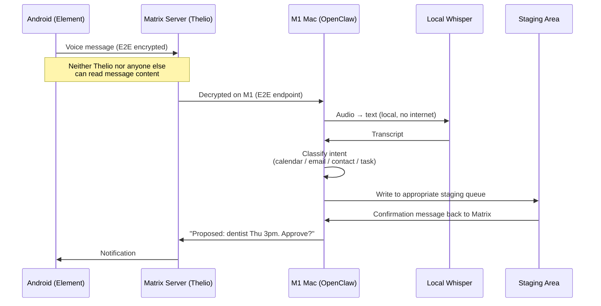
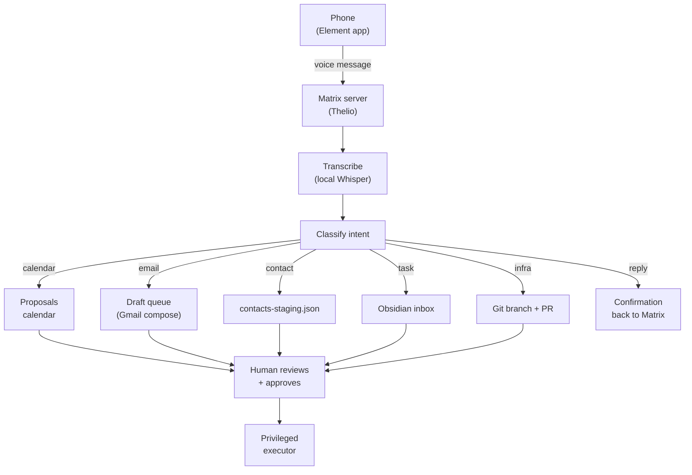

# Pattern: Voice-to-Action Pipeline

> Part of the [AI Agent Security Patterns](../../ai-agent-security-patterns.md) guide.

Speak into the Element app on your Android phone. The message goes E2E-encrypted to your
Matrix server on Thelio. The Matrix bot forwards it to OpenClaw on the M1 Mac. A local
Whisper instance transcribes it. The transcript is classified by intent, and a staging
entry is written to the appropriate queue. You review and approve.

**Key machines:** Android phone → Thelio (Matrix server) → M1 MacBook Pro (transcription + classify)

## End-to-End Flow

## Intent Classification and Staging

## Transcription in Your Setup

You have local Whisper available on the M1 Mac (Apple Silicon runs it efficiently).
Use local Whisper for all Matrix voice input — the content is sensitive (personal plans,
health, scheduling) and should not leave your infrastructure.

For the Intel Mac / Discord bot: cloud transcription is acceptable since that channel
carries only community/research content with no sensitive data.

| Method | Privacy | Latency | Use for |
|--------|---------|---------|---------|
| Local Whisper (M1 Mac) | High — audio never leaves device | Slightly higher | Matrix: personal/sensitive voice |
| Cloud API (OpenAI, Google) | Lower — audio sent to internet | Lower | Discord: community/public voice |

## Why Matrix over WhatsApp/Discord for Sensitive Input

- **Self-hosted**: Messages stay on your infrastructure (Thelio)
- **E2E encrypted**: Even the server admin can't read messages
- **Bot-friendly**: Well-documented bot SDK, no Terms of Service risk
- **Bridgeable**: Can bridge to other platforms if needed
- **No vendor lock-in**: Standards-based protocol (unlike proprietary APIs)

Using Discord for sensitive voice input would expose content to Discord's servers and
create a dependency on their platform availability and policies.
