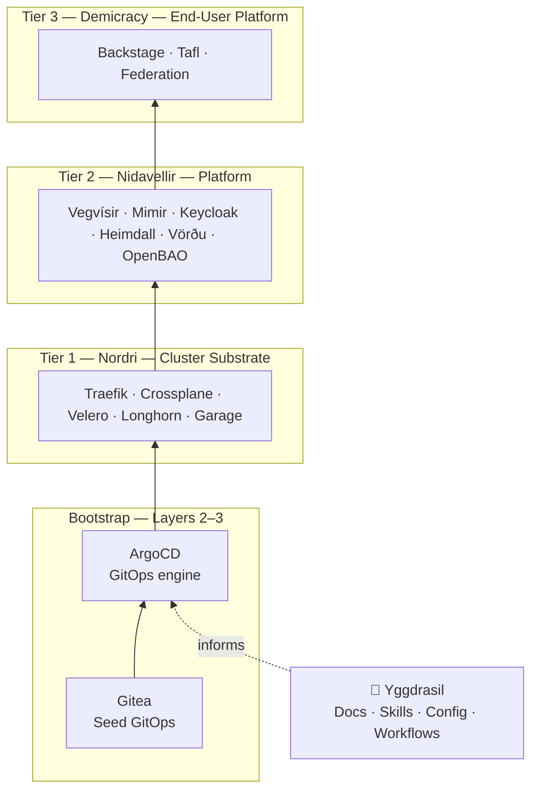

# Yggdrasil Ecosystem Architecture

## Overview

The Yggdrasil ecosystem is a self-hosted, cloud-portable platform organized as three
deployment tiers, each sitting on top of the previous. A single Kubernetes cluster
(GKE or k3s/k3d) runs all tiers via GitOps, managed by one ArgoCD instance that
Nordri bootstraps.

**Yggdrasil itself** is the conceptual and documentary root — not a deployable. It holds
architecture docs, agent skills, workflow strategies, and the project constellation map
that makes sense of everything else.

## Three-Tier Architecture



The arrows read as **"provides the foundation for"**:
- ArgoCD (bootstrapped) deploys Nordri's cluster substrate
- Nordri deploys Nidavellir as its app-of-apps
- Nidavellir deploys Demicracy as its app-of-apps

Each tier only holds the reference to the tier directly above it. Nordri has no
knowledge of Demicracy.

## Tier Breakdown

### Tier 1: Nordri — Cluster Substrate
**Repo**: `nordri` / github.com/SiliconSaga/nordri

Nordri is one of the dwarves that holds up the sky in Norse mythology. All other tiers depend on this:

| Component | Purpose | Environment |
|-----------|---------|-------------|
| Traefik | Gateway controller + LoadBalancer | All |
| Crossplane | Infrastructure vending (Kubernetes, Helm) | All |
| Velero | Cluster backups to object storage | All |
| Longhorn | Distributed block storage | Homelab only |
| Garage S3 | Self-hosted object storage | Homelab only |

Nordri's `platform/argocd/` holds one entry-point Application per tier above it:
currently `nidavellir-apps.yaml` (pointing at `nidavellir/apps/`).

### Tier 2: Nidavellir — Platform
**Repo**: `nidavellir` / github.com/SiliconSaga/nidavellir

The Star Forge — the developer platform everything is built on:

| Component | Purpose | Status |
|-----------|---------|--------|
| Vegvísir | Shared Traefik Gateway + cert-manager + TLS | Active |
| Mimir | Data services (PostgreSQL, MySQL, MongoDB, Kafka, Valkey) | Active |
| Heimdall | Observability (Prometheus, Grafana, Loki, Tempo, Thanos) | Planned |
| Keycloak | Identity and SSO | Planned |
| Vörðu | BDD roadmap visualization | Active |
| OpenBAO | Secrets management | Planned |

Nidavellir's `apps/` directory holds one Application manifest per component, plus the
`demicracy-apps.yaml` entry point that bootstraps Tier 3.

**Deployment ordering** within Tier 2 is controlled by ArgoCD sync waves:

| Wave | Component | Notes |
|------|-----------|-------|
| 5 | Vegvisir | Gateway + TLS must be available first |
| 7 | Mimir | Data services for Keycloak and applications |
| 10 | Heimdall | Observability; no hard dependency on Mimir |
| 10 | Keycloak | Identity; consumes Mimir Postgres |
| — | OpenBAO, Vordu | Not yet deployed |

### Tier 3: Demicracy — End-User Platform
**Repo**: `demicracy` / github.com/SiliconSaga/demicracy

Civics, collaboration, and community tooling:

| Component | Purpose | Status |
|-----------|---------|--------|
| Backstage | Developer portal and service catalog | Planned |
| Tafl + Agones | Game server hosting and routing | Planned |
| Bifrost | Cross-game federation API | Planned |
| Federation tooling | ActivityPub / decentralized infra | Future |

## Bootstrap Layers

The bootstrap sequence uses numbered **layers** (distinct from the three deployment
**tiers** above — see terminology note below):

```
Local machine
  └── bootstrap.sh [gke|homelab]
        ├── L2   Install Gitea in cluster
        ├── L2   Mirror local repos to Gitea (nordri, nidavellir, ...)
        ├── L2.5 Install Gateway API CRDs (kubectl apply)
        ├── L2.5 Install Crossplane (Helm, pre-ArgoCD)
        ├── L2.6 Install Traefik (Helm, pre-ArgoCD, provides IngressRoute CRDs)
        ├── L2.7 Install Crossplane providers + functions (wait Healthy)
        ├── L2.8 Install Crossplane ProviderConfigs + RBAC
        ├── L3   Install ArgoCD (Helm)
        └── L4   Apply nordri root-app.yaml → ArgoCD takes over:
                    ├── layer4-fundamentals (Nordri Tier 1 components)
                    └── nidavellir (Nidavellir Tier 2 app-of-apps)
                              ├── vegvisir (Gateway + TLS)
                              ├── mimir (data services)
                              ├── ... (Keycloak, Heimdall, etc.)
                              └── demicracy (Demicracy Tier 3 app-of-apps)
                                        ├── backstage
                                        └── ...
```

## Terminology Note

Two separate numbering schemes exist:

| Term | Meaning | Example |
|------|---------|---------|
| **Layer** (L2, L2.5, L3...) | Bootstrap sequence step | "Layer 2.6 pre-installs Traefik" |
| **Tier** (1, 2, 3) | App-of-apps deployment group | "Nidavellir is Tier 2" |

## Repository Map

| Repo | Tier | Role |
|------|------|------|
| `yggdrasil` | — | Docs, skills, config, workspace root |
| `nordri` | Tier 1 | Cluster substrate app-of-apps |
| `nidavellir` | Tier 2 | Platform app-of-apps; deploys Tier 3 |
| `mimir` | Tier 2 component | Data services (Crossplane + operators) |
| `heimdall` | Tier 2 component | Observability stack |
| `vordu` | Tier 2 component | Roadmap visualization web app |
| `demicracy` | Tier 3 | End-user platform app-of-apps |
| `tafl` | Tier 3 component | Game server orchestration |

## Workspace Structure

Component repos live inside yggdrasil under `components/`:

```
yggdrasil/
  ecosystem.yaml            # Manifest: components, tiers, chart versions, values
  ecosystem.local.yaml      # Per-developer overrides (gitignored)
  components/
    nordri/                  # Independent Git repo (gitignored)
    nidavellir/
    mimir/
    vordu/
    heimdall/
    ymir/
  .generated/
    applications/            # ArgoCD manifests from ws-resolve.sh (gitignored)
```

### Dual-Mode Source Resolution

Each component can be consumed in two ways:

1. **Source mode** (local Git checkout exists): ArgoCD syncs from the Git repo
   (via internal Gitea mirror). Used during development.
2. **Chart mode** (no local checkout): ArgoCD installs a pre-built Helm chart
   from the OCI registry. Used for stable dependencies you aren't actively changing.

The `scripts/ws-resolve.sh` script auto-detects which mode applies per component
and generates the appropriate ArgoCD Application manifests.

Developers can override resolution per-component via `ecosystem.local.yaml`:
- `forceChart: true` — use chart even when local source exists
- Override `values:` for local environment specifics
- Toggle `disabled` to include/exclude components

See `ecosystem.yaml` for the full component inventory.

## Environments

| Environment | Kubernetes | Storage | Notes |
|-------------|-----------|---------|-------|
| `homelab` | k3d (local) | Longhorn + Garage S3 | Traefik built-in to k3s disabled; Nordri installs its own |
| `gke` | GKE (cloud) | GCS | No Garage/Longhorn; cert-manager may be pre-installed |

## Related Docs

- `project-constellation.md` — Detailed narrative description of each project
- `nidavellir/vegvisir/README.md` — Vegvísir routing/TLS ownership and GitHub transition
- `nordri/docs/bootstrap.md` — Nordri bootstrap runbook
- `nordri/scripts/gke-provision.sh` — GKE test cluster provisioning
