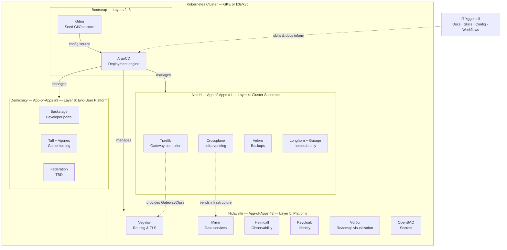

# Yggdrasil Ecosystem Architecture

## Overview

The Yggdrasil ecosystem is a self-hosted, cloud-portable platform organized as three
concentric layers of concern. A single Kubernetes cluster (GKE or k3s/k3d) runs all
layers via GitOps, managed by one ArgoCD instance that is bootstrapped by Nordri.

**Yggdrasil itself** is the conceptual and documentary root — not a deployable. It holds
architecture docs, agent skills, workflow strategies, and the project constellation map
that makes sense of everything else.

## Three-Tier App-of-Apps Model



## Layer Breakdown

### Layer 1: The Metal
Raw Kubernetes — either GKE (managed) or k3s/k3d (self-hosted). Provisioned by scripts
before any GitOps tooling exists.

### Layers 2–3: Bootstrap (Gitea + ArgoCD)
`bootstrap.sh [gke|homelab]` handles this entirely:
1. Installs Gitea in-cluster as the seed GitOps store
2. Mirrors repo content from local workspace into Gitea (Nordri, Nidavellir, ...)
3. Installs ArgoCD, points it at the Gitea-hosted Nordri root app

After bootstrap, ArgoCD manages everything via GitOps. Gitea serves as the source of
truth until the cluster is stable enough to swap to GitHub (see transition docs in
`nidavellir/vegvisir/README.md`).

### Layer 4: Nordri — Cluster Substrate
**Repo**: `refr-k8s` / [github.com/SiliconSage/refr-k8s](https://github.com/SiliconSage/refr-k8s)

The dwarves that hold up the sky. Everything else depends on this layer:

| Component | Purpose | Environment |
|-----------|---------|-------------|
| Traefik | Gateway controller + LoadBalancer | All |
| Crossplane | Infrastructure vending (Kubernetes, Helm) | All |
| Velero | Cluster backups to object storage | All |
| Longhorn | Distributed block storage | Homelab only |
| Garage S3 | Self-hosted object storage | Homelab only |

Nordri also bootstraps the **app-of-apps entry points** for Nidavellir and Demicracy —
ArgoCD Applications that point to those repos' `apps/` directories.

### Layer 5: Nidavellir — Platform
**Repo**: `nidavellir` / [github.com/SiliconSage/nidavellir](https://github.com/SiliconSage/nidavellir)

The Star Forge — the developer platform on top of which everything is built:

| Component | Purpose | Status |
|-----------|---------|--------|
| Vegvísir | Shared Traefik Gateway + cert-manager + TLS | Active |
| Mimir | Data services (PostgreSQL, MySQL, MongoDB, Kafka, Valkey) | Active |
| Heimdall | Observability (Prometheus, Grafana, Loki, Tempo) | Planned |
| Keycloak | Identity and SSO | Planned |
| Vörðu | BDD roadmap visualization (Node.js web app) | Planned |
| OpenBAO | Secrets management | Planned |

Nidavellir's `apps/` directory holds ArgoCD Application manifests for each component.
Nordri's ArgoCD uses a single `nidavellir-apps.yaml` entry to manage this entire layer.

### Layer 6: Demicracy — End-User Platform
**Repo**: `demicracy` / [github.com/SiliconSage/demicracy](https://github.com/SiliconSage/demicracy)

Civics, collaboration, and community tooling:

| Component | Purpose | Status |
|-----------|---------|--------|
| Backstage | Developer portal and service catalog | Planned |
| Tafl + Agones | Game server hosting and routing | Planned |
| Bifrost | Cross-game federation API | Planned |
| Federation tooling | Homelab + ActivityPub / decentralized infra | Future |

## Repository Map

| Repo | Layer | Role |
|------|-------|------|
| `yggdrasil` | — | Docs, skills, config, workspace root |
| `refr-k8s` (Nordri) | L4 | Cluster substrate app-of-apps |
| `nidavellir` | L5 | Platform app-of-apps |
| `mimir` | L5 component | Data services (Crossplane + operators) |
| `heimdall` | L5 component | Observability stack |
| `vordu` | L5 component | Roadmap visualization web app |
| `demicracy` | L6 | End-user platform app-of-apps |
| `tafl` | L6 component | Game server orchestration |

## Bootstrap Sequence

```
Local machine
  └── bootstrap.sh [gke|homelab]
        ├── Install Gitea in cluster
        ├── Mirror: nordri → gitea/nordri
        ├── Mirror: nidavellir → gitea/nidavellir
        ├── Install Gateway API CRDs (kubectl apply)
        ├── Install Crossplane (Helm, pre-ArgoCD)
        ├── Install Traefik (Helm, pre-ArgoCD)
        ├── Install Crossplane providers + configs
        ├── Install ArgoCD (Helm)
        └── Apply nordri root-app.yaml
              └── ArgoCD takes over:
                    ├── layer4-fundamentals (Nordri components)
                    ├── nidavellir-apps (Nidavellir app-of-apps → nidavellir/apps/)
                    │     ├── vegvisir (Gateway + TLS)
                    │     ├── mimir (data services)
                    │     └── ... (Keycloak, Heimdall, etc.)
                    └── demicracy-apps (Demicracy app-of-apps → demicracy/apps/)
                          ├── backstage
                          └── ...
```

## Environments

| Environment | Kubernetes | Notes |
|-------------|-----------|-------|
| `homelab` | k3d (local) | Gitea, Garage S3, Longhorn; Traefik built-in |
| `gke` | GKE (cloud) | No Garage/Longhorn; cert-manager may be pre-installed |

Nordri's `bootstrap.sh [gke|homelab]` selects the correct Kustomize overlay.
The same app-of-apps structure (Nordri → Nidavellir → Demicracy) works identically
in both environments.

## Related Docs

- `project-constellation.md` — Detailed narrative description of each project
- `nidavellir/vegvisir/README.md` — Vegvísir routing/TLS ownership and GitHub transition
- `refr-k8s/docs/bootstrap.md` — Nordri bootstrap runbook
- `refr-k8s/scripts/gke-provision.sh` — GKE test cluster provisioning
