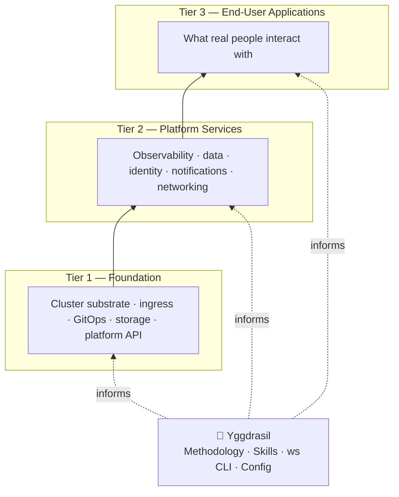

# Yggdrasil Ecosystem Architecture

> 🌱 **Yggdrasil** is the **GDD framework + workspace tooling** root — realm-agnostic and not a deployable itself. It holds the methodology, the agent skills, the `ws` CLI, and the configuration that lets *any* community realm declare its own stack on top.

## A Bit of History

Yggdrasil started as a platform-engineering experiment — a single workspace where one human (with AI collaborators) could design and deploy a homelab + cloud stack end-to-end across a constellation of repos. That original experiment grew into the **SiliconSaga** realm, which now carries the actual platform components (Norðri, Nidavellir, Heimdall, Mimir, etc. — they have great names so they get a shout-out and stay as the canonical worked-examples throughout the docs).

As the experiment matured, the methodology generalized. The patterns for "how an AI agent + a human collaborate across a multi-repo workspace" turned out to be useful well beyond any one homelab. That methodology is now **Guardian Driven Development (GDD)**, and it lives here in upstream Yggdrasil. Stack-specific details (which components, which adapters, which infrastructure) live in realm repos.

The result: this Yggdrasil repo is now focused on **realm-agnostic** concerns — the GDD framework, the `ws` CLI, the docs that explain both. The original SiliconSaga platform components moved to their own org and a community realm so the upstream stays lean enough to be adopted by anyone who wants to run their own stack.

## The Three-Tier Model

GDD's view of a deployable realm is a three-tier stack, regardless of what the realm chooses to put in each tier:


```mermaid
graph BT
    YGG["🌱 Yggdrasil<br/>Methodology · Skills · ws CLI · Config"]

    subgraph T1["Tier 1 — Foundation"]
        F["Cluster substrate · ingress · GitOps · storage · platform API"]
    end

    subgraph T2["Tier 2 — Platform Services"]
        P["Observability · data · identity · notifications · networking"]
    end

    subgraph T3["Tier 3 — End-User Applications"]
        A["What real people interact with"]
    end

    F --> P
    P --> A
    YGG -. "informs" .-> F
    YGG -. "informs" .-> P
    YGG -. "informs" .-> A
```

Arrows read as **"provides the foundation for"** — each tier only knows about the tier directly above it.

| Tier | Role | SiliconSaga realm example |
|------|------|---------------------------|
| **1** | Foundation — cluster substrate | `nordri` (ingress, GitOps controller, storage, platform API) |
| **2** | Platform services | `nidavellir` (platform app-of-apps), plus capability components like observability / data / notifications |
| **3** | End-user applications | The apps real people actually interact with |

Tiers 1–3 are *deployable* tiers — they describe where a component sits in the stack's dependency chain. A realm's `ecosystem.yaml` may also declare components in two **non-stack roles** that sit outside this chain: `test` (throwaway fixtures that validate the tooling itself, e.g. SiliconSaga's `echo-test`) and `vendor` (third-party mirrors — see below).

For the concrete SiliconSaga stack — what's in each tier, the GitOps model, the alert pipeline, the cluster-identity pattern — see the realm-side narrative at [SiliconSaga/realm-siliconsaga: `docs/stack.md`](https://github.com/SiliconSaga/realm-siliconsaga/blob/main/docs/stack.md) (and the per-tier docs alongside it). If you've cloned the realm via `ws realm`, the same file is at `realms/realm-siliconsaga/docs/stack.md` locally. Other realms describe their own stacks the same way.

## Workspace Structure

Component repos live inside yggdrasil under `components/`. Community-specific configuration lives in realm repos under `realms/`.

```text
yggdrasil/
  ecosystem.yaml            # Upstream defaults (generic, no components)
  ecosystem.local.yaml      # Per-developer overrides (gitignored)
  components/
    nordri/                 # Independent Git repo (gitignored)
    heimdall/
    mimir/
    ...
  realms/
    realm-siliconsaga/      # Community realm (gitignored, independent repo)
      ecosystem.yaml        # Components, identity, defaults
      adapters/             # Per-component build/test commands
      docs/                 # Realm-side narrative + tier docs
    realm-template/         # Tutorial realm
```

### Three-Layer Config Merge

Configuration is assembled from three layers, merged in order:

```text
ecosystem.yaml (upstream Yggdrasil — generic defaults)
    ↓ deep merge
realms/<active>/ecosystem.yaml (community config — components, identity)
    ↓ deep merge
ecosystem.local.yaml (per-developer overrides)
```

All `ws` commands read the merged result. Realms own the component list; upstream provides methodology and tooling.

> **Inheritance future:** the merge generalizes to N layers if multi-realm chains land later (e.g. corp → dept → team). No new identifier needed — the same upstream → realm(s) → local pattern with child-wins semantics. See [Realms and Hoards Design](plans/2026-04-24-realms-and-hoards-design.md#future-directions).

## Realms — Where Stack Choice Lives

A realm is a small git repo containing community-specific configuration. The GDD-side conceptual model (what realms are, how `ws realm` works, how adapters wire per-component commands, how identity / authentication is configured) lives with the GDD methodology docs:

- [`docs/gdd/realms.md`](gdd/realms.md) — realms concept + lifecycle
- [`docs/gdd/adapters.md`](gdd/adapters.md) — per-component adapters
- [`docs/gdd/access.md`](gdd/access.md) — identity / authentication
- [`docs/gdd/cr-internals.md`](gdd/cr-internals.md) — cross-fork CR mechanics + the two-token model

`ws realm` quick reference:

```bash
ws realm init              # Clone the template realm (tutorials)
ws realm <git-url>         # Clone a community realm
ws realm list              # Show available realms
ws realm use <name>        # Switch active realm
```

## Deployment Manifest Generation (removed)

The workspace once shipped a `ws resolve` command that read these ecosystem fields and generated ArgoCD `Application` manifests — a "dual-mode source resolution" that picked Git-source vs. pre-built-chart per component. It was early-design and went unused: real stacks deploy from their own hand-authored app-of-apps (richer than the flat generator — sync-waves, per-app sync options, namespaces), and generating ArgoCD apps is a stack/infra concern rather than a GDD-framework one. So it was removed.

The classification fields it relied on still live in the ecosystem schema — `tier` is consumed by `ws list`/`ws clone` for repo roles, and a realm's own deploy tree decides Git-vs-chart per app. The theory behind the generator (dual-mode resolution, the `forceChart`/`values`/`disabled` overrides) and a vision for a future redo — e.g. scaffolding a starter app-of-apps when bootstrapping a brand-new stack — is parked as a realm/stack-side concern in [SiliconSaga/realm-siliconsaga#17](https://github.com/SiliconSaga/realm-siliconsaga/issues/17).

## Vendored Mirrors (`tier: vendor`)

Sometimes a realm needs to deploy manifests it does **not** author — an upstream operator's CRDs + controller, a third-party chart's raw YAML, anything where the bytes are owned elsewhere but a GitOps deploy needs them at a pinned version. The naive options both have real costs:

- **Vendor the files into a component repo you maintain.** A single operator's CRDs can be tens of thousands of lines. They dwarf your own code on contribution/LOC stats, bloat code-review (and review-bot context budgets), and can choke IDE/agent indexers — all for bytes you never edit and review adds nothing to.
- **Sync ArgoCD straight from the upstream GitHub URL.** Reproducibility now depends on the internet and on an upstream tag staying immutable, and a foundational app reaches outside your trust boundary on every refresh.

The `vendor` role is the third option: a realm declares the upstream repo as its own component (`tier: vendor`), held as an **individual, intact mirror** — full history and tags — under the realm's org. The bytes live in a dedicated repo that *isn't one you maintain*, so they never touch your maintained repos' stats, review surface, or local indexers, while staying first-class in the workspace:

- **`ws clone`** fetches the mirror naturally alongside every other component, so a from-scratch workspace gets it without special steps.
- **Hydration** (the GitOps source-of-truth push — SiliconSaga's seed-Gitea flow) pushes the mirror's *real history and tags* (not the orphan-commit snapshot used for maintained repos), so an in-cluster ArgoCD app can pin an exact upstream tag (`targetRevision: <tag>`) against the local copy.
- **Not an ArgoCD app itself.** A mirror is a *source repo*, not a deployable — like the other non-deployable tiers (`supporting`/`test`), nothing generates an `Application` for it. It reaches a cluster only through a *real* component's app that pins it (e.g. `repoURL: <git-host>/<mirror>.git`, `targetRevision: <tag>`); the pin lives on that consuming app, not in `ecosystem.yaml`.
- **Updating** is re-syncing the mirror from upstream and bumping the pin — the same deliberate, auditable upgrade ceremony as vendoring, just relocated out of the maintained tree.

A vendor mirror is **read-only**: never commit local edits to it (that would fork it from upstream). If you need to modify upstream manifests, that's a real component you maintain, not a mirror. Whether mirrors stay manually re-synced or become self-maintaining (e.g. a platform Git host's native pull-mirror feature) is a realm-infrastructure choice, not a GDD-framework concern.

> SiliconSaga worked example: the Keycloak operator ships as the `keycloak-k8s-resources` vendor mirror, pinned to a tag by Nidavellir's `keycloak-operator` ArgoCD app — keeping ~18k lines of operator CRD schema out of the Nidavellir repo entirely. Upstream Yggdrasil declares no vendor components itself; the role exists in the framework for any realm to use.

## Related Docs

- [`docs/gdd/index.md`](gdd/index.md) — Guardian Driven Development overview.
- [`docs/workspace-setup.md`](workspace-setup.md) — prerequisites, PATH, workspace shape, agent permissions.
- [`docs/ws-cli-guide.md`](ws-cli-guide.md) — full `ws` CLI reference.
- For the SiliconSaga-flavoured concrete stack: [SiliconSaga/realm-siliconsaga: `docs/stack.md`](https://github.com/SiliconSaga/realm-siliconsaga/blob/main/docs/stack.md) and the per-tier docs alongside it (locally at `realms/realm-siliconsaga/docs/stack.md` once you've cloned the realm).
