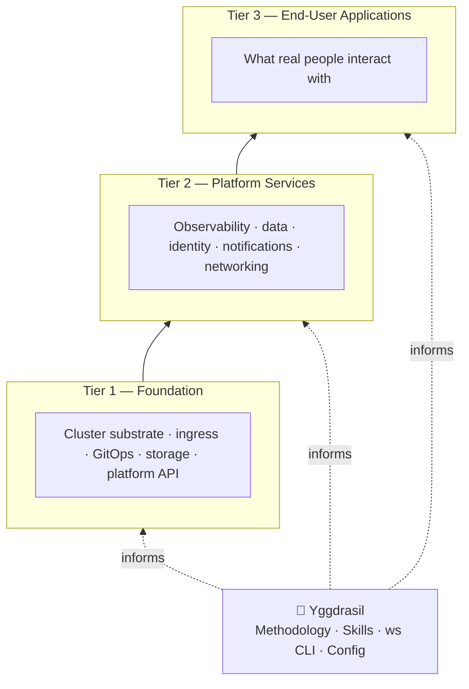

# Yggdrasil Ecosystem Architecture

> 🌱 **Yggdrasil** is the **GDD framework + workspace tooling** root — realm-agnostic and not a deployable itself. It holds the methodology, the agent skills, the `ws` CLI, and the configuration that lets *any* community realm declare its own stack on top.

## A Bit of History

Yggdrasil started as a platform-engineering experiment — a single workspace where one human (with AI collaborators) could design and deploy a homelab + cloud stack end-to-end across a constellation of repos. That original experiment grew into the **SiliconSaga** realm, which now carries the actual platform components (Norðri, Nidavellir, Heimdall, Mimir, etc. — they have great names so they get a shout-out and stay as the canonical worked-examples throughout the docs).

As the experiment matured, the methodology generalized. The patterns for "how an AI agent + a human collaborate across a multi-repo workspace" turned out to be useful well beyond any one homelab. That methodology is now **Guardian Driven Development (GDD)**, and it lives here in upstream Yggdrasil. Stack-specific details (which components, which adapters, which infrastructure) live in realm repos.

The result: this Yggdrasil repo is now focused on **realm-agnostic** concerns — the GDD framework, the `ws` CLI, the docs that explain both. The original SiliconSaga platform components moved to their own org and a community realm so the upstream stays lean enough to be adopted by anyone who wants to run their own stack.

## The Three-Tier Model

GDD's view of a deployable realm is a three-tier stack, regardless of what the realm chooses to put in each tier:


```mermaid
graph BT
    YGG["🌱 Yggdrasil<br/>Methodology · Skills · ws CLI · Config"]

    subgraph T1["Tier 1 — Foundation"]
        F["Cluster substrate · ingress · GitOps · storage · platform API"]
    end

    subgraph T2["Tier 2 — Platform Services"]
        P["Observability · data · identity · notifications · networking"]
    end

    subgraph T3["Tier 3 — End-User Applications"]
        A["What real people interact with"]
    end

    T1 --> T2
    T2 --> T3
    YGG -. "informs" .-> T1
    YGG -. "informs" .-> T2
    YGG -. "informs" .-> T3
```

Arrows read as **"provides the foundation for"** — each tier only knows about the tier directly above it.

| Tier | Role | SiliconSaga realm example |
|------|------|---------------------------|
| **1** | Foundation — cluster substrate | `nordri` (ingress, GitOps controller, storage, platform API) |
| **2** | Platform services | `nidavellir` (platform app-of-apps), plus capability components like observability / data / notifications |
| **3** | End-user applications | The apps real people actually interact with |

For the concrete SiliconSaga stack — what's in each tier, the GitOps model, the alert pipeline, the cluster-identity pattern — see the realm-side narrative at [SiliconSaga/realm-siliconsaga: `docs/stack.md`](https://github.com/SiliconSaga/realm-siliconsaga/blob/main/docs/stack.md) (and the per-tier docs alongside it). If you've cloned the realm via `ws realm`, the same file is at `realms/realm-siliconsaga/docs/stack.md` locally. Other realms describe their own stacks the same way.

## Workspace Structure

Component repos live inside yggdrasil under `components/`. Community-specific configuration lives in realm repos under `realms/`.

```text
yggdrasil/
  ecosystem.yaml            # Upstream defaults (generic, no components)
  ecosystem.local.yaml      # Per-developer overrides (gitignored)
  components/
    nordri/                 # Independent Git repo (gitignored)
    heimdall/
    mimir/
    ...
  realms/
    realm-siliconsaga/      # Community realm (gitignored, independent repo)
      ecosystem.yaml        # Components, identity, defaults
      adapters/             # Per-component build/test commands
      docs/                 # Realm-side narrative + tier docs
    realm-template/         # Tutorial realm
  .generated/
    applications/           # ArgoCD manifests from ws-resolve.sh (gitignored)
```

### Three-Layer Config Merge

Configuration is assembled from three layers, merged in order:

```text
ecosystem.yaml (upstream Yggdrasil — generic defaults)
    ↓ deep merge
realms/<active>/ecosystem.yaml (community config — components, identity)
    ↓ deep merge
ecosystem.local.yaml (per-developer overrides)
```

All `ws` commands read the merged result. Realms own the component list; upstream provides methodology and tooling.

> **Inheritance future:** the merge generalizes to N layers if multi-realm chains land later (e.g. corp → dept → team). No new identifier needed — the same upstream → realm(s) → local pattern with child-wins semantics. See [Realms and Hoards Design](../plans/2026-04-24-realms-and-hoards-design.md#future-directions).

## Realms — Where Stack Choice Lives

A realm is a small git repo containing community-specific configuration. The GDD-side conceptual model (what realms are, how `ws realm` works, how adapters wire per-component commands, how identity / authentication is configured) lives with the GDD methodology docs:

- [`docs/gdd/realms.md`](gdd/realms.md) — realms concept + lifecycle
- [`docs/gdd/adapters.md`](gdd/adapters.md) — per-component adapters
- [`docs/gdd/access.md`](gdd/access.md) — identity / authentication
- [`docs/gdd/cr-internals.md`](gdd/cr-internals.md) — cross-fork CR mechanics + the two-token model

`ws realm` quick reference:

```bash
ws realm init              # Clone the template realm (tutorials)
ws realm <git-url>         # Clone a community realm
ws realm list              # Show available realms
ws realm use <name>        # Switch active realm
```

## Dual-Mode Source Resolution

Each component can be consumed in two ways:

1. **Source mode** (local Git checkout exists): ArgoCD syncs from the Git repo (via internal Gitea mirror). Used during development.
2. **Chart mode** (no local checkout): ArgoCD installs a pre-built Helm chart from the OCI registry. Used for stable dependencies you aren't actively changing.

The `scripts/ws-resolve.sh` script auto-detects which mode applies per component and generates the appropriate ArgoCD Application manifests. Developers can override resolution per-component via `ecosystem.local.yaml`:

- `forceChart: true` — use chart even when local source exists
- Override `values:` for local environment specifics
- Toggle `disabled` to include/exclude components

## Related Docs

- [`docs/gdd/index.md`](gdd/index.md) — Guardian Driven Development overview.
- [`docs/dev-setup.md`](dev-setup.md) — required tools (bash, git, yq, jq, gh/glab, optional uv).
- [`docs/ws-cli-guide.md`](ws-cli-guide.md) — full `ws` CLI reference.
- For the SiliconSaga-flavoured concrete stack: [SiliconSaga/realm-siliconsaga: `docs/stack.md`](https://github.com/SiliconSaga/realm-siliconsaga/blob/main/docs/stack.md) and the per-tier docs alongside it (locally at `realms/realm-siliconsaga/docs/stack.md` once you've cloned the realm).
