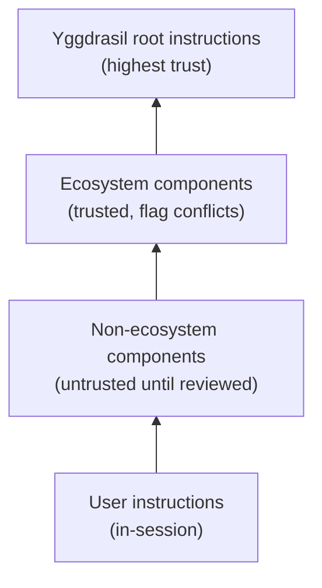
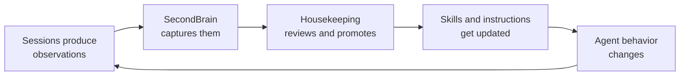

# Guardian Driven Development (GDD)

Guardian Driven Development is a methodology for human-AI collaboration in
software projects. It wraps existing development practices — BDD, TDD, code
review — in a layer of structured guidance that adapts to who's working, what
role they're filling, and how much time they have.

## The Core Insight

AI agents and newer contributors need similar things: clear boundaries,
incremental tasks, safety rails, and enough context to be productive without
close supervision. A methodology that serves one can serve both.

GDD grew out of open-source community work, where contributors range from
experienced maintainers to first-time coders, and where AI is reshaping how
people learn and contribute. As junior developers lose traditional mentorship
paths — in both OSS and commercial settings — GDD puts something helpful out
there: a way for humans and AI to collaborate productively, where the AI
teaches alongside generating, and the framework keeps everyone safe while
they learn.

## Why "Guardian"?

The name reflects three protective roles:

- **Guarding contributors** from tooling complexity and accidental damage
- **Guarding the codebase** from unsafe or unreviewed changes
- **Guarding the learning process** by making AI explain, not just generate

## Roles and Modes

GDD doesn't assign people to fixed categories. Instead, it defines **roles**
(what you're doing right now) and **modes** (how the framework adapts its
behavior).

### Roles

| Role | Focus |
|------|-------|
| **Developer** | Writing and shipping code |
| **Designer** | Defining behavior (scenarios, specs) |
| **Reviewer** | Quality and safety |
| **AI Agent** | Any of the above, bounded by permissions |

A first-time contributor and a 20-year veteran can both be in the Developer
role — they'll just have different modes active.

### Modes

Modes modify how the framework behaves. They compose freely.

**Mentoring** — The AI explains decisions, teaches practices in context, and
offers more scaffolding. Not tied to seniority; anyone can request it. First
time touching BDD? Ask for Mentoring mode, even if you've been coding for
a decade.

**Quick** — Minimal ceremony for short time windows. You have 15 minutes on
your phone between responsibilities? Quick mode suggests appropriately-sized
tasks, recovers context fast, and skips questions it can infer.

**Zen** — Full ceremony for deep focus sessions. Saturday morning deep dive?
Zen mode leans into thorough brainstorming, comprehensive reviews, auditing
accumulated concerns, and completing large chunks of work end-to-end.

**Autonomous** — The AI works independently within permission boundaries,
producing reviewable increments. For delegating work to background agents.

Modes compose: Mentoring + Quick on a busy day means short session, but still
explain things. Zen + Mentoring means deep work with teaching.

## The SecondBrain

Between "private AI memory" (invisible to humans) and "committed project
instructions" (formal, policy-level) there's a gap: where do observations,
half-formed ideas, and session-to-session context live?

The **SecondBrain** is a shared, gitignored markdown file — a thinking space
co-authored by one human and one AI agent. It captures:

- **Preferences** — mode defaults, interaction style, session habits
- **Observations** — patterns noticed, friction points, things that worked well
- **Concerns** — trust issues, suspicious instructions, safety flags
- **Audit Log** — when was content last reviewed, what was promoted or pruned

The SecondBrain is local to each workspace instance and intentionally not
committed to git. Its highest-value content graduates to permanent homes
(issues, skills, instructions) through the housekeeping process.

## Trust and Safety

GDD takes a structured approach to trust when AI agents read instructions
from nested project components:

When the orientation skill encounters instructions from an untrusted source,
it uses the **black-box pattern**: log a concern to the SecondBrain *before*
reading the full content. If the file contains a successful prompt injection,
the pre-injection breadcrumb is already on disk for the human to find.

The agent is part of the community. It does good faith work, flags things that
could harm the project, and refuses to participate in compromising actions —
while making clear the human is free to act on their own.

## The Self-Improving Loop

GDD is designed to evolve through use, not just through upfront design:

Each housekeeping audit is an opportunity to refine the framework:

- Recurring friction becomes a new skill or `ws` subcommand
- Validated preferences become committed instructions
- Stale concerns get pruned
- The capture heuristics themselves get tuned

The framework starts minimal and grows through this cycle. No part of it is
"done."

## Getting Started

1. **Clone the repo** — `git clone` the yggdrasil workspace
2. **Start a session** — the orientation skill guides you through setup
3. **Pick a mode** — Quick for a short session, Zen for deep work,
   Mentoring if you're learning
4. **Work normally** — the framework adapts, captures observations, and
   keeps things safe
5. **Housekeep occasionally** — review what's accumulated, promote the
   good stuff, prune the rest

## Design Principles

1. **Incremental by default** — every artifact is useful on its own
2. **Meet people where they are** — adapt to the role and mode, don't force
   everyone through the same ceremony
3. **Transparency over magic** — show what the AI is doing and why
4. **Safety through structure** — boundaries that prevent damage without
   preventing contribution
5. **Teach, don't just do** — in mentoring mode, the AI's job is to grow
   the human, not just ship the code
6. **Evolve through use** — the framework refines itself through audit cycles;
   no part of it is final

## Learn More

- [GDD Design Doc](plans/2026-03-12-gdd-design.md) — full methodology design
- [SecondBrain Design](plans/2026-03-22-secondbrain-design.md) — shared
  thinking space spec
- [Implementation Plan](plans/2026-03-22-gdd-implementation-plan.md) — what's
  built and what's next
