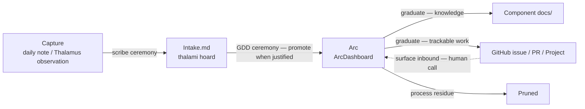

# The Organization Stack

Work in this ecosystem lives across several places: an Obsidian vault for daily life organization, the Thalamus and arcs for in-flight GDD work, component `docs/` directories for durable reference knowledge, and GitHub for trackable collaborative work. The **organization stack** names those four tiers and defines the promotion paths between them, so items move deliberately rather than drifting or getting lost.

## The four tiers

The stack is read as audience/purpose tiers, not a simple durability ladder. Durability rises roughly across the tiers but not monotonically — an Area note in the Vault is permanent, while an arc in the Thalami tier is ephemeral.

| Tier | Artifact(s) | Audience / purpose | Horizon |
|------|-------------|--------------------|---------|
| **Vault** | daily notes, project notes, area notes | You — and your agent during the scribe ceremony. Life organization, every topic: personal, GDD, work | daily: hours; project: weeks–months; area: permanent |
| **Thalami** (the thalami hoard) | per-machine `*-thalamus.md` (observations + arcs), `Intake.md`, `ArcDashboard.md` | You + your agents. GDD working memory, in-flight work | weeks–months, pruned in housekeeping |
| **Docs** (`<component>/docs/`) | repo README + docs index + topic files | Anyone reading the repo. Durable reference knowledge | permanent, versioned |
| **GitHub** | issues, PRs, the companion Project board | Collaborators / public. Trackable, durable, dynamic work | long-lived, edited live |

Both the Vault and the Thalami hoard are git-synced across machines, but differently: the Vault is one shared tree, while the Thalami hoard syncs a collection of per-machine files — each machine writes only its own `*-thalamus.md`, which is what keeps the sync merge-conflict-free. The distinction between tiers is audience: the Vault is human-facing life organization; the Thalami hoard is agent-facing GDD working memory.

Any Obsidian hoard scaffolded from the `obsidian-vault` template (`ws hoard init obsidian-vault`) plays the Vault role. Examples below name **`borgr`** — the maintainer's personal vault — as the concrete instance; the model works the same with any vault the template produces, under any name.

## The two ceremonies

Exactly two ceremonies move items across seams, both propose-then-confirm — neither moves anything silently.

**The scribe ceremony** (operating in `borgr`) owns Vault-internal drift and the Vault → Thalami bridge: daily-note bullets that have clarified their horizon drift to project or area notes, and daily-note `#gdd` bullets cross the bridge to `Intake.md` in the thalami hoard.

**The GDD ceremony** (orientation + housekeeping) owns the Thalami tier and everything to its right: `Intake.md` items are promoted to arcs when the work justifies one, arcs graduate to Docs (durable knowledge) or GitHub (trackable work), and inbound GitHub items are surfaced for the human's consideration — an arc is never created automatically from an inbound issue.

The **bridge** is the process of populating and draining `Intake.md`, not the file itself. `Intake.md` is a machine-agnostic file in the thalami hoard, sitting beside `ArcDashboard.md`, holding pre-arc GDD work items — things lifted out of a daily note that belong in GDD-land but haven't yet been shaped into an arc or assigned to a host. The scribe ceremony populates it; the GDD ceremony drains it — distributing items to the right host's `*-thalamus.md` and promoting to an arc when the work justifies one.

## Capture wide, route narrow

There are exactly two capture surfaces, and everything funnels through one. Routing happens later, in a ceremony — never at capture time.

- The **`borgr` daily note** is the universal capture surface. Any topic, captured the moment it occurs, with zero categorization required.
- The **Thalamus Observations section** is the capture surface when you are already mid-GDD-session — an idea that surfaces during work is written there rather than forcing a context-switch into the vault.

Routing — the "where does it go" decision — is driven by three questions:

1. **Horizon** — minutes/hours → stays a daily-note task. Days–weeks → arc-candidate. Bounded multi-step outcome → project. Open-ended responsibility → area.
2. **Audience** — just you / life → stays in the Vault. GDD agent work → `Intake.md` → Thalami. Reference others will read → Docs. Collaborative / trackable → GitHub.
3. **Durability** — ephemeral → leave it low; it will drift or be pruned. Durable → it must eventually reach Docs or GitHub, or it is at risk.

The "belongs in two places" problem dissolves: an item has one home for its current horizon and audience, and it moves as those change — never copied. A daily-note bullet that drifts unactioned across several days was simply mis-horizoned; the ceremony promotes it to a project, arc, or `Intake.md` rather than letting it rot in the daily note.

## Graduation

When an arc completes, its residue splits three ways:

- **Knowledge** — how something works, why a decision was made, conceptual reference — graduates to **component `docs/`**. Durable knowledge belongs in a real docs index plus topic files, not stranded in a closed arc.
- **Trackable work** — follow-ups, deferred items, anything others should see — graduates to **GitHub** as an issue or PR. The arc closes as `promoted` with a pointer to the GitHub item.
- **Process residue** — the day-to-day "did X, reviewed Y" churn — is **not** graduated. It is pruned in housekeeping. That is the ephemeral tier doing its job.

`ArcDashboard` and the GitHub Project board are **companions, not redundant**: `ArcDashboard` shows in-flight private work across your machines — ephemeral, fast, pruned. The GitHub Project board shows graduated durable work — persistent, public, edited live. An arc with `status: promoted` is the hand-off marker between the two.

## How the Docs tier is structured — the doc-shape ladder

The Docs tier has its own "start small, grow as needed" ladder, mirroring the stack as a whole. A component's documentation moves through four **shapes** as its content grows, and — like every seam here — graduation between shapes is propose-then-confirm, never automatic:

1. **Loose root Markdown** — a `README.md` plus optional root companions (`CONTRIBUTING.md`, `CHANGELOG.md`, …), no `docs/` yet. Right for anything from brand-new to small-but-focused, where everything fits in a handful of root files.
2. **Plainly structured `/docs`** — the README plus a `docs/` directory holding a `docs/README.md` index and one topic file per concept, in plain Markdown with no site config. This is the shape a graduating arc's durable knowledge lands in.
3. **Themed docs site** — adds a site config (MkDocs / Jekyll / equivalent), a theme, and navigation, and deploys to GitHub Pages. Right once navigation and search start to matter, or the audience extends beyond developers reading on GitHub.
4. **Custom site** — beyond the standard frameworks. Named only so the ladder is finite; most components never reach it.

The Shape 1 → 2 trigger is the graduation moment above: when a closing arc's durable knowledge would otherwise pile into a single root README, that is the signal to give the component a real `docs/` index plus topic files. The per-shape structure, file roles, and anti-patterns are the operational detail an agent applies when writing docs — those live in the `gdd-doc-writing` skill.

## The cadence ladder

The two ceremonies move items across seams as work happens, but the durable tier also needs periodic review — otherwise promoted issues are never looked at again. The model defines a **cadence ladder**: ceremonies keyed to horizon, not only to session boundaries.

| Cadence | Ceremony | Scope |
|---------|----------|-------|
| Per session | GDD orientation | Picks up arcs, reads the Thalamus, sets session context |
| Daily / ad-hoc | scribe micro + daily review | Vault — daily note, project-status drift |
| Weekly | scribe weekly synthesis **+ durable-tier sweep** | Vault weekly review **+ GitHub Project review** |
| Monthly | scribe monthly **+ GDD housekeeping at scale** | Thalami arc audit **+ Docs freshness + GitHub board grooming** |

The new element is the **durable-tier sweep** — a recurring walk of the GitHub Project board asking of each promoted issue: still relevant? stalled? needs an arc to actually move it? done and closeable? This keeps promoted work from rotting unseen.

The weekly and monthly passes have distinct focuses: the weekly sweep is a lightweight review (what's on the board, what's stalled); the monthly pass is grooming (deeper — re-prioritizing, closing dead items, checking Docs freshness). The durable-tier sweep is a step appended to the existing scribe weekly/monthly ceremony rather than a standalone one — the scribe weekly synthesis is already the "zoom out" moment, so the review attaches there instead of adding another ceremony to remember.

## Start small

The full stack — four tiers, two ceremonies, a cadence ladder — is the complete picture, but it is not all-or-nothing. You can adopt a subset and grow into the rest:

- **Vault only.** Use `borgr` and the scribe ceremony for life organization. No Thalami bridge, no arcs, no GitHub Project. A complete, useful system on its own.
- **+ Thalami.** Add arcs and `ArcDashboard` for in-flight GDD work; the bridge connects the daily note to `Intake.md`. Where most solo GDD users will sit.
- **+ Docs / GitHub.** Add the graduation seams and the companion GitHub Project once work is durable or collaborative enough to warrant them.

Each tier is independently useful; each seam is dormant until the tier on its far side is in use. The model degrades gracefully — a missing tier means its seam is unused, not broken, and the routing rule still works: items just have fewer possible homes.

Full design and rationale: [organization-stack design doc](../plans/2026-05-19-organization-stack-design.md).
