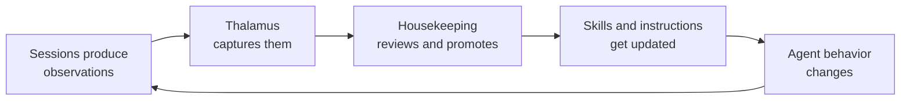

# The Self-Improving Loop

GDD is designed to evolve through use, not just through upfront design. The
framework starts minimal and grows through a continuous feedback cycle.

## The Cycle

## What Evolves

Each housekeeping audit is an opportunity to refine the framework:

- **Recurring friction** becomes a new skill or `ws` subcommand
- **Validated preferences** become committed instructions
- **Stale concerns** get pruned
- **Capture heuristics** get tuned — "we're capturing too much noise about
  formatting, let's stop noting those"

## Co-Evolving Artifacts

Three artifacts evolve together:

| Artifact | What it does | How it evolves |
|----------|-------------|----------------|
| **Thalamus.md** | Captures observations | Sections added/removed based on what's useful |
| **Orientation skill** | Governs capture behavior | Heuristics tuned by housekeeping feedback |
| **Housekeeping skill** | Audits and promotes | Process refined as we learn what promotions are valuable |

None of these is "done." Each audit cycle refines the template, adjusts
capture heuristics, or adds new sections to the file.

## The Principle

> **Evolve through use** — the framework refines itself through audit cycles;
> no part of it is final.

This is GDD's 6th design principle. It means the initial implementation is
deliberately minimal. Rather than trying to design the perfect framework
upfront, GDD provides just enough structure to start capturing observations,
then lets real usage reveal what's worth formalizing.

A framework that can't change is a framework that will be abandoned. GDD
is designed to be the opposite — it gets better the more you use it.
