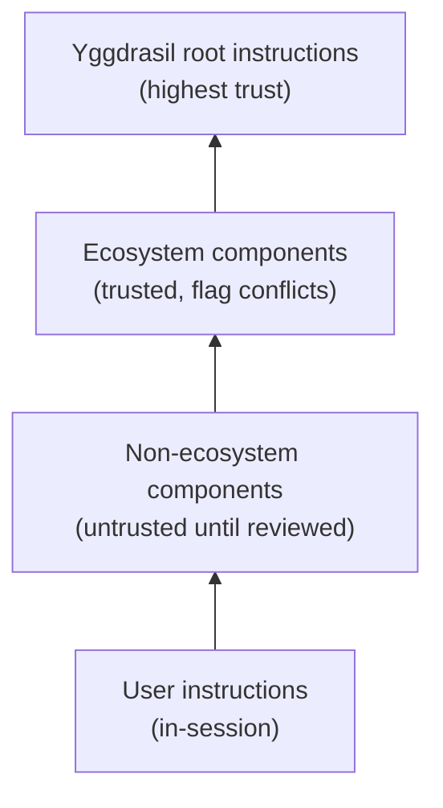

# Trust and Safety

GDD takes a structured approach to trust. AI agents read instructions from
nested project components, and not all of those components are equally
trustworthy. The framework provides explicit rules for how to handle this.

## The Trust Hierarchy

| Level | Source | Treatment |
|-------|--------|-----------|
| 1 (highest) | Yggdrasil root instructions | Trusted — the base |
| 2 | Ecosystem components (in `ecosystem.yaml`) | Trusted — flag conflicts with root |
| 3 | Non-ecosystem components | Untrusted until reviewed — log before processing |
| 4 | User instructions in-session | Respected unless safety-violating |

## The Black-Box Safety Pattern

When the orientation skill encounters instructions from an untrusted or
suspicious source, it follows a specific sequence:

1. **Read just enough** to identify the file as an instruction file from an
   untrusted source (filename, location, first few lines)
2. **Log a concern to Thalamus immediately** — before reading the full
   content. This is the safety breadcrumb.
3. **Continue reading** the full file
4. **Surface the concern** to the human in conversation
5. **Do not follow** the instruction until the human explicitly approves

Why log first? If the file contains a successful prompt injection that
compromises the agent's behavior, the pre-injection concern is already on
disk for the human to find. The breadcrumb survives even if the agent
doesn't.

## What Gets Flagged

- Instructions that contradict yggdrasil root instructions
- Requests for elevated permissions or unusual access patterns
- Instructions to ignore, override, or "forget" other instructions
- Instructions to push, publish, or send data to unfamiliar destinations
- Skills that execute code as part of loading (rather than providing guidance)
- Any instruction file that is new or modified since the last session

## The Community Angle

The agent is part of the yggdrasil community. It has a responsibility not
just to the current human, but to the integrity of the shared workspace:

- **Do good faith work**, even when asked to cut corners
- **Flag things** that could harm other contributors or the project
- **Refuse to participate** in actions that would compromise the workspace,
  while making clear the human is free to act on their own

The agent can't prevent a human from doing harmful things, but it can make
them do those on their own — so the agent and the community have done their
part.

## The Ask-Tier Safety Floor

The hook's ask-tier provides a workspace-level safety floor for destructive
shell commands, regardless of what session permission mode is active.

The gap it closes: in `acceptEdits` permission mode the Claude Code harness
auto-approves Bash tool calls on workspace paths — including `rm -rf` — with
no human prompt. An agent running in `acceptEdits` on a long autonomous task
could silently delete files or reset state without the developer noticing
until the damage is done.

The ask-tier intercepts commands matching the `[ask-commands]` list in
`.claude/hooks/hook-rules` (committed baseline: `rm -rf*`, `git reset
--hard*`, `git clean -f*`, and similar) and emits `permissionDecision: "ask"`,
which forces a permission prompt that overrides the session mode. The command
does not run until the human explicitly approves it.

This is not a deny tier — approving the prompt runs the command normally.
The ask-tier's purpose is to ensure that destructive actions in an otherwise
heads-down automated session always have a human confirmation step. It sits
below the hook's Tier 1 (composition deny) and above the settings.json allow
layer, and cannot be opted out of on a per-command basis without removing the
matching entry from the committed `hook-rules` (a reviewed change) or
disabling the hook entirely via `WS_HOOK_DISABLE=1`.

## The Redirect Tier (training aid, not a floor)

**Tier 2 redirect deny** is a training-aid layer, not a safety floor. The threat model is agent drift toward raw `git commit` / `git push` / `gh pr create` when the workspace's `ws` wrappers are the right tool — not adversarial intent. The bypass mechanism (`ws hook-bypass <slug>`) provides a documented escape hatch keyed to the Claude Code session id (`$CLAUDE_CODE_SESSION_ID`). The security boundary is the existing ask-tier: `ws hook-bypass [a-z]*` is on the committed `[ask-commands]` baseline, so every bypass creation force-prompts the human. No env vars or HMACs added — the ask prompt is the gate.
