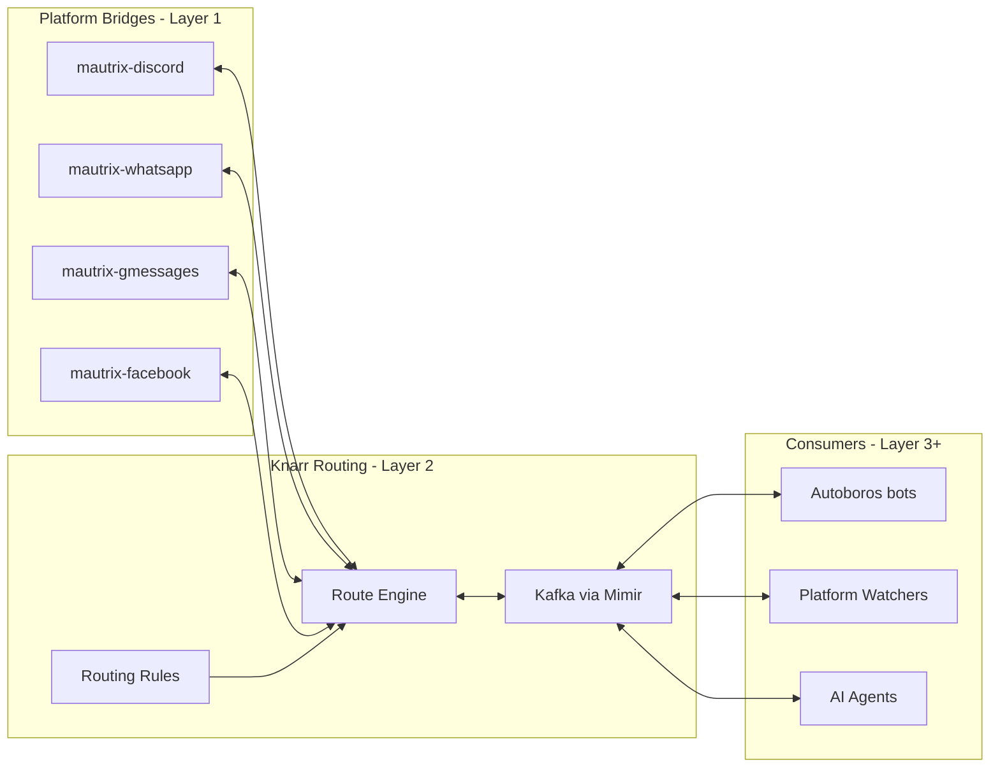
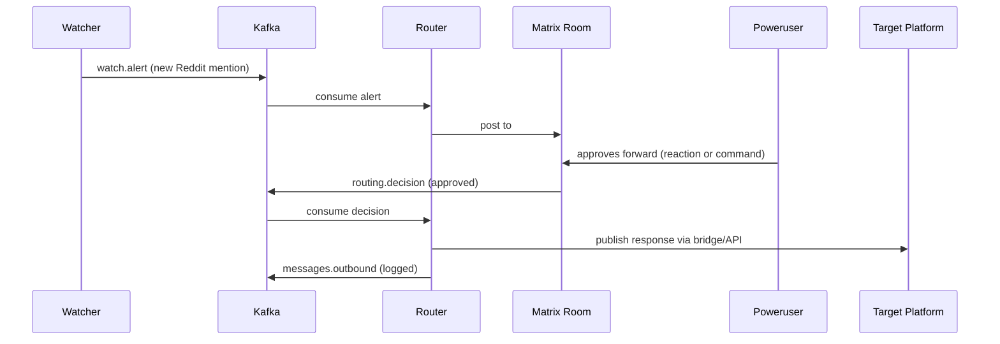
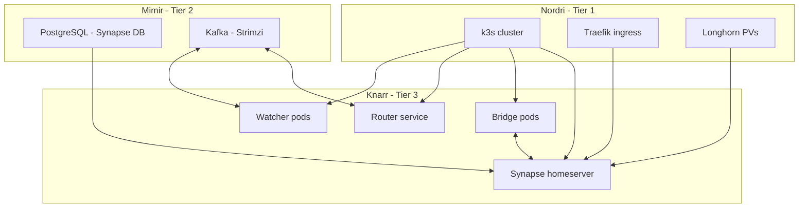

# Knarr Design Spec

**Date:** 2026-04-02
**Status:** Draft
**Component:** knarr (new)

---

## Overview

Knarr is the integration/bridging layer of the Yggdrasil ecosystem. It owns the
communication infrastructure: a self-hosted Matrix homeserver, bridge fleet, Kafka
message bus, and routing logic. It serves as a multi-community communication hub
for three audiences with very different platform mixes and engagement patterns.

**The metaphor:** Knarr is the merchant ship and its trade routes. It carries messages
between ports (platforms), knows the routes (routing rules), and keeps a manifest
(Kafka event log). Autoboros is the crew aboard — the agents who decide what cargo to
load, reshape goods for each market, and negotiate deals.

### Target Communities

| Community | Platforms in use | Urgency |
|-----------|-----------------|---------|
| **Terasology** (OSS game dev) | Discord, GitHub, Reddit, Twitter x2, YouTube, Steam forum, 2 blog sites, LinkedIn, Patreon, own forum (broken) | North star model; watching capability wanted immediately |
| **Sports league** (kids, parent coaches) | TeamSnap, scattered email, barely any communication | Spring season starts mid-April 2026 |
| **PTA** | WhatsApp, texting, email, Facebook | Demo-ready by end of school year (~June 2026) |

### Design Goals

1. **Spider in the web** — detect activity across platforms from a single Matrix dashboard
2. **Team visibility** — volunteer teams share awareness of what needs attention and what's been handled
3. **Meet people where they are** — parents use WhatsApp/SMS/Facebook; gamers use Discord; power users use Element
4. **Curated routing** — some messages flow automatically, some need human approval before fan-out
5. **Content adaptation** — write once, reshape per platform, review before publishing (Autoboros concern, Knarr provides the transport)

---

## System Boundaries

### Knarr Owns

| Concern | Description |
|---------|-------------|
| Matrix homeserver (Synapse) | Core communication hub |
| Bridge fleet (mautrix-*) | Platform connectivity |
| Kafka topics and event schemas | Internal message bus |
| Routing rules | What goes where, auto vs approval-gated |
| Room topology and access control | Spaces, rooms, permissions |
| Platform watchers | Monitoring external platforms for activity |

### Autoboros Owns

| Concern | Description |
|---------|-------------|
| Chatbot personalities and command handling | Body + brain components |
| Content adaptation | Reshaping posts per platform format |
| ChatOps workflows | PR creation, issue triage, etc. |
| AI agent integration | OpenClaw, LLM calls |

### Other Boundaries

- **Mimir (Tier 2):** Provides Kafka via Strimzi and PostgreSQL via Percona Crossplane compositions. Knarr declares what it needs; Mimir provisions.
- **Nidavellir (Tier 2):** Provides Keycloak for admin auth if needed.
- **Nordri (Tier 1):** Provides k3s cluster, Longhorn storage, Traefik ingress.
- **GDD Git interface:** Future integration point. Autoboros chatbots could surface GDD-style Git commands for human preview/approval in Matrix rooms. Knarr provides transport; command formatting and approval UX is an Autoboros concern.

---

## Architecture Layers

### Layer 1: Nervous System (Matrix + Bridges)

Synapse homeserver with mautrix bridges, deployed via Helm into k3s.

**Bridge fleet:**

| Bridge | Community | Notes |
|--------|-----------|-------|
| mautrix-discord | Terasology | Immediate priority |
| mautrix-whatsapp | PTA, sports league | Spare phone as anchor device |
| mautrix-gmessages | Sports league, PTA | SMS via Google Messages on spare phone |
| mautrix-facebook | PTA | Meeting parents where they are |
| mautrix-slack | Future | If needed |

**Room hierarchy:**

```
#terasology/               (public space)
  #general
  #dev
  #social-watch            (Reddit, Twitter, Steam mentions — Layer 2)
  #engine-room             (private — content drafting, invite-only)

#pta/                      (private space, invite-only)
  #announcements
  #volunteers
  #events

#sports-league/            (private space, invite-only)
  #announcements           (bridged to WhatsApp group + SMS)
  #coaches
  #schedule                (game times, cancellations)
```

**User visibility model:** Power users (owner + a few volunteers) use Matrix directly
via Element. Everyone else stays on their native platform and never needs to know
Matrix exists. Power users are encouraged to "upgrade" to Element over time.

### Layer 2: Routing Layer (Kafka + Routing Logic)

A lightweight Knarr service that handles curated, rule-based message fan-out beyond
what transparent bridging provides. The router connects to Synapse as a Matrix bot
(client-server API), parallel to the bridges which use the appservice API. Bridges
handle transparent bidirectional chat; the router handles everything else — watching,
approval workflows, cross-posting orchestration.



**Kafka topics:**

| Topic | Purpose |
|-------|---------|
| `knarr.messages.inbound` | All messages arriving from any bridge |
| `knarr.messages.outbound` | Messages approved for publishing to platforms |
| `knarr.routing.pending` | Messages awaiting human approval before fan-out |
| `knarr.routing.decisions` | Approval/rejection events from power users |
| `knarr.watch.alerts` | Platform monitoring alerts (new mention, new thread) |
| `knarr.content.draft` | Content being shaped by Autoboros before publishing |

**Routing rule examples:**
- Messages in `#sports-league/announcements` → auto-forward to WhatsApp group + SMS list
- New Reddit mention of "Terasology" → post alert to `#terasology/social-watch`, await human decision
- Blog post draft approved in `#terasology/engine-room` → Autoboros adapts per platform → publish via `knarr.messages.outbound`

### Layer 3: Agent Layer (Watchers + Integration Points)

**Platform watchers** — services that poll or subscribe to external platforms and
publish alerts to Kafka:

- Reddit watcher (API polling for subreddit/mention activity)
- Steam forum watcher (scraping or API)
- Twitter/X watcher (API access permitting)
- YouTube comment watcher
- GitHub notification aggregator

**Approval workflow:**



**Team visibility:** Because everything flows through Kafka, any volunteer in the
Matrix room can see what alerts are pending. When someone responds, the event is
logged and others can see it's handled. Kafka replay supports tooling for catch-up.

---

## Event Schema

Common envelope for all Kafka events:

```json
{
  "event_id": "uuid",
  "timestamp": "2026-04-02T10:30:00Z",
  "source": {
    "platform": "discord",
    "channel": "terasology-general",
    "community": "terasology"
  },
  "author": {
    "platform_id": "discord:12345",
    "display_name": "contributor42"
  },
  "content": {
    "type": "text",
    "body": "Has anyone tried the new module system?"
  },
  "routing": {
    "status": "auto",
    "targets": ["matrix:#terasology/general"],
    "requires_approval": false
  }
}
```

For approval workflows, `routing.status` cycles: `pending` → `approved`/`rejected`
→ `published`, with each transition as a separate event on `knarr.routing.decisions`.

---

## Tech Stack

| Component | Technology | Rationale |
|-----------|-----------|-----------|
| Homeserver | Synapse | Most mature, best bridge compatibility, Python |
| Bridges | mautrix suite | Active development, Python, consistent API |
| Router | Python (FastAPI or similar) | Lightweight, same language as bridges and Autoboros |
| Watchers | Python | Same ecosystem; each watcher is a small service |
| Message bus | Kafka via Mimir | Already in stack, durable log for audit and replay |
| Database | PostgreSQL via Mimir | Synapse requires it, already vended by Crossplane |
| Client | Element | Standard Matrix client, mobile + desktop |

---

## Deployment Architecture

Knarr is a Tier 3 application deployed via ArgoCD.



### Helm Chart Structure

```
knarr/
  Chart.yaml
  values.yaml               # Defaults
  values-local.yaml          # Local k3s overrides
  values-gke.yaml            # GKE production overrides
  templates/
    synapse/
      deployment.yaml
      service.yaml
      configmap.yaml         # homeserver.yaml generation
    bridges/
      discord.yaml
      whatsapp.yaml
      gmessages.yaml
      facebook.yaml
    router/
      deployment.yaml
      service.yaml
      configmap.yaml         # routing rules
    watchers/
      reddit.yaml
      steam.yaml
      twitter.yaml
      youtube.yaml
      github.yaml
  config/
    homeserver/              # Synapse config templates
    bridges/                 # Bridge registration files
    routing/                 # Routing rule definitions
  src/
    router/                  # Knarr router service source
    watchers/                # Watcher service source
  tests/
    features/                # BDD specs for routing behavior
  docs/
    architecture.md
    bridges.md
    routing-rules.md
```

### Spare Phone

The spare phone serves as the persistent anchor for mautrix-whatsapp (WhatsApp Web
session) and mautrix-gmessages (SMS via Google Messages). It must stay powered on
and connected. For local testing it sits on the same network as the k3s node. When
the homeserver moves to GKE, the phone needs to remain reachable — either colocated
with a bridge pod on a local machine, or via a relay. The phone is 100% dedicated
to Knarr.

---

## Phasing

| Phase | Scope | Timeline | Goal |
|-------|-------|----------|------|
| 0 | Bare Synapse + Postgres on M1 Mac k3s | Week 1 | "I can chat with myself across devices via my own server" |
| 1 | mautrix-discord + Terasology watching | Week 2 | "I can see Terasology activity across platforms from one place" |
| 2 | mautrix-whatsapp + mautrix-gmessages for sports league | Weeks 3-4 | "Coaches and parents can communicate, I see everything in Element" |
| 3 | Kafka topics + routing engine + approval workflows | Weeks 5-8 | "The volunteer team has shared awareness of what needs attention" |
| 4 | Cross-posting + content adaptation (Autoboros integration) | Weeks 8-12 | "I write a post once and publish everywhere with review" |
| 5 | PTA bridges + demo | Months 2-3 | "Show a working communication hub that meets parents where they are" |

### Phase Details

**Phase 0 — Bare homeserver:**
Deploy Synapse + Postgres on M1 Mac k3s. Create room hierarchy (spaces for each
community). Connect with Element from phone and desktop. Federation disabled
(private homeserver). Validate basic operation.

**Phase 1 — Discord bridge + Terasology watching:**
Deploy mautrix-discord, bridge key Terasology channels. Deploy Kafka topics via
Mimir. Deploy first watchers (Reddit, GitHub notifications). Stand up
`#terasology/social-watch` room with alerts flowing in.

**Phase 2 — Sports league bridge:**
Deploy mautrix-whatsapp, link spare phone. Bridge `#sports-league/announcements`
to WhatsApp group. Deploy mautrix-gmessages for SMS. Test with coaches first.

**Phase 3 — Routing engine + approval workflows:**
Build the Knarr router service. Implement routing rules (auto-forward vs
pending-approval). Approval UX in Matrix rooms (reactions or bot commands). Team
visibility — volunteers see what's been handled.

**Phase 4 — Cross-posting + content adaptation:**
Integration point for Autoboros content adaptation. Blog post → multi-platform
publish workflow. Platform-specific formatting.

**Phase 5 — PTA demo:**
Apply bridge infrastructure (WhatsApp, SMS, Facebook). PTA-specific room hierarchy
and routing rules. Demo to PTA leadership.

---

## Autoboros Migration Path

The stem component in Autoboros becomes legacy. Migration steps:

1. Knarr deploys with Kafka topics active
2. Autoboros adds a Kafka consumer/producer (replacing NATS client code in stem)
3. Autoboros body/brain connect to `knarr.messages.inbound` to receive chat events
4. Autoboros publishes responses to `knarr.messages.outbound`
5. Stem's NATS code is archived or removed

After migration, Autoboros no longer connects directly to Discord. It connects to
Kafka, and Knarr handles all platform I/O.

---

## Future Explorations

### Web-Searchable Chat Archive ("Scribe")

Bring back IRC-style public chat logging for the modern multi-platform world.
A Kafka consumer ("scribe") reads `knarr.messages.inbound`, writes messages to
a static site (Hugo/Jekyll/plain HTML) organized by room and date, and deploys
to GitHub Pages or in-cluster. Because everything flows through Kafka, this
archives all bridged platforms (Discord, Matrix, future bridges) — not just
Matrix-native messages. Kafka replay enables regenerating the archive from
history. Public rooms only; routing rules can control what gets archived.

### Blog Comments via Cactus Comments

Cactus Comments uses Matrix rooms as a commenting backend for static sites.
Each blog post gets a dedicated Matrix room. Comments posted on the blog appear
in Matrix (and vice versa — moderatable from Element). The JS widget renders
client-side, so comments are not search-engine indexable by default. The scribe
archiver above could solve this: blog comment rooms flow through Kafka like any
other room, and the scribe produces a static indexed copy. This gives interactive
commenting + permanent searchable record.

Relevant for the Terasology blog sites and the personal blog (Cervator.github.io).

---

## Decisions

| Decision | Choice | Rationale |
|----------|--------|-----------|
| Message bus | Kafka (not NATS) | Already in stack via Mimir; NATS had cross-platform reliability issues; Kafka's durable log enables team visibility and replay |
| Homeserver | Synapse (not Dendrite/Conduit) | Most mature, best bridge compatibility |
| Approach | Layered Hub (not Bridge-First Monolith or Federation-First) | Clean separation of concerns; can deploy Layer 1 immediately and build Layers 2-3 iteratively; can split to federation later if needed |
| Phasing order | Terasology first (not sports league) | More engaged testers, watching capability wanted immediately |
| User visibility | Matrix hidden from end users | Power users use Element directly; everyone else stays on native platforms |
