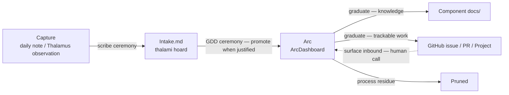

# Organization Stack — Design

*Design doc — 2026-05-19. Defines the conceptual model; the facets (SP-A/B/C) and the nonclaudesidian migration carry the detailed work. See "Facet boundaries" below.*

## Problem

Work in this ecosystem is captured and tracked across several disconnected artifacts: an Obsidian vault (`borgr`) for daily life-organization, per-machine Thalamus files plus `ArcDashboard.md` for in-flight GDD work, component `docs/` directories for reference knowledge, and GitHub issues/PRs. Each works well alone, but the *seams* between them are undefined:

- An item captured in a daily note that is really GDD work has no machine-agnostic place to go — arcs must be filed against a specific host's `*-thalamus.md`.
- Arcs get pruned in housekeeping, so knowledge produced inside a closed arc is lost unless someone manually moves it to durable docs.
- Issues promoted out of the Thalamus "disappear into the ether" — nothing periodically reviews them.
- The same item can plausibly belong in two places (a personal task that is also GDD work), with no rule for resolving it.

This document defines a single model — the **organization stack** — that names the artifacts, their boundaries, and the promotion paths between them. It does not implement anything; it is the frame the facet designs slot into.

## The four tiers

The stack is read as **audience/purpose tiers**, not a durability ladder. Durability rises roughly across the tiers but not monotonically — an Area note in the Vault is permanent, while an arc in the Thalami tier is ephemeral.

| Tier | Artifact(s) | Audience / purpose | Horizon |
|------|-------------|--------------------|---------|
| **Vault** | daily notes, project notes, area notes | You — and your agent during the scribe ceremony. Life organization, every topic: personal, GDD, work | daily: hours; project: weeks–months; area: permanent |
| **Thalami** (the thalami hoard) | per-machine `*-thalamus.md` (observations + arcs), `Intake.md`, `ArcDashboard.md` | You + your agents. GDD working memory, in-flight work | weeks–months, pruned in housekeeping |
| **Docs** (`<component>/docs/`) | repo README + docs index + topic files | Anyone reading the repo. Durable reference knowledge | permanent, versioned |
| **GitHub** | issues, PRs, the companion Project board | Collaborators / public. Trackable, durable, dynamic work | long-lived, edited live |

Both the Vault and the Thalami hoard are already git-synced across machines — neither tier is machine-specific. The distinction between them is audience: the Vault is human-facing life organization; the Thalami hoard is agent-facing GDD working memory.

Any Obsidian hoard scaffolded from the `obsidian-vault` template (`ws hoard init obsidian-vault`) plays the Vault role. In this document, examples refer to **`borgr`** — the maintainer's personal vault, kept in a private repo — as the concrete instance; the model works the same with any vault produced by the template, under any name.

## The seams and the ceremonies that own them

Exactly **two ceremonies** move items across seams. Both are propose-then-confirm — neither moves anything silently.

**The scribe ceremony** (operating in `borgr`) owns Vault-internal drift and the Vault → Thalami bridge:

- daily-note bullet → project / area note (intra-Vault drift, as horizon clarifies)
- daily-note `#gdd` bullet → Thalami `Intake.md` (the bridge)

**The GDD ceremony** (orientation + housekeeping) owns the Thalami tier and everything to its right:

- `Intake.md` item → **arc** (promoted to an arc only when justified — not every intake item becomes an arc)
- arc → **Docs** (durable knowledge graduates here)
- arc → **GitHub** issue / PR / Project (trackable work graduates; the arc closes as `promoted`)
- GitHub inbound → **surfaced for consideration** (issues/PRs needing attention are shown to the human; an arc is never created automatically from one)

### The bridge

The "bridge" is the *process* of populating and draining `Intake.md`, not the file itself. `Intake.md` is a machine-agnostic file in the thalami hoard, sitting beside `ArcDashboard.md`. It holds pre-arc GDD work items — things lifted out of a daily note that belong in GDD-land but have not yet been shaped into an arc or assigned to a host.

The scribe ceremony populates it; the GDD ceremony drains it — distributing items to the right host's `*-thalamus.md` and promoting to an arc when the work justifies one. Because the agent runs both ceremonies, it can move items into the thalami hoard readily even though that hoard is a separate repo.

## Routing rule — capture wide, route narrow

There are exactly two capture surfaces, and everything funnels through one of them. Routing happens later, in a ceremony — **never at capture time**.

- The **`borgr` daily note** is the universal capture surface. Any topic, captured the moment it occurs, with zero categorization required.
- The **Thalamus Observations section** is the capture surface when the user is already mid-GDD-session — an idea that surfaces during work is written there rather than forcing a context-switch into the vault.

Routing — the "where does it go" decision — is driven by three questions:

1. **Horizon** — minutes/hours → stays a daily-note task. Days–weeks → arc-candidate. Bounded multi-step outcome → project. Open-ended responsibility → area.
2. **Audience** — just you / life → stays in the Vault. GDD agent work → `Intake.md` → Thalami. Reference others will read → Docs. Collaborative / trackable → GitHub.
3. **Durability** — ephemeral → leave it low; it will drift or be pruned. Durable → it must eventually reach Docs or GitHub, or it is at risk.

The "belongs in two places" problem dissolves: an item has **one** home for its current horizon and audience, and it **moves** as those change — it is never copied. A daily-note bullet that drifts unactioned across several days was simply mis-horizoned; the ceremony promotes it to a project, arc, or `Intake.md` rather than letting it rot in the daily note.

## Graduation — the durable end of the stack

When an arc completes, its residue splits three ways:

- **Knowledge** — how something works, why a decision was made, conceptual reference — graduates to **component `docs/`**. (Worked example: HTTPS / wildcard-TLS knowledge belongs in `nidavellir/docs/`, organized as a real index plus topic files — not stranded in a closed arc or hodge-podged into one file. This is SP-C's exercise.)
- **Trackable work** — follow-ups, deferred items, anything others should see — graduates to **GitHub** as an issue or PR. The arc closes as `promoted` with a pointer to the GitHub item.
- **Process residue** — the day-to-day "did X, reviewed Y" churn — is **not** graduated. It is pruned in housekeeping. That is the ephemeral tier doing its job.

The `ArcDashboard` and the GitHub Project board are **companions, not redundant**:

- `ArcDashboard` shows in-flight private work across the user's machines — ephemeral, fast, pruned.
- The GitHub Project board shows graduated durable work — persistent, public, edited live.

An arc with `status: promoted` is the hand-off marker between the two. The GitHub Project board is what SP-B designs.

## The cadence ladder

The two ceremonies above move items across seams *as work happens*. But the durable tier also needs periodic *review* — otherwise promoted issues are never looked at again. The model therefore defines a **cadence ladder**: ceremonies keyed to horizon, not only to session boundaries.

| Cadence | Ceremony | Scope |
|---------|----------|-------|
| Per session | GDD orientation | Picks up arcs, reads the Thalamus, sets session context |
| Daily / ad-hoc | scribe micro + daily review | Vault — daily note, project-status drift |
| Weekly | scribe weekly synthesis **+ durable-tier sweep** | Vault weekly review **+ GitHub Project review** |
| Monthly | scribe monthly **+ GDD housekeeping at scale** | Thalami arc audit **+ Docs freshness + GitHub board grooming** |

The new element is the **durable-tier sweep** — a recurring walk of the GitHub Project board asking of each promoted issue: *still relevant? stalled? needs an arc to actually move it? done and closeable?* This is what keeps promoted work from rotting unseen.

The weekly and monthly passes have **distinct focuses**: the weekly sweep is a lightweight *review* (what is on the board, what is stalled); the monthly pass is *grooming* (deeper — re-prioritizing, closing dead items, checking Docs freshness).

The durable-tier sweep is a **step appended to the existing scribe weekly/monthly ceremony** rather than a standalone ceremony — the scribe weekly synthesis is already the user's "zoom out" moment, so the review attaches there instead of adding another ceremony to remember.

## Incremental adoption

The full stack — four tiers, two ceremonies, a cadence ladder — is the complete picture, but it must not be all-or-nothing. A newcomer (and the GDD tutorial deliberately starts gentle) should be able to adopt a subset and grow into the rest:

- **Vault only.** Use `borgr` and the scribe ceremony for life organization. No Thalami bridge, no arcs, no GitHub Project. A complete, useful system on its own.
- **+ Thalami.** Add arcs and `ArcDashboard` for in-flight GDD work; the bridge connects the daily note to `Intake.md`. Where most solo GDD users will sit.
- **+ Docs / GitHub.** Add the graduation seams and the companion GitHub Project once work is durable or collaborative enough to warrant them.

Each tier is independently useful; each seam is dormant until the tier on its far side is in use. The model degrades gracefully — a missing tier means its seam is unused, not broken, and the routing rule still works: items simply have fewer possible homes.

## Documentation

When the model is implemented it must be discoverable, not merely present:

- A section in `docs/gdd/features.md` (the GDD Features Tour) introducing the organization stack as a named feature, in the same style as the existing Thalamus and self-improving-loop sections.
- A dedicated `docs/gdd/` reference page (e.g. `organization-stack.md`) carrying the full user-facing explanation, linked from the features.md section — mirroring how `features.md` links out to `thalamus.md`, `hoards.md`, and `self-improving-loop.md`.

These are implementation deliverables tracked in the plan, not separate facets.

## Model-level vocabulary calls

The model fixes the following distinctions. The *detail* behind each is deferred to a facet or to the migration.

- **Area vs. tag.** An **area** is a hierarchical container — a note with one home in a tree (e.g. Household → Family → Graciela). A **tag** is a cross-cutting facet that ignores the tree (e.g. `#medical` spanning multiple children and areas; `#gdd` spanning Vault and GDD work). One item has **exactly one area** (its home) and **any number of tags**. The actual area tree and tag vocabulary are deferred to the nonclaudesidian migration.
- **`Intake.md`.** The bridge file is machine-agnostic, lives in the thalami hoard beside `ArcDashboard.md`, and holds pre-arc GDD work items. "Bridge" names the populating/draining *process*, not the file.
- **Project vs. arc.** A project (Vault) is a container that can span **multiple arcs** (Thalami) over its life. One project, many arcs. The internal structure question — "active projects stay flat, archive gets subfolders by area" — is a Vault-internal matter deferred to SP-C / the migration; it is not a model call.
- **Tier naming.** This document uses "tier" generically for the four organization-stack tiers and names them (Vault / Thalami / Docs / GitHub) rather than numbering them, to avoid collision with the platform **Tier** (1/2/3) and bootstrap **Layer** (L2/L3) terminology defined in the writing-yggdrasil-docs skill.

## Facet boundaries

This model is deliberately thin. The detailed work lives in separate specs, each brainstormed and planned on its own:

- **SP-A — ArcDashboard QoL upgrade.** Impact/Urgency columns ("Eisenhower-lite"), the `review` status schema gap, the arc → Obsidian-project `priority` collapse. (A refined sketch already exists in the Dionysus thalamus, dated 2026-05-19.)
- **SP-B — Companion GitHub Project.** The board structure, columns, what the durable-tier sweep walks, how `promoted` arcs land as cards, inbound-item surfacing.
- **SP-C — Component docs convention.** The `docs/<component>/` standard — repo README + docs index + topic files, cross-linking from the ecosystem, GitHub Pages presentation. The nidavellir docs cleanup is its worked example.
- **nonclaudesidian migration.** The Vault-internal area tree and tag taxonomy, plus the active-flat / archive-by-area project structure.

## Open questions

- **Intake-file lifecycle detail.** How long may an item sit in `Intake.md` before the GDD ceremony nudges it? Does it have lightweight per-item frontmatter (captured date, source host) or is it a plain list? Likely settled when SP-B or the GDD-ceremony skill update is specified.
- **Work vs. personal capture.** The model routes everything through the `borgr` daily note, including work items. This is fine today (one work machine, the Nvidia laptop), but if work organization grows its own surface, the capture-wide rule may need a second universal surface. Deferred until there is evidence of need.
- **Ceremony skill updates.** Implementing this model means touching the scribe skill (bridge population, durable-tier sweep) and the gdd-orientation / gdd-housekeeping skills (intake drain, graduation, cadence ladder). The sequencing of those edits is an implementation-plan concern, not a model one.
