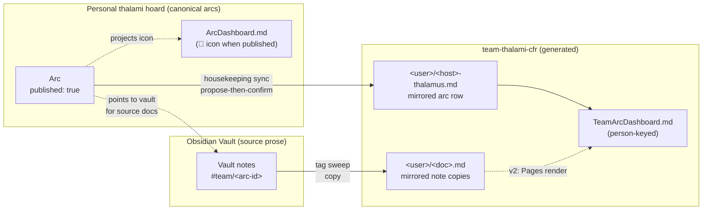

# The Team Tier — Team-Visibility Thalami

Status: design (proposed)
Extends: [Organization Stack](2026-05-19-organization-stack-design.md), [Thalamus Arc Dashboard](2026-05-07-thalamus-arc-dashboard-design.md), [Realms and Hoards](2026-04-24-realms-and-hoards-design.md)

## Problem

The [organization stack](../gdd/organization-stack.md) defines four audience tiers — Vault → Thalami → Docs → GitHub — with deliberate promotion seams between them. The Thalami tier is **personal**: a thalami hoard syncs one human's in-flight arcs across their own machines (one `<host>-thalamus.md` per machine), and `ArcDashboard.md` projects every machine's arc frontmatter into a single live table.

A growing team wants the next thing the stack doesn't yet have: **team visibility into in-flight work**. A person should be able to promote a personal arc — and the notes that go with it — to a place teammates can see, without surrendering the chatty, ephemeral, personal nature of their own thalami. Today there is no audience tier between "you + your agents" (Thalami) and "anyone reading the repo" (Docs) / "collaborators and the public" (GitHub). The Team tier fills that gap: in-flight work, promoted for *team* audience, while the work itself stays live and personally owned.

## Core distinction — publication is not graduation

The existing stack graduates a *completed* arc: its residue splits to Docs (durable knowledge) or GitHub (trackable work), and the arc closes as `status: promoted`. Graduation is **terminal** — a hand-off at the end of an arc's life.

Team publication is **non-terminal**. You publish an arc that is *still in flight*; you keep working it on your personal side; a live projection is mirrored out for the team. The arc keeps its real lifecycle `status` (`active`, `review`, …) the entire time. Publication and graduation are orthogonal concepts with different mechanics — a published arc can later also graduate, or be un-published, independently.

## Governing invariant

**The personal thalami is canonical; the team hoard is generated, never hand-edited.**

You always work the arc and its notes on your personal side. A sync *projects* the published slice into the team hoard. Sync is one-way (personal → team). Nobody ever types into the team copy, so it is a mirror physically but single-source semantically — the DRY concern dissolves, and per-user write isolation makes conflicts near-impossible. Un-publishing (removing the flag) deletes the projected copy on the next sync. Like everything in the Thalamus, nothing in the team hoard is permanent — published content is either kept current by sync, or removed when un-published, closed, or pruned.

## The artifact — a `team-thalami` hoard

A new hoard **flavor** (`templates/hoards/team-thalami/`), instantiated once per team (e.g. `team-thalami-cfr`) and **declared by the realm** so every teammate clones the same repo. This is the natural classification: a team thalami is a disconnected collection of promoted notes — not a component (no build artifact) and not realm config. It reuses the personal thalami's arc-frontmatter data model wholesale; the only structural addition is a per-user folder layer.

```text
team-thalami-cfr/
  TeamArcDashboard.md          # person-keyed projection (Obsidian/Dataview in v1; feeds Pages in v2)
  README.md                    # one-time Obsidian + Dataview/Meta Bind setup, sync model, conventions
  <username>/                  # one folder per teammate — the ONLY place that user's sync writes
    <host>-thalamus.md         # mirrored arc frontmatter for that user/host (per-host retained)
    <arc-id>/                  # one subfolder per published arc (collision-safe + prune-safe)
      <vault-relative-path>.md # mirrored COPIES of that arc's tagged Vault notes
    .publish-manifest.yaml     # records the files this user's last publish wrote (scopes pruning)
    ...
```

Per-host files are retained as the storage substrate (forward-compat for anyone using more than one workspace, and a mechanically clean promotion target — a published arc row mirrors from `personal/<host>-thalamus.md` to `team/<username>/<host>-thalamus.md`). The *team audience* is person-centric, so the dashboard keys on user and demotes host to a detail column (see Dashboards).

### Where source docs live — the Vault, not the hoard

The prose docs published with an arc do **not** live in the thalami hoard. They live in a separate **Obsidian Vault** — either a personal/unrelated vault or one scaffolded from the `obsidian-vault` hoard template (the stack's Vault tier). The active Thalamus *points* to that Vault as its source for docs, and there is already separate (scribe) housekeeping that moves content between the Vault and the Thalamus. Team publication does not duplicate that movement — it **consumes the current state of the Vault**: at sync time it reads the Vault notes currently tagged for a published arc and mirrors *copies* of them into the team hoard (teammates can't reach your personal Vault, so the copy is necessary). The thalami hoard contributes the arc *frontmatter*; the Vault contributes the *prose*. The team hoard remains the single generated projection of both.

### Realm-declared hoards — a new capability

Today hoards are personal-only (`ws hoard init`, auto-discovered under `hoards/`). The Team tier introduces a **realm-declared** hoard: the realm carries a pointer (URL + flavor) to the shared team hoard, and a `ws` flow clones it for each teammate. This keeps the realm in its envisioned role — team/community container and *pointer*, not content host — while the work-content lives in the hoard.

## The publish marker — arc-anchored, tag-swept

Publishing is **arc-anchored**: a doc is published *because* it belongs to a published arc, never free-floating. This is the guardrail that keeps the team surface organized and prunable — un-publish the arc and its docs leave with it. A standing "team overview" page that isn't tied to active work is modeled as its own `parked` arc (e.g. `team-overview`) whose associated doc is the overview — one model, no special case.

Two things make an arc publishable:

1. **The flag.** The arc frontmatter gains `published: true`. This is a *flag*, orthogonal to `status` — a published arc keeps its real lifecycle status (`active`/`review`/…). It is deliberately **not** a new `status` value, both to avoid colliding with the existing terminal `promoted` status and to preserve the dashboard's status-driven decay vibes.
2. **The doc tag.** Associated docs are collected by a **namespaced tag keyed to the arc id**: `#team/<arc-id>`, applied to **Vault notes** (not thalami-hoard files). The sync sweeps the Vault the active Thalamus points to for notes bearing that tag and mirrors copies of them into the team hoard under that arc. The arc id is already the stable cross-host slug, so this adds no bookkeeping; namespacing avoids a generic `#publish` tag bleeding across arcs, and un-publishing a single doc is just removing its tag. The tag is recognized in either Obsidian form: a frontmatter `tags:` entry (`team/<arc-id>`, no `#`) or an inline `#team/<arc-id>` in the body.

### Privacy guardrails — copying to a shared repo is gated three ways

The destination is team-visible, so a single mis-applied tag must never leak a sensitive note. Publishing a note requires it to pass **all three** gates:

1. **Association** — the note carries `#team/<arc-id>` for an arc that is itself `published: true`.
2. **Denylist (machine backstop)** — the note is not excluded. A note carrying an exclusion tag (`#private` / `#noteam`, configurable) or matching a configured exclude-glob is **never** copied, even if it bears the association tag — recognized either inline (`#private`) or as a frontmatter `tags:` list item (`- private`); a bare prose mention of the word is not enough. The denylist wins over the tag. (An allowlist mode — only sweep notes under a designated publishable folder — is an alternative the plan can offer; denylist is the default.)
3. **Human confirm (human backstop)** — `ws thalami publish` lists every file it will copy, with full source and destination paths, and waits for confirmation before writing anything.

Neither gate is trusted alone: the denylist catches mis-tagging mechanically, the confirm catches everything else.

### Collision-safe doc layout

Mirrored notes land under a **per-arc subfolder** preserving their Vault-relative path: `team-thalami-cfr/<username>/<arc-id>/<vault-relative-path>.md`. This is collision-free by construction (Vault paths are unique within an arc), avoids two same-basename notes clobbering each other, reinforces arc-anchoring (un-publish an arc → delete its whole subfolder), and keeps the `<host>-thalamus.md` arc-frontmatter files (which the dashboard projects) separate from the prose.

## Sync — ceremony-driven, script-assisted

The mirror runs as a step in the **GDD housekeeping ceremony**, propose-then-confirm like every other seam in the stack ("nothing moves silently"):

> "Arc `x` is marked `published`. Sync its row plus 2 docs tagged `#team/x` into `team-thalami-cfr/<username>/`?"

A small `ws` subcommand performs the mechanical work — read published arcs, sweep tagged docs (subject to the privacy gates above), write the user's team-hoard subtree, and **prune scoped by a per-user `.publish-manifest.yaml`** so deletes only ever touch files a prior publish recorded — never files the tool didn't create. The commit/push to the team hoard follows normal hoard cadence (the team hoard is a separate repo; a quick rebase-before-push keeps the per-user folders clean). Nothing is automatic; the human confirms the projection.



## Configuration & resolution — cascading, confirm-before-write

`ws thalami publish` is the scripted step. It is deliberately **generic and multi-purpose** — team publication is its first consumer, but the same verb could later back a solo/Obsidian-style publish to some other target. It is normally **invoked as a stage of regular GDD housekeeping** (housekeeping calls it when there are published arcs to sync), and can also be run on its own.

It must resolve two things — the **source** (where the Vault prose lives, plus the person's identity) and the **destination** (which team hoard, plus any public-facing details) — and it does so by walking a cascade, then **always confirming the resolved plan with the user before writing anything**:

| Need | Resolution order | Lives where |
|------|------------------|-------------|
| **Destination** — team hoard pointer + public-facing details | active **realm** | shared/public — belongs in the realm |
| **Source Vault path** | per-arc `vault:` → thalamus-level `vault:` → active **thalami hoard** config → root **`Thalamus.md`** | **local** — never the realm |
| **Identity** (which `<username>/` folder) | arc/thalamus `user:` → `identity.human_account` → resolved OS user | local thalami / `Thalamus.md` |

Notes on the cascade:

- **Single-system day-job users** are common: if there's no thalami hoard, the resolver falls back to the root `Thalamus.md`. The feature degrades gracefully to one machine with no hoard.
- **Vault path may vary per arc** — an arc's docs might live in a different vault than your default — so a per-arc `vault:` override sits above the thalamus-level default.
- **Identity is confirmed, not assumed.** A hostname maps cleanly to a machine, but the OS user does *not* reliably map to a person's name (it may be an employee id). So the resolved username is surfaced for the user to confirm or override (via `user:`) during setup / onboarding / first-time housekeeping, not silently trusted.
- **Confirm before execute.** The command presents the resolved source, destination, identity, and the exact arcs + docs it will publish/prune, and waits — consistent with the stack's propose-then-confirm rule.

## Dashboards — two, lightly forked

**Personal `ArcDashboard.md`** — behavior unchanged. When `published: true`, a small `📡` is *concatenated* onto an existing cell (the vibe glyph or the Arc name); no dedicated team column. The indicator is **data-driven, not mode-driven** — solo users never set the flag, so the icon never appears and the dashboard is identical to today with zero config. (Template change is additive and backward-safe for existing hoards.)

**`TeamArcDashboard.md`** (in the team hoard) — a person-primary variant of the existing query:

- **User** column derived from `file.folder` (or a `user:` frontmatter field) becomes the row key.
- **Host** demoted to a secondary detail column (so a teammate with three workspaces doesn't fragment into three unrelated rows).
- **No publish filter needed** — the team hoard only ever *contains* published arcs, so presence in the repo *is* the published state. `FROM ""` over the team hoard projects exactly the published set.

Otherwise it reuses the existing Dataview projection (status vibes, freshness decay, filter/sort/refresh controls).

## Schema additions (personal arc frontmatter)

```yaml
# top-level frontmatter (per-host thalamus file)
user: <name>                       # NEW, optional — overrides folder/OS-user → person mapping;
                                   #   confirmed or overridden at onboarding / first housekeeping
vault: <path-to-obsidian-vault>    # NEW, optional — default source Vault path (LOCAL; never in the realm)

arcs:
  - id: <kebab-case-slug>
    name: <short human label>
    status: active                 # unchanged lifecycle enum
    started: 2026-06-01
    last_touched: 2026-06-01
    next: "<one-line next step>"
    published: true                # NEW — flag, orthogonal to status
    # vault: <path>                # NEW, optional — per-arc override of the source Vault
    # docs published with this arc carry the tag #team/<id> in that Vault
    # optional, unchanged: issue / impact / urgency / project / tags
```

No change to the lifecycle `status` enum. `published` defaults to absent/false. `user` and `vault` are optional and resolved via the cascade below.

## Tooling & skill integration

- **`templates/hoards/team-thalami/`** — new flavor: `README.md`, `TeamArcDashboard.md`, an example `<username>/` subtree, and a **commented/deferred** `.gitlab-ci.yml` stub (Pages, v2).
- **`templates/hoards/thalami/`** — additive: document the `published` flag and `#team/<arc-id>` convention; add the conditional `📡` to `ArcDashboard.md`.
- **`gdd-housekeeping` skill** — invoke `ws thalami publish` as a stage when there are published arcs to sync (propose-then-confirm). Distinct from the **scribe** Vault↔Thalami housekeeping: team-publish *consumes* the Vault's current state, it does not move content between Vault and Thalamus.
- **`ws thalami publish`** — generic, multi-purpose publish verb (team publication is its first consumer). Mechanical work: resolve source/destination/identity via the cascade above, confirm with the user, then read published arcs (thalami hoard / `Thalamus.md`), sweep the resolved Vault for notes tagged `#team/<arc-id>` that pass the privacy gates, mirror the arc row + note copies into the user's team-hoard subtree (per-arc subfolders), and prune via the per-user `.publish-manifest.yaml` (deletes limited to files a prior publish wrote). Runnable standalone or as a housekeeping stage.
- **Realm** — declare the team hoard pointer; a clone flow for teammates.
- **Docs** — extend [`organization-stack.md`](../gdd/organization-stack.md) with the Team tier and the publication-vs-graduation distinction; cross-link from [`thalamus.md`](../gdd/thalamus.md).

## Phasing

- **v1 (this spec):** team-thalami hoard flavor + realm-declared-hoard capability + `published` flag + `#team/<arc-id>` sweep + `TeamArcDashboard.md` + conditional personal-dashboard icon + ceremony/script sync. Reviewed locally via Obsidian/Dataview. **No GitLab Pages.**
- **Deferred v2 — Pages:** a `.gitlab-ci.yml` **in the team hoard** (not the realm — the hoard's push is what should trigger, and Pages is served per-project) that `include:`s RepoWarden's shared step and renders `TeamArcDashboard` + swept docs to a static site on each push.
- **Deferred v3 — nvcollective bridge:** an optional arc `persona:` tag, leaving the door open to map a team arc to an nvcollective persona/shift later. Kept out of v1 — GDD roles ("how a human is working now") and nvcollective personas (curated AI workers executing infra-ops formulas) operate at different layers; coupling now would balloon scope for no v1 payoff.

## Naming — CIS → CFR

The org unit formerly "CIS" is renamed **CFR**. All new naming uses CFR (`team-thalami-cfr`; the realm should eventually become `realm-nvidia-cfr`). Existing "CIS" references get renamed opportunistically while editing, not as a mass sweep. The realm-directory rename (`realm-nvidia-cis` → `realm-nvidia-cfr`) touches config paths and is tracked as a **separate follow-up**, not part of this spec.

## Non-goals

- GitLab Pages rendering (v2).
- nvcollective integration / role reconciliation (v3).
- Free-floating published docs not anchored to an arc.
- Bi-directional sync or editing on the team side — the team hoard is generated only.
- Mass CIS→CFR rename.

## Open questions (for the plan)

1. **Exact config keys per layer.** The resolution cascade is fixed (realm → thalami hoard → `Thalamus.md`; per-arc → thalamus-level), but the concrete key names and how the realm declares the team-hoard pointer are plan-level detail.
2. **Onboarding flow for identity confirmation.** Where the first-time `user:` confirm/override lives — a dedicated `ws` setup step, or surfaced inside first-time housekeeping.
