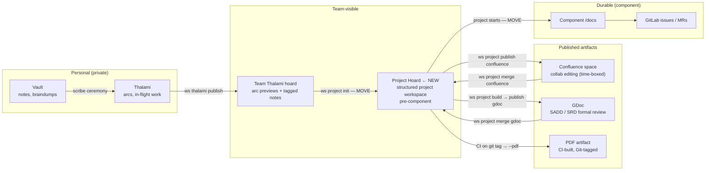
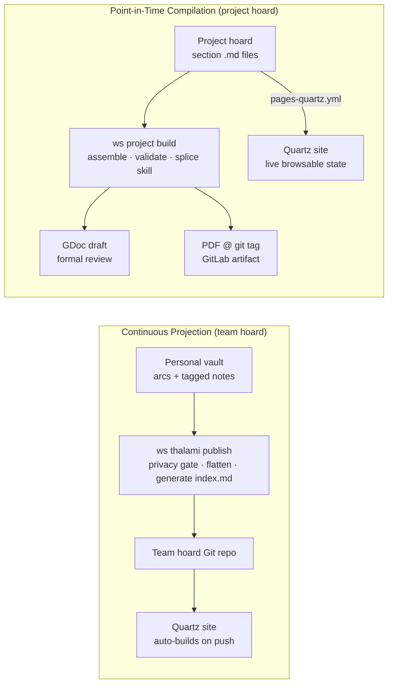

# Agentic Document Synchronization Engine (ADSE) — Design

Status: design (proposed)
Supersedes: [agent-document-sync-engine.md](agent-document-sync-engine.md), [2026-06-08-team-thalami-site-design.md](2026-06-08-team-thalami-site-design.md)
Extends: [organization-stack](../gdd/organization-stack.md), [team-thalami tier design](2026-06-01-team-thalami-tier-design.md)

---

## 1. Problem

The team has two converging documentation pain points:

**Status visibility.** A team lead cannot open a URL and see what the team has in flight. The team hoard (v1, `ws thalami publish`) exists but has no browsable surface — you need Obsidian or direct Git access.

**Design document rot.** SADDs and other formal design artifacts are written once in GDocs, disconnected from the Git-tracked source material, and immediately start drifting. A coworker's polished proposal (`GNI Service Infrastructure Strategy.md`) lives in an Obsidian vault alongside POC notes and decision records. The only way to share it today is manual copy-paste into a GDoc, losing all connection to the living source. Subsequent updates require the same manual process.

Both problems share a root: there is no automated pipeline from a local Markdown workspace to an appropriate publication target for each audience and purpose.

---

## 2. Solution overview

ADSE is a two-part system:

- **`components/adse`** — a reusable pipeline component providing processors, assembler scripts, and CI job templates. Consumed by any hoard or component that needs publication capability.
- **Hoard templates** (`templates/hoards/sadd-project/`, etc.) — document-type-specific scaffolds initialised via `ws hoard init`. They wire in ADSE CI templates and define the section manifest for that document type.

A new **`ws project`** CLI namespace provides ADSE-aware operations on any hoard whose `.project.yaml` declares a document type.

---

## 3. Extended organisation stack

The existing five-tier stack gains one tier and a new rendering layer:



**Promotion semantics:**

- Vault → Thalami → Team Thalami: non-terminal — arc stays in flight on the personal side.
- Team Thalami → Project Hoard: **MOVE** — arc closes in the team hoard; the project hoard is the new home. Triggered when work is substantial enough for its own structured workspace.
- Project Hoard → Confluence / GDoc: non-terminal push with a defined merge-back cycle.
- Project Hoard → Component /docs: **MOVE** when development starts. Git history of the project hoard stands as the design record; history continuity across the move is not required.

---

## 4. Two publish modes

ADSE supports two fundamentally different publish modes, both using the same CI template library:



| | Continuous Projection | Point-in-Time Compilation |
|---|---|---|
| **Trigger** | Every `ws thalami publish` push | Deliberate `ws project build` or git tag |
| **Source** | Live arc notes — always current | Stable section files — frozen at tag |
| **Output** | Browsable site showing current state | Versioned artifact (GDoc draft / PDF) |
| **Quartz home** | Generated `index.md` (compiled arc dashboard) | `index.md` project overview |
| **CI templates used** | `pages-quartz.yml` | `sadd-build.yml` + `pages-quartz.yml` |

The team hoard (v1 + v2) is a **lightweight ADSE consumer**: it adds only `pages-quartz.yml`. The generated `index.md` from `ws thalami publish` becomes the Quartz site's home page — the static equivalent of `TeamArcDashboard.md`. Dataview stays in the hoard for Obsidian users; the site gets the generated plain-markdown version. This closes the v2 site design without a separate implementation.

---

## 5. `components/adse` structure

ADSE is a single component holding all reusable pipeline logic. Subdirectories are by processor type, not by document type (document types live in hoard templates).

```
components/adse/
  processors/
    confluence/
      preprocess.py        # inject mark headers; stdlib only (from obsidimark)
      publish.sh           # local convenience wrapper around mark
    gdoc/
      push.py              # assembled markdown → GDoc API
      merge.py             # pull GDoc edits back (semantic diff input)
    pdf/
      export.sh            # pandoc markdown → PDF
  scripts/
    assemble.py            # generic section compiler: reads sadd_section: tags, orders sections
    status.py              # section coverage scanner: present / missing / mandatory check
    merge.py               # AI-guided pull-back: diff remote edits → patch section files + readability pass
  ci-templates/
    confluence-publish.yml # generic Confluence push job (replaces obsidimark inline job)
    pages-quartz.yml       # Quartz build + GitLab Pages publish job
    sadd-build.yml         # SADD assembly + optional PDF artifact job (on git tag)
```

`hoards/obsidimark` becomes a thin config wrapper — its inline scripts and CI job are replaced by:

```yaml
# hoards/obsidimark/.gitlab-ci.yml (after migration)
include:
  - project: gni-cfr/gdd/adse
    file: ci-templates/confluence-publish.yml
variables:
  CONFLUENCE_USER: rpraestholm@nvidia.com
  CONFLUENCE_BASE_URL: https://nvidia.atlassian.net/wiki
```

All hoard instances get fixes and improvements from the single `adse` component — no manual script copying.

---

## 6. Hoard templates

Document-type templates live outside `adse`, as standard GDD hoard templates:

```
templates/hoards/
  sadd-project/            # ws hoard init sadd-project <name>
    .project.yaml          # section manifest, mandatory list, approvers register
    .gitlab-ci.yml         # include: adse/sadd-build.yml + adse/pages-quartz.yml
    .publish.yaml          # Confluence config stub
    index.md               # Quartz site landing page stub
    philosophy.md          # stub — sadd_section: purpose-scope
    architecture.md        # stub — sadd_section: architecture (mandatory)
    design/
      alternatives.md      # stub — sadd_section: design-alternatives
    working/               # scratch, meeting notes — never compiled
  srd-project/             # future: ws hoard init srd-project <name>
  confluence-hoard/        # generalised obsidimark pattern (obsidimark is an instance)
```

---

## 7. Project hoard layout philosophy

A project hoard is structured as a **proto-`/docs`**: the same shape it will have when it moves into the component on project start. There is no `sadd/` subfolder — documents live where they would naturally live in a component's docs directory.

The compiler selects files for inclusion via `sadd_section:` frontmatter. Extended detail documents sit beside the top-level section files and are linked (not inlined) from the resulting GDoc, pointing to the specific GitLab commit at build time.

```
tensegrity-project/              # the project hoard Git repo
  index.md                       # Quartz site home — project overview
  philosophy.md                  # sadd_section: purpose-scope
  architecture.md                # sadd_section: architecture ← compiled into SADD
  design/
    alternatives.md              # sadd_section: design-alternatives ← compiled in
    k8s-topology.md              # extended detail — linked at commit, not compiled
    metal3-integration.md        # extended detail — linked at commit
  operations/
    ha.md                        # sadd_section: other.ha ← compiled in (if present)
    observability.md             # extended detail
  working/
    GNI Service Infrastructure Strategy.md   # source narrative — never compiled
    meeting-notes-2026-05-13.md              # scratch
  .project.yaml
  .gitlab-ci.yml                 # include: adse/sadd-build.yml + adse/pages-quartz.yml
  .publish.yaml                  # Confluence space config
```

When the project graduates to a component, the non-`working/` content moves into `/docs` without restructuring.

---

## 8. `.project.yaml` schema

`.project.yaml` is both the section manifest and the approvals register. `doc-control` (title, authors, approvers, revision table) is generated on the fly by the assembler — there is no `doc-control.md` file. Revision history auto-populates from `git log` filtered on a `sadd-change:` commit message convention.

```yaml
template: sadd
title: "Tensegrity: Bare-Metal K8s Deployment Platform"
authors:
  - name: Joel Cressy
    email: jcressy@nvidia.com
approvers:
  - name: Jason Black
    role: Eng Approver
  - name: Vu Pham
    role: Eng Approver
plc_template: "SWE-PLC-L1-002-BasicPLC-SADD-TMPL"

mandatory: [purpose-scope, assumptions, architecture]

sections:
  - id: purpose-scope
  - id: value-prop          # optional — omitted from build if no file tags it
  - id: assumptions
  - id: constraints         # optional
  - id: dependencies        # optional
  - id: glossary            # optional
  - id: references          # optional
  - id: architecture
  - id: design-alternatives # optional
  - id: static-design       # optional
  - id: dynamic-design      # optional
  - id: security            # optional
  - id: testing             # optional
  - id: other.ha            # optional
  - id: other.scalability   # optional
  - id: other.future-work   # optional
  - id: open-questions      # optional

build_targets:
  gdoc_id: ""               # set after first publish
  confluence_space: ""      # set if collab path used
```

A `ws project build` run with missing mandatory sections exits non-zero with a clear report — suitable as a CI gate.

---

## 9. `ws project` CLI

`ws project` is the ADSE-enhancement namespace for any hoard whose `.project.yaml` declares a document type. The hoard name resolves to the hoard instance via ecosystem config; `type` is inferred from `.project.yaml`.

```
ws hoard init sadd-project <name>     # scaffold project hoard from template

ws project <name> status              # section coverage: present / missing / mandatory
ws project <name> build [--pdf]       # assemble + validate; --pdf adds PDF artifact
ws project <name> publish gdoc        # push assembled doc to GDoc as new draft version
ws project <name> publish confluence  # push hoard content to Confluence space
ws project <name> publish pages       # force-push trigger for Quartz site rebuild (CI handles it automatically on push to main)
ws project <name> merge gdoc          # pull GDoc review edits → patch section files + readability pass
ws project <name> merge confluence    # pull Confluence edits → patch + readability pass
```

`merge` guidelines vary by source:
- **gdoc**: GDoc is a formal review artifact — changes are typically comments and minor edits. The merge applies them conservatively; major structural changes are flagged for the author to apply in source instead.
- **confluence**: Confluence is a collaborative editing window (time-boxed, ~1 week). Author freezes local at push time. At merge time the full diff is applied with AI-guided conflict resolution and an author-tone readability pass. Author reviews the result before committing.

---

## 10. SADD section-fill skill

A `sadd-section-fill` skill reads unstructured narrative source documents (from `working/`) and drafts the appropriate `sadd_section:`-tagged files for author review. This is the migration path for existing content (e.g., Joel's `working/GNI Service Infrastructure Strategy.md` → a set of stub section files). The skill reads the narrative, identifies which content belongs in which section, and produces draft files that the author edits and approves. It does not auto-commit — output is always author-reviewed.

---

## 11. Immediate relief path (Option C)

Before ADSE is built, Joel (and anyone with a similar vault) gets partial relief immediately:

1. Add `publish: true` to `GNI Service Infrastructure Strategy.md` → it appears on his existing Quartz GitLab Pages site on next push. Zero new tooling.
2. Apply the obsidimark pattern to `jcressy-notes` (copy `.publish.yaml` + add the CI job) → the same note auto-pushes to a team Confluence space on every push to `main`.

This eliminates the most acute pain (manual copy-paste) while ADSE is built. A fork of `jcressy-notes` with minimal restructuring (add `tensegrity-project/` folder, wire up Quartz) gives Joel a side-by-side review without disrupting his live vault.

---

## 12. Increment plan

Each step is independently useful. Later steps do not block earlier ones.

| Step | Deliverable | Value delivered |
|---|---|---|
| 1 | `components/adse` scaffolding; move `preprocess.py`; extract `confluence-publish.yml`; update obsidimark to `include:` | Proves component split; obsidimark still works; all future hoards get free improvements |
| 2 | `pages-quartz.yml` CI template; add to team hoard `.gitlab-ci.yml` | Team arc dashboard browsable at a URL — v2 closes |
| 3 | `sadd-project` hoard template; `.project.yaml` schema; section stub files | `ws hoard init sadd-project` produces a ready scaffold |
| 4 | `ws project status` + `ws project build` | Deterministic assembly with fail-fast mandatory check; no AI yet |
| 5 | `sadd-build.yml` CI template + PDF export | SADD PDF artifact on git tag; versioned design record |
| 6 | `ws project publish gdoc` | Assembled SADD pushed to GDoc as a draft; formal review path open |
| 7 | `sadd-section-fill` skill | Migration path for existing narrative content |
| 8 | `ws project merge gdoc` / `merge confluence` | Pull-back with AI-guided merge + readability pass; hardest step, last |

Template evolution (harvesting patterns from instances back into templates) is **aspirational** — designed for in the `.project.yaml` schema but not implemented in these increments.

---

## 13. Open questions

- **`adse` component name** — short, expands sensibly to "Agentic Document Synchronization Engine." Naming brainstorm deferred until initial scaffolding is in place.
- **Quartz vs mkdocs vs Zensical** — Quartz is the starting point (existing working example in `hoards/jcressy-notes`). `pages-quartz.yml` can be joined by `pages-mkdocs.yml` later; the hoard template chooses which to include.
- **SRD template** — same pattern as SADD; section manifest differs. Deferred to a follow-on increment after SADD is proven.
- **GDoc API vs n8n webhook** — `gdoc/push.py` implementation detail. Corporate firewall constraints may require the n8n relay from the earlier ADSE draft; this is an implementation choice at step 6, not a design constraint.
