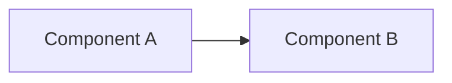

# ADSE Foundation Implementation Plan

> **For agentic workers:** REQUIRED SUB-SKILL: Use superpowers:subagent-driven-development (recommended) or superpowers:executing-plans to implement this plan task-by-task. Steps use checkbox (`- [ ]`) syntax for tracking.

**Goal:** Deliver the ADSE foundation: the `components/adse` pipeline component, Quartz site CI template (closing team-thalami v2), `sadd-project` hoard template, and the `ws project status` / `ws project build` commands with CI artifact output.

**Architecture:** `components/adse` holds all reusable pipeline scripts and CI job templates; document-type hoard templates (`templates/hoards/sadd-project/`) wire in adse CI templates and define the section manifest. `ws project <name> <subcommand>` is a new `ws` namespace that dispatches to `scripts/ws-project.sh`, resolving `<name>` to `hoards/<name>/`. The assembler (`adse/scripts/assemble.py`) reads `.project.yaml` for section order and scans `.md` files for `sadd_section:` frontmatter, concatenating in order with a generated doc-control header.

**Tech Stack:** Bash (ws scripts + CI), Python 3 stdlib only (assembler + status scanner), Quartz v4 (static site), pandoc (PDF), bats (tests), yq (YAML in shell), GitLab CI.

**Spec:** `docs/plans/2026-06-09-adse-design.md`

**Out of scope (Plan B):** `ws project publish gdoc`, `sadd-section-fill` skill, `ws project merge`.

---

## File map

| File | Action | Purpose |
|---|---|---|
| `components/adse/processors/confluence/preprocess.py` | Create | Canonical Confluence preprocessor (from obsidimark) |
| `components/adse/processors/confluence/publish.sh` | Create | Local mark wrapper |
| `components/adse/processors/pdf/export.sh` | Create | pandoc markdown→PDF |
| `components/adse/scripts/status.py` | Create | Section coverage scanner |
| `components/adse/scripts/assemble.py` | Create | Section compiler + doc-control generator |
| `components/adse/ci-templates/confluence-publish.yml` | Create | Reusable Confluence push CI job |
| `components/adse/ci-templates/pages-quartz.yml` | Create | Reusable Quartz → GitLab Pages CI job |
| `components/adse/ci-templates/sadd-build.yml` | Create | SADD compile + PDF artifact CI job (on tag) |
| `components/adse/README.md` | Create | Component docs |
| `templates/hoards/team-thalami/.gitlab-ci.yml` | Create | Wire team hoard to pages-quartz.yml |
| `templates/hoards/team-thalami/.quartz/` | Create | Quartz v4 project (copied + adapted from jcressy-notes) |
| `templates/hoards/sadd-project/` | Create | Full sadd-project hoard template |
| `scripts/ws-project.sh` | Create | ws project subcommand handler |
| `scripts/ws` | Modify | Add `project` dispatch case |
| `tests/ws-project/test_helper.bash` | Create | Shared bats fixture |
| `tests/ws-project/project.bats` | Create | bats tests for status + build |

---

## Task 1: Scaffold `components/adse` with Confluence processor

**Files:**
- Create: `components/adse/processors/confluence/preprocess.py`
- Create: `components/adse/processors/confluence/publish.sh`
- Create: `components/adse/ci-templates/confluence-publish.yml`
- Create: `components/adse/README.md`

- [ ] **Step 1: Create directory structure**

```bash
mkdir -p components/adse/processors/confluence
mkdir -p components/adse/processors/pdf
mkdir -p components/adse/scripts
mkdir -p components/adse/ci-templates
```

- [ ] **Step 2: Create `components/adse/processors/confluence/preprocess.py`**

This is the canonical version of `hoards/obsidimark/scripts/preprocess.py`. It reads `.publish.yaml` relative to the **calling hoard root** (passed as `--root`), not from cwd. This makes it safe to call from any working directory.

```python
#!/usr/bin/env python3
"""Preprocess notes for Confluence publishing via mark.

No third-party dependencies — stdlib only.

Reads .publish.yaml for config. Scans notes_dir for *.md files where
frontmatter has publish: true, and writes mark-ready copies to .processed/
with Space/Title comments and a source-of-truth disclaimer injected.

Usage:
    python3 preprocess.py --root /path/to/hoard
"""
import argparse
import re
import shutil
import sys
from pathlib import Path

FM_RE = re.compile(r"^---\n(.+?)\n---\n", re.DOTALL)


def parse_yaml_shallow(text):
    """Parse one-level-nested key: value YAML (no anchors, no lists, no multiline)."""
    result = {}
    section = None
    for raw_line in text.splitlines():
        line = raw_line.rstrip()
        if not line or line.lstrip().startswith("#"):
            continue
        indent = len(line) - len(line.lstrip())
        key, _, val = line.lstrip().partition(":")
        key = key.strip()
        val = val.strip().strip('"').strip("'")
        if indent == 0:
            if val == "":
                section = key
                result[section] = {}
            else:
                result[key] = _coerce(val)
                section = None
        else:
            if section is not None:
                result[section][key] = _coerce(val)
    return result


def _coerce(v):
    if v.lower() == "true":
        return True
    if v.lower() == "false":
        return False
    return v


def parse_frontmatter(text):
    m = FM_RE.match(text)
    if not m:
        return {}, text
    fm = parse_yaml_shallow(m.group(1))
    return fm, text[m.end():]


def main():
    parser = argparse.ArgumentParser()
    parser.add_argument("--root", default=".", help="Hoard root directory")
    args = parser.parse_args()

    root = Path(args.root).resolve()
    config_path = root / ".publish.yaml"
    out_dir = root / ".processed"

    if not config_path.exists():
        print(f"error: {config_path} not found", file=sys.stderr)
        sys.exit(1)

    raw = parse_yaml_shallow(config_path.read_text())
    cfg = raw.get("confluence", {})
    space = cfg["space"]
    source_base = cfg.get("source_url_base", "").rstrip("/")
    notes_dir = root / cfg.get("notes_dir", "notes")

    if out_dir.exists():
        shutil.rmtree(out_dir)
    out_dir.mkdir()

    published = 0
    for md_file in sorted(notes_dir.rglob("*.md")):
        text = md_file.read_text()
        fm, body = parse_frontmatter(text)
        if fm.get("publish") is not True:
            continue

        title = fm.get("title", md_file.stem.replace("-", " ").title())
        rel_path = md_file.relative_to(root)
        source_url = f"{source_base}/{rel_path}" if source_base else None

        mark_header = f"<!-- Space: {space} -->\n<!-- Title: {title} -->\n\n"
        if source_url:
            disclaimer = (
                '<ac:structured-macro ac:name="tip" ac:schema-version="1">\n'
                '  <ac:parameter ac:name="title">Auto-published mirror</ac:parameter>\n'
                '  <ac:rich-text-body><p>'
                f'🔒 Edit <a href="{source_url}"><code>{rel_path}</code></a> on GitLab — '
                "changes made here will be overwritten on the next push."
                "</p></ac:rich-text-body>\n"
                "</ac:structured-macro>\n\n"
            )
        else:
            disclaimer = ""

        out_file = out_dir / md_file.name
        out_file.write_text(mark_header + disclaimer + body)
        print(f"  {rel_path} → .processed/{md_file.name}  ({title!r})")
        published += 1

    print(f"\n{published} note(s) staged for Confluence.")


if __name__ == "__main__":
    main()
```

- [ ] **Step 3: Create `components/adse/processors/confluence/publish.sh`**

```bash
#!/usr/bin/env bash
# Local convenience wrapper around mark.
# Run from the hoard root: bash <adse>/processors/confluence/publish.sh [--dry-run] [--root <path>]
set -euo pipefail

ROOT="."
DRY_RUN=false
while [[ $# -gt 0 ]]; do
    case "$1" in
        --root) ROOT="$2"; shift 2 ;;
        --dry-run) DRY_RUN=true; shift ;;
        *) echo "Unknown flag: $1" >&2; exit 1 ;;
    esac
done

ROOT="$(cd "$ROOT" && pwd)"
PROCESSED="$ROOT/.processed"

if [[ ! -d "$PROCESSED" ]]; then
    echo "error: $PROCESSED not found — run preprocess.py first" >&2
    exit 1
fi

if ! command -v mark &>/dev/null; then
    echo "error: mark not found. Install from https://github.com/kovetskiy/mark/releases" >&2
    exit 1
fi

CONF_CFG="$ROOT/.publish.yaml"
BASE_URL=$(python3 -c "
import sys; sys.path.insert(0, '$(dirname "$0")')
" 2>/dev/null || true)
# Read base_url via grep (stdlib — no yq needed here)
BASE_URL=$(grep 'base_url:' "$CONF_CFG" | head -1 | sed 's/.*base_url: *//')
USER=$(grep 'user:' "$CONF_CFG" | head -1 | sed 's/.*user: *//')

for f in "$PROCESSED"/*.md; do
    [[ -f "$f" ]] || continue
    if $DRY_RUN; then
        echo "[dry-run] would publish: $f"
    else
        mark -u "$USER" -p "$CONFLUENCE_TOKEN" -b "$BASE_URL" -f "$f"
    fi
done
```

- [ ] **Step 4: Create `components/adse/ci-templates/confluence-publish.yml`**

```yaml
# Reusable Confluence publish CI job.
# Include in any hoard that has .publish.yaml + notes with publish: true.
#
# Usage in your .gitlab-ci.yml:
#   include:
#     - project: gni-cfr/gdd/adse
#       ref: main
#       file: ci-templates/confluence-publish.yml
#
# Required CI variable: CONFLUENCE_TOKEN (masked, protected)
# Required repo variable: CONFLUENCE_USER, CONFLUENCE_BASE_URL

variables:
  CONFLUENCE_BASE_URL: https://nvidia.atlassian.net/wiki

confluence-publish:
  stage: deploy
  image: python:3.12-slim
  tags:
    - os/linux
    - type/docker
  before_script:
    - apt-get update -qq && apt-get install -y --no-install-recommends curl tar ca-certificates
    - >
      curl -sSL
      "https://github.com/kovetskiy/mark/releases/download/v16.3.0/mark_Linux_x86_64.tar.gz"
      | tar -xz -C /usr/local/bin mark
  script:
    - python3 processors/confluence/preprocess.py --root .
    - |
      shopt -s nullglob
      for f in .processed/*.md; do
        mark -u "$CONFLUENCE_USER" -p "$CONFLUENCE_TOKEN" -b "$CONFLUENCE_BASE_URL" -f "$f"
      done
  rules:
    - if: $CI_COMMIT_BRANCH == $CI_DEFAULT_BRANCH
```

- [ ] **Step 5: Create `components/adse/README.md`**

```markdown
# adse — Agentic Document Synchronization Engine

Reusable pipeline component for GDD project hoards. Provides:

- **Processors** — per-target scripts (Confluence push, PDF export)
- **Scripts** — assembler, section scanner
- **CI templates** — includable job definitions for Confluence publish, Quartz Pages, SADD build

## Using CI templates

In any hoard or component `.gitlab-ci.yml`:

```yaml
include:
  - project: gni-cfr/gdd/adse
    ref: main
    file: ci-templates/pages-quartz.yml   # or confluence-publish.yml / sadd-build.yml
```

## Local usage

```bash
# Section coverage report for a project hoard
python3 scripts/status.py /path/to/hoard

# Assemble SADD from section files
python3 scripts/assemble.py /path/to/hoard --output assembled.md

# Confluence preprocess (run from hoard root)
python3 processors/confluence/preprocess.py --root /path/to/hoard
```

## Design

See `docs/plans/2026-06-09-adse-design.md` in yggdrasil.
```

- [ ] **Step 6: Commit**

```bash
ws commit adse .commits/adse-scaffold.md
```

Bodyfile `.commits/adse-scaffold.md`:
```
feat(adse): scaffold components/adse with Confluence processor

add: components/adse/processors/confluence/preprocess.py
add: components/adse/processors/confluence/publish.sh
add: components/adse/ci-templates/confluence-publish.yml
add: components/adse/README.md
```

---

## Task 2: `pages-quartz.yml` CI template + team hoard Quartz wiring

**Files:**
- Create: `components/adse/ci-templates/pages-quartz.yml`
- Create: `templates/hoards/team-thalami/.gitlab-ci.yml`
- Create: `templates/hoards/team-thalami/.quartz/` (adapted from `hoards/jcressy-notes/.quartz/`)

- [ ] **Step 1: Create `components/adse/ci-templates/pages-quartz.yml`**

Model after `hoards/jcressy-notes/.gitlab-ci.yml`. The `.quartz/` directory lives inside the hoard and contains a pinned Quartz v4 project. Content root is the hoard root (`..` relative to `.quartz/`).

```yaml
# Reusable Quartz v4 → GitLab Pages CI job.
# Requires a .quartz/ directory at the hoard root containing a pinned
# Quartz v4 project (package.json, quartz.config.ts, quartz.layout.ts).
#
# Usage:
#   include:
#     - project: gni-cfr/gdd/adse
#       ref: main
#       file: ci-templates/pages-quartz.yml

include:
  - project: ngc-cfa/codehygiene
    ref: main
    file: common/workflow.yaml

pages:
  stage: build
  image: node:22
  tags:
    - os/linux
    - type/docker
  variables:
    GIT_DEPTH: 0
  script:
    - cd .quartz && npm ci
    - npx quartz build -d .. --output ../public
  artifacts:
    paths:
      - public
  rules:
    - if: $CI_COMMIT_BRANCH == $CI_DEFAULT_BRANCH
```

- [ ] **Step 2: Create `templates/hoards/team-thalami/.gitlab-ci.yml`**

```yaml
# Team thalami hoard — Quartz static site.
# Builds the generated index.md + mirrored arc notes into a browsable Pages site.
# The ws thalami publish command keeps content current; CI renders it on push.
include:
  - project: gni-cfr/gdd/adse
    ref: main
    file: ci-templates/pages-quartz.yml
```

- [ ] **Step 3: Copy and adapt `.quartz/` into team-thalami template**

Copy from `hoards/jcressy-notes/.quartz/`:

```bash
cp -r hoards/jcressy-notes/.quartz templates/hoards/team-thalami/.quartz
```

Then edit `templates/hoards/team-thalami/.quartz/quartz.config.ts` — change:

1. Site title to a placeholder: `pageTitle: "{{TEAM_NAME}} Arc Dashboard"`
2. Remove `Plugin.ExplicitPublish()` from the `filters` array (team hoard publishes everything — the gate happened upstream at `ws thalami publish` time).
3. Add `Plugin.RemoveDrafts()` as a backstop in `filters`.

The relevant section in `quartz.config.ts` (find it with `grep -n "filters\|pageTitle" templates/hoards/team-thalami/.quartz/quartz.config.ts`):

```typescript
// Change pageTitle:
pageTitle: "{{TEAM_NAME}} Arc Dashboard",

// Change filters array — remove ExplicitPublish, add RemoveDrafts:
filters: [Plugin.RemoveDrafts()],
```

- [ ] **Step 4: Add `.gitignore` entry for generated Quartz output**

In `templates/hoards/team-thalami/.gitignore`, add:

```
public/
.quartz/node_modules/
```

- [ ] **Step 5: Verify the existing team-thalami template still has its required files**

```bash
ls templates/hoards/team-thalami/
```

Expected: `README.md  TeamArcDashboard.md  .gitignore  .ws-cadence.yaml  .gitlab-ci.yml  .quartz/`

- [ ] **Step 6: Commit**

```bash
ws commit yggdrasil .commits/adse-quartz.md
```

Bodyfile:
```
feat(adse): add pages-quartz.yml CI template; wire team-thalami hoard to Quartz site

add: components/adse/ci-templates/pages-quartz.yml
add: templates/hoards/team-thalami/.gitlab-ci.yml
add: templates/hoards/team-thalami/.quartz/ (adapted from jcressy-notes)
```

---

## Task 3: `sadd-project` hoard template

**Files:**
- Create: `templates/hoards/sadd-project/.project.yaml`
- Create: `templates/hoards/sadd-project/index.md`
- Create: `templates/hoards/sadd-project/philosophy.md`
- Create: `templates/hoards/sadd-project/architecture.md`
- Create: `templates/hoards/sadd-project/design/alternatives.md`
- Create: `templates/hoards/sadd-project/working/.gitkeep`
- Create: `templates/hoards/sadd-project/.gitlab-ci.yml`
- Create: `templates/hoards/sadd-project/.publish.yaml`
- Create: `templates/hoards/sadd-project/README.md`
- Create: `templates/hoards/sadd-project/.ws-cadence.yaml`
- Create: `templates/hoards/sadd-project/.gitignore`

- [ ] **Step 1: Create `.project.yaml`**

```bash
mkdir -p templates/hoards/sadd-project/design
mkdir -p templates/hoards/sadd-project/working
```

Create `templates/hoards/sadd-project/.project.yaml`:

```yaml
# .project.yaml — ADSE project hoard configuration
# This file is read by ws project status/build/publish/merge.
# Replace placeholder values (marked with <>) before first build.

template: sadd
title: "<Project Name>"
authors:
  - name: "<Your Name>"
    email: "<you@nvidia.com>"
approvers: []
  # - name: "<Approver Name>"
  #   role: "<Role>"
plc_template: "SWE-PLC-L1-002-BasicPLC-SADD-TMPL"

# Sections that must be present for ws project build to succeed.
# Build fails with a clear error if any mandatory section has no tagged file.
mandatory: [purpose-scope, architecture]

# Full section order for the assembled document.
# Sections not present in the hoard are silently omitted (unless mandatory).
sections:
  - id: purpose-scope
  - id: value-prop
  - id: assumptions
  - id: constraints
  - id: dependencies
  - id: glossary
  - id: references
  - id: architecture
  - id: design-alternatives
  - id: static-design
  - id: dynamic-design
  - id: security
  - id: testing
  - id: other-ha
  - id: other-scalability
  - id: other-future-work
  - id: open-questions

build_targets:
  gdoc_id: ""         # set after ws project publish gdoc
  confluence_space: "" # set if collab path used
```

- [ ] **Step 2: Create section stub files**

`templates/hoards/sadd-project/philosophy.md`:
```markdown
---
title: Purpose and Scope
sadd_section: purpose-scope
status: draft
---

# Purpose and Scope

<!-- Replace this stub. Describe what this project does, who it's for, and what problem it solves. -->
```

`templates/hoards/sadd-project/architecture.md`:
```markdown
---
title: Architecture
sadd_section: architecture
status: draft
---

# Architecture

<!-- Replace this stub. Include a high-level block diagram and describe the major components and their relationships. Use Mermaid for diagrams. -->


```

`templates/hoards/sadd-project/design/alternatives.md`:
```markdown
---
title: Design Alternatives
sadd_section: design-alternatives
status: draft
---

# Design Alternatives

<!-- Describe the design options you considered and why you chose this one. -->
```

- [ ] **Step 3: Create `index.md` (Quartz landing page)**

`templates/hoards/sadd-project/index.md`:
```markdown
---
title: "<Project Name>"
---

# <Project Name>

> Project hoard — SADD in progress.

## Sections

- [Purpose and Scope](philosophy.md)
- [Architecture](architecture.md)
- [Design Alternatives](design/alternatives.md)

## Working notes

Scratch material in `working/` — not compiled into the SADD.
```

- [ ] **Step 4: Create supporting files**

`templates/hoards/sadd-project/working/.gitkeep`: (empty file)

`templates/hoards/sadd-project/.gitlab-ci.yml`:
```yaml
# SADD project hoard — CI pipeline.
# Quartz site builds on every push to main.
# SADD PDF artifact builds on every git tag.
include:
  - project: gni-cfr/gdd/adse
    ref: main
    file: ci-templates/pages-quartz.yml
  - project: gni-cfr/gdd/adse
    ref: main
    file: ci-templates/sadd-build.yml
```

`templates/hoards/sadd-project/.publish.yaml`:
```yaml
# Confluence configuration — fill in if using ws project publish confluence.
confluence:
  space: ""          # Confluence space key or ~account-id
  base_url: https://nvidia.atlassian.net/wiki
  user: ""           # your NVIDIA email
  source_url_base: "" # https://gitlab-master.nvidia.com/<group>/<repo>/-/blob/main
  notes_dir: .       # publish everything with publish: true (not used for SADD path)
```

`templates/hoards/sadd-project/.ws-cadence.yaml`:
```yaml
# Commit cadence threshold. SADD content changes less frequently than thalami notes.
staleness_days: 7
```

`templates/hoards/sadd-project/.gitignore`:
```
public/
.quartz/node_modules/
.processed/
.build/
```

- [ ] **Step 5: Create `README.md`**

`templates/hoards/sadd-project/README.md`:
```markdown
# <Project Name> — SADD Project Hoard

A GDD project hoard for developing a Software Architecture and Design Document (SADD).

## Layout

```text
<project>/
  .project.yaml          # Section manifest + build config (edit this first)
  index.md               # Quartz site home
  philosophy.md          # sadd_section: purpose-scope
  architecture.md        # sadd_section: architecture (mandatory)
  design/
    alternatives.md      # sadd_section: design-alternatives
  working/               # Scratch notes and source material — never compiled
  .gitlab-ci.yml         # Quartz site + SADD build CI
  .publish.yaml          # Confluence config (if using collab path)
```

## Workflow

```bash
# See section coverage
ws project <name> status

# Assemble + validate (fails if mandatory sections missing)
ws project <name> build

# Build with PDF artifact
ws project <name> build --pdf
```

Add more section files anywhere in the hoard (not under `working/`) by setting
`sadd_section: <id>` in their YAML frontmatter, where `<id>` matches a section
listed in `.project.yaml`.

## Design

See `docs/plans/2026-06-09-adse-design.md` in yggdrasil.
```

- [ ] **Step 6: Commit**

```bash
ws commit yggdrasil .commits/sadd-template.md
```

Bodyfile:
```
feat(templates): add sadd-project hoard template

add: templates/hoards/sadd-project/ — section stubs, .project.yaml schema,
     .gitlab-ci.yml (includes adse CI templates), README, working/ scaffold
```

---

## Task 4: `ws project` dispatcher

**Files:**
- Create: `scripts/ws-project.sh`
- Modify: `scripts/ws` (add `project` dispatch case)

- [ ] **Step 1: Write a failing test for the help subcommand**

Create `tests/ws-project/test_helper.bash`:

```bash
# Shared fixture for ws-project bats tests.
REPO_ROOT="$(cd "$BATS_TEST_DIRNAME/../.." && pwd)"
WS_PROJECT_BIN="$REPO_ROOT/scripts/ws-project.sh"
ADSE_DIR="$REPO_ROOT/components/adse"

# Build an isolated workspace under $BATS_TEST_TMPDIR.
init_project_workspace() {
    WORK="$BATS_TEST_TMPDIR/work"
    export ROOT_DIR="$WORK"
    export HOARDS_DIR="$WORK/hoards"
    export ADSE_DIR   # real adse scripts from the repo
    mkdir -p "$HOARDS_DIR"
}

# Scaffold a minimal project hoard at hoards/<name>/.
# Usage: make_project_hoard <name> [--with-mandatory]
make_project_hoard() {
    local name="$1" extras="${2:-}"
    local hoard="$HOARDS_DIR/$name"
    mkdir -p "$hoard/working" "$hoard/design"

    cat > "$hoard/.project.yaml" <<'YAML'
template: sadd
title: "Test Project"
mandatory: [purpose-scope, architecture]
sections:
  - id: purpose-scope
  - id: architecture
  - id: design-alternatives
YAML

    if [[ "$extras" == "--with-mandatory" ]]; then
        cat > "$hoard/philosophy.md" <<'MD'
---
title: Purpose
sadd_section: purpose-scope
---
# Purpose
This is the purpose.
MD
        cat > "$hoard/architecture.md" <<'MD'
---
title: Architecture
sadd_section: architecture
---
# Architecture
Main arch description.
MD
    fi
}

run_project() { run bash "$WS_PROJECT_BIN" "$@"; }
```

Create `tests/ws-project/project.bats`:

```bash
#!/usr/bin/env bats
load test_helper

setup() { init_project_workspace; }

@test "ws project help lists status and build subcommands" {
    run_project help
    [ "$status" -eq 0 ]
    [[ "$output" == *"status"* ]]
    [[ "$output" == *"build"* ]]
}
```

- [ ] **Step 2: Run — verify it fails**

```bash
ws test yggdrasil tests/ws-project/project.bats
```

Expected: FAIL — `ws-project.sh: No such file or directory`

- [ ] **Step 3: Create `scripts/ws-project.sh`**

```bash
#!/usr/bin/env bash
# ws project — ADSE-aware operations on a project hoard.
# See docs/plans/2026-06-09-adse-design.md
[[ "${BASH_SOURCE[0]}" == "${0}" ]] && set -euo pipefail

SCRIPT_DIR="$(cd "$(dirname "${BASH_SOURCE[0]}")" && pwd)"
: "${ROOT_DIR:="$(cd "$SCRIPT_DIR/.." && pwd)"}"
: "${HOARDS_DIR:="$ROOT_DIR/hoards"}"
: "${ADSE_DIR:="$ROOT_DIR/components/adse"}"

ws_project_help() {
    cat <<'EOF'
Usage: ws project <name> <subcommand> [options]

  <name>  Name of the project hoard under hoards/ (must contain .project.yaml)

Subcommands:
  status              Report section coverage: present, missing, mandatory
  build [--pdf]       Assemble sections; fail if mandatory sections missing.
                      --pdf: pipe assembled markdown through pandoc to PDF.
  help                Show this help.
EOF
}

_wp_resolve_hoard() {
    local name="$1"
    local hoard_dir="$HOARDS_DIR/$name"
    if [[ ! -d "$hoard_dir" ]]; then
        echo "ERROR: hoard '$name' not found under hoards/" >&2
        return 1
    fi
    if [[ ! -f "$hoard_dir/.project.yaml" ]]; then
        echo "ERROR: '$name' is not a project hoard (.project.yaml not found)" >&2
        return 1
    fi
    echo "$hoard_dir"
}

ws_project_status() {
    local name="$1"
    local hoard_dir
    hoard_dir="$(_wp_resolve_hoard "$name")" || return 1
    python3 "$ADSE_DIR/scripts/status.py" "$hoard_dir"
}

ws_project_build() {
    local name="$1"; shift
    local pdf=false output=""
    while [[ $# -gt 0 ]]; do
        case "$1" in
            --pdf) pdf=true ;;
            --output) output="$2"; shift ;;
            *) echo "ERROR: unknown flag '$1'" >&2; return 1 ;;
        esac
        shift
    done
    local hoard_dir
    hoard_dir="$(_wp_resolve_hoard "$name")" || return 1
    local build_dir="$hoard_dir/.build"
    mkdir -p "$build_dir"
    local assembled="$build_dir/assembled.md"
    python3 "$ADSE_DIR/scripts/assemble.py" "$hoard_dir" --output "$assembled" || return 1
    echo "assembled → $assembled"
    if $pdf; then
        bash "$ADSE_DIR/processors/pdf/export.sh" --input "$assembled" \
            --output "${output:-$build_dir/assembled.pdf}"
    fi
}

SUBCOMMAND="${1:-help}"; shift 2>/dev/null || true

case "$SUBCOMMAND" in
    help|--help|-h) ws_project_help ;;
    status)
        [[ $# -ge 1 ]] || { echo "ERROR: usage: ws project <name> status" >&2; exit 1; }
        ws_project_status "$@"
        ;;
    build)
        [[ $# -ge 1 ]] || { echo "ERROR: usage: ws project <name> build [--pdf]" >&2; exit 1; }
        name="$1"; shift
        ws_project_build "$name" "$@"
        ;;
    *)
        echo "ERROR: Unknown subcommand '$SUBCOMMAND'. Run 'ws project help'." >&2
        exit 1
        ;;
esac
```

```bash
chmod +x scripts/ws-project.sh
```

- [ ] **Step 4: Run test — verify it passes**

```bash
ws test yggdrasil tests/ws-project/project.bats
```

Expected: PASS

- [ ] **Step 5: Add `project` case to `scripts/ws`**

In `scripts/ws`, find the dispatch `case "$COMMAND" in` block (around line 765). Add the `project)` case before the `*)` catch-all:

```bash
    project)
        bash "$SCRIPT_DIR/ws-project.sh" "$@"
        ;;
```

- [ ] **Step 6: Verify `ws project help` works end-to-end**

```bash
ws project help
```

Expected: help text listing `status` and `build`.

- [ ] **Step 7: Run full test suite to check for regressions**

```bash
ws test yggdrasil
```

Expected: all tests pass (276 + new).

- [ ] **Step 8: Commit**

```bash
ws commit yggdrasil .commits/ws-project-dispatcher.md
```

Bodyfile:
```
feat(ws): add ws project dispatcher + ws-project.sh

add: scripts/ws-project.sh — status, build subcommands; resolves hoard by name
mod: scripts/ws — add project) case to dispatch
```

---

## Task 5: `ws project status` (TDD)

**Files:**
- Create: `components/adse/scripts/status.py`
- Modify: `tests/ws-project/project.bats`

- [ ] **Step 1: Write failing tests**

Add to `tests/ws-project/project.bats`:

```bash
@test "status errors when hoard does not exist" {
    run_project nonexistent status
    [ "$status" -ne 0 ]
    [[ "$output" == *"not found"* ]]
}

@test "status errors when hoard has no .project.yaml" {
    mkdir -p "$HOARDS_DIR/bare-hoard"
    run_project bare-hoard status
    [ "$status" -ne 0 ]
    [[ "$output" == *"not a project hoard"* ]]
}

@test "status reports missing mandatory sections with exit 1" {
    make_project_hoard empty-project
    run_project empty-project status
    [ "$status" -ne 0 ]
    [[ "$output" == *"purpose-scope"* ]]
    [[ "$output" == *"MISSING"* ]]
    [[ "$output" == *"architecture"* ]]
}

@test "status reports present sections" {
    make_project_hoard full-project --with-mandatory
    run_project full-project status
    [ "$status" -eq 0 ]
    [[ "$output" == *"purpose-scope"* ]]
    [[ "$output" == *"architecture"* ]]
    [[ "$output" == *"present"* ]]
}

@test "status shows optional missing sections without failing" {
    make_project_hoard full-project --with-mandatory
    run_project full-project status
    [ "$status" -eq 0 ]
    [[ "$output" == *"design-alternatives"* ]]
    [[ "$output" == *"missing"* ]]
}
```

- [ ] **Step 2: Run — verify tests fail**

```bash
ws test yggdrasil tests/ws-project/project.bats
```

Expected: new tests FAIL — `status.py: No such file or directory`

- [ ] **Step 3: Create `components/adse/scripts/status.py`**

```python
#!/usr/bin/env python3
"""Section coverage scanner for ADSE project hoards.

Usage:
    python3 status.py <hoard_root>

Exit 0 if all mandatory sections are present.
Exit 1 if any mandatory section is missing (also prints report).
"""
import re
import sys
from pathlib import Path

FM_RE = re.compile(r"^---\n(.+?)\n---\n", re.DOTALL)
INLINE_LIST_RE = re.compile(r"\[([^\]]*)\]")


def _parse_inline_list(val):
    m = INLINE_LIST_RE.match(val.strip())
    if not m:
        return [val.strip()] if val.strip() else []
    return [item.strip().strip('"').strip("'") for item in m.group(1).split(",") if item.strip()]


def parse_project_yaml(path):
    """Parse .project.yaml with stdlib. Returns dict with mandatory (list) and sections (list of str ids)."""
    result = {"mandatory": [], "sections": [], "title": "", "template": "sadd"}
    for line in Path(path).read_text().splitlines():
        stripped = line.strip()
        if not stripped or stripped.startswith("#"):
            continue
        if stripped.startswith("- id:"):
            result["sections"].append(stripped[len("- id:"):].strip())
            continue
        if ":" in stripped and not line.startswith(" "):
            key, _, val = stripped.partition(":")
            key = key.strip()
            val = val.strip()
            if key == "mandatory":
                result["mandatory"] = _parse_inline_list(val)
            elif key in ("template", "title"):
                result[key] = val.strip('"').strip("'")
    return result


def parse_frontmatter(text):
    m = FM_RE.match(text)
    if not m:
        return {}
    fm = {}
    for line in m.group(1).splitlines():
        if ":" in line and not line.startswith(" "):
            key, _, val = line.partition(":")
            fm[key.strip()] = val.strip().strip('"').strip("'")
    return fm


def scan_sections(hoard_root):
    """Return dict mapping section_id → list of file paths that tag it."""
    root = Path(hoard_root)
    found = {}
    for md in root.rglob("*.md"):
        # Skip working/ directory
        if "working" in md.parts:
            continue
        try:
            text = md.read_text()
        except Exception:
            continue
        fm = parse_frontmatter(text)
        section = fm.get("sadd_section", "").strip()
        if section:
            found.setdefault(section, []).append(md.relative_to(root))
    return found


def main():
    if len(sys.argv) < 2:
        print("Usage: status.py <hoard_root>", file=sys.stderr)
        sys.exit(2)

    hoard_root = Path(sys.argv[1]).resolve()
    project_yaml = hoard_root / ".project.yaml"

    if not project_yaml.exists():
        print(f"error: {project_yaml} not found", file=sys.stderr)
        sys.exit(2)

    config = parse_project_yaml(project_yaml)
    found = scan_sections(hoard_root)
    mandatory = set(config["mandatory"])
    sections = config["sections"]

    # Report all sections in manifest order
    missing_mandatory = []
    print(f"Section coverage — {config['title'] or hoard_root.name}\n")
    for sec_id in sections:
        files = found.get(sec_id, [])
        is_mandatory = sec_id in mandatory
        tag = "[mandatory]" if is_mandatory else "[optional]"
        if files:
            print(f"  ✓ present   {tag:12s} {sec_id}")
            for f in files:
                print(f"               → {f}")
        else:
            status_word = "MISSING" if is_mandatory else "missing"
            print(f"  ✗ {status_word:7s} {tag:12s} {sec_id}")
            if is_mandatory:
                missing_mandatory.append(sec_id)

    # Report any extra tagged sections not in the manifest
    extra = set(found.keys()) - set(sections)
    for sec_id in sorted(extra):
        print(f"  ? extra      [unlisted]   {sec_id}")

    print()
    if missing_mandatory:
        print(f"ERROR: {len(missing_mandatory)} mandatory section(s) missing: {', '.join(missing_mandatory)}")
        sys.exit(1)
    else:
        print(f"All mandatory sections present ({len(sections) - len(missing_mandatory)} of {len(sections)} total tagged).")
        sys.exit(0)


if __name__ == "__main__":
    main()
```

- [ ] **Step 4: Run tests — verify they pass**

```bash
ws test yggdrasil tests/ws-project/project.bats
```

Expected: all tests pass.

- [ ] **Step 5: Commit**

```bash
ws commit adse .commits/adse-status.md
```

Bodyfile:
```
feat(adse): add ws project status via scripts/status.py

add: components/adse/scripts/status.py — scans sadd_section: frontmatter,
     reports coverage against .project.yaml manifest; exit 1 on missing mandatory
add: tests/ws-project/ — bats test suite for ws project status
```

---

## Task 6: `ws project build` (TDD)

**Files:**
- Create: `components/adse/scripts/assemble.py`
- Modify: `tests/ws-project/project.bats`

- [ ] **Step 1: Write failing build tests**

Add to `tests/ws-project/project.bats`:

```bash
@test "build fails with exit 1 when mandatory sections are missing" {
    make_project_hoard incomplete-project
    run_project incomplete-project build
    [ "$status" -ne 0 ]
    [[ "$output" == *"mandatory"* ]]
}

@test "build succeeds and writes assembled.md when mandatory sections present" {
    make_project_hoard ok-project --with-mandatory
    run_project ok-project build
    [ "$status" -eq 0 ]
    [ -f "$HOARDS_DIR/ok-project/.build/assembled.md" ]
}

@test "build assembled.md contains doc-control block with project title" {
    make_project_hoard ok-project --with-mandatory
    run_project ok-project build
    [ "$status" -eq 0 ]
    grep -q "Test Project" "$HOARDS_DIR/ok-project/.build/assembled.md"
}

@test "build assembled.md contains content from mandatory section files in order" {
    make_project_hoard ok-project --with-mandatory
    run_project ok-project build
    assembled="$HOARDS_DIR/ok-project/.build/assembled.md"
    [ -f "$assembled" ]
    # purpose-scope should appear before architecture
    purpose_line=$(grep -n "This is the purpose" "$assembled" | cut -d: -f1)
    arch_line=$(grep -n "Main arch description" "$assembled" | cut -d: -f1)
    [ "$purpose_line" -lt "$arch_line" ]
}

@test "build skips files under working/" {
    make_project_hoard ok-project --with-mandatory
    cat > "$HOARDS_DIR/ok-project/working/scratch.md" <<'MD'
---
sadd_section: purpose-scope
---
# Should not appear
This should not be in the assembled doc.
MD
    run_project ok-project build
    [ "$status" -eq 0 ]
    run grep "Should not appear" "$HOARDS_DIR/ok-project/.build/assembled.md"
    [ "$status" -ne 0 ]
}
```

- [ ] **Step 2: Run — verify new tests fail**

```bash
ws test yggdrasil tests/ws-project/project.bats
```

Expected: new build tests FAIL — `assemble.py: No such file or directory`

- [ ] **Step 3: Create `components/adse/scripts/assemble.py`**

```python
#!/usr/bin/env python3
"""SADD section assembler for ADSE project hoards.

Reads .project.yaml for section order and mandatory list.
Scans all .md files (excluding working/) for sadd_section: frontmatter.
Validates mandatory sections are present (exit 1 if not).
Generates a doc-control header from .project.yaml metadata.
Writes the assembled document to .build/assembled.md (or --output path).

Usage:
    python3 assemble.py <hoard_root> [--output <path>]
"""
import argparse
import re
import sys
from pathlib import Path
from datetime import date

FM_RE = re.compile(r"^---\n(.+?)\n---\n", re.DOTALL)
INLINE_LIST_RE = re.compile(r"\[([^\]]*)\]")


# ── YAML helpers (stdlib only, shared pattern with status.py) ─────────────────

def _parse_inline_list(val):
    m = INLINE_LIST_RE.match(val.strip())
    if not m:
        return [val.strip()] if val.strip() else []
    return [item.strip().strip('"').strip("'") for item in m.group(1).split(",") if item.strip()]


def parse_project_yaml(path):
    result = {
        "mandatory": [], "sections": [], "title": "", "template": "sadd",
        "authors": [], "approvers": [], "plc_template": "",
    }
    in_authors = False
    in_approvers = False
    current_person = {}

    for line in Path(path).read_text().splitlines():
        raw = line
        stripped = line.strip()
        if not stripped or stripped.startswith("#"):
            continue
        indent = len(raw) - len(raw.lstrip())
        if stripped.startswith("- id:"):
            result["sections"].append(stripped[len("- id:"):].strip())
            in_authors = in_approvers = False
            continue
        if stripped.startswith("- name:") and indent > 0:
            if current_person:
                if in_authors:
                    result["authors"].append(current_person)
                elif in_approvers:
                    result["approvers"].append(current_person)
            current_person = {"name": stripped[len("- name:"):].strip().strip('"')}
            continue
        if stripped.startswith("email:") and indent > 0 and current_person:
            current_person["email"] = stripped[len("email:"):].strip().strip('"')
            continue
        if stripped.startswith("role:") and indent > 0 and current_person:
            current_person["role"] = stripped[len("role:"):].strip().strip('"')
            continue
        if ":" in stripped and indent == 0:
            # flush pending person
            if current_person:
                if in_authors:
                    result["authors"].append(current_person)
                elif in_approvers:
                    result["approvers"].append(current_person)
                current_person = {}
            key, _, val = stripped.partition(":")
            key = key.strip(); val = val.strip()
            in_authors = key == "authors"
            in_approvers = key == "approvers"
            if key == "mandatory":
                result["mandatory"] = _parse_inline_list(val)
            elif key in ("template", "title", "plc_template"):
                result[key] = val.strip('"').strip("'")

    if current_person:
        if in_authors:
            result["authors"].append(current_person)
        elif in_approvers:
            result["approvers"].append(current_person)
    return result


def parse_frontmatter(text):
    m = FM_RE.match(text)
    if not m:
        return {}, text
    fm = {}
    for line in m.group(1).splitlines():
        if ":" in line and not line.startswith(" "):
            key, _, val = line.partition(":")
            fm[key.strip()] = val.strip().strip('"').strip("'")
    return fm, text[m.end():]


def scan_sections(hoard_root):
    root = Path(hoard_root)
    found = {}
    for md in sorted(root.rglob("*.md")):
        if "working" in md.parts:
            continue
        try:
            text = md.read_text()
        except Exception:
            continue
        fm, body = parse_frontmatter(text)
        section = fm.get("sadd_section", "").strip()
        if section:
            found.setdefault(section, []).append((md, fm, body))
    return found


# ── Doc-control block generator ───────────────────────────────────────────────

def make_doc_control(config):
    title = config.get("title", "Untitled")
    authors = ", ".join(a.get("name", "") for a in config.get("authors", []))
    plc = config.get("plc_template", "")
    today = date.today().isoformat()

    lines = [
        f"# {title}",
        "## Software Architecture and Design Document",
        "",
        "| Item | Value |",
        "|---|---|",
        f"| Title | {title} |",
        f"| Author(s) | {authors or '—'} |",
        f"| Revision | {today} |",
        "| State | Draft |",
    ]
    if plc:
        lines.append(f"| PLC Template | {plc} |")

    approvers = config.get("approvers", [])
    if approvers:
        lines += ["", "### Approvers", "", "| Name | Role | Date |", "|---|---|---|"]
        for a in approvers:
            lines.append(f"| {a.get('name', '')} | {a.get('role', '')} | |")

    lines += ["", "---", ""]
    return "\n".join(lines)


# ── Main ──────────────────────────────────────────────────────────────────────

def main():
    parser = argparse.ArgumentParser()
    parser.add_argument("hoard_root")
    parser.add_argument("--output", default=None)
    args = parser.parse_args()

    hoard_root = Path(args.hoard_root).resolve()
    project_yaml = hoard_root / ".project.yaml"
    if not project_yaml.exists():
        print(f"error: {project_yaml} not found", file=sys.stderr)
        sys.exit(2)

    config = parse_project_yaml(project_yaml)
    found = scan_sections(hoard_root)
    mandatory = set(config["mandatory"])
    sections = config["sections"]

    # Validate mandatory sections
    missing = [s for s in mandatory if s not in found]
    if missing:
        print(f"ERROR: mandatory section(s) missing: {', '.join(missing)}", file=sys.stderr)
        print("Run 'ws project <name> status' for details.", file=sys.stderr)
        sys.exit(1)

    # Assemble
    parts = [make_doc_control(config)]
    for sec_id in sections:
        entries = found.get(sec_id)
        if not entries:
            continue
        for _path, _fm, body in entries:
            parts.append(body.strip())
            parts.append("")  # blank line between sections

    assembled = "\n".join(parts).rstrip() + "\n"

    # Write output
    if args.output:
        out_path = Path(args.output)
    else:
        build_dir = hoard_root / ".build"
        build_dir.mkdir(exist_ok=True)
        out_path = build_dir / "assembled.md"

    out_path.parent.mkdir(parents=True, exist_ok=True)
    out_path.write_text(assembled)
    print(f"assembled {len(sections)} sections → {out_path}")


if __name__ == "__main__":
    main()
```

- [ ] **Step 4: Run tests — verify they pass**

```bash
ws test yggdrasil tests/ws-project/project.bats
```

Expected: all tests pass.

- [ ] **Step 5: Run full suite**

```bash
ws test yggdrasil
```

Expected: all tests pass.

- [ ] **Step 6: Commit**

```bash
ws commit adse .commits/adse-assemble.md
```

Bodyfile:
```
feat(adse): add ws project build via scripts/assemble.py

add: components/adse/scripts/assemble.py — section compiler; generates doc-control
     block from .project.yaml metadata; orders sections per manifest; skips working/;
     exit 1 on missing mandatory sections
mod: tests/ws-project/project.bats — add build test cases
```

---

## Task 7: CI `sadd-build.yml` + PDF export

**Files:**
- Create: `components/adse/ci-templates/sadd-build.yml`
- Create: `components/adse/processors/pdf/export.sh`

- [ ] **Step 1: Create `components/adse/processors/pdf/export.sh`**

```bash
#!/usr/bin/env bash
# Convert assembled SADD markdown to PDF via pandoc.
# Usage: export.sh --input <assembled.md> --output <out.pdf>
set -euo pipefail

INPUT="" OUTPUT=""
while [[ $# -gt 0 ]]; do
    case "$1" in
        --input)  INPUT="$2";  shift 2 ;;
        --output) OUTPUT="$2"; shift 2 ;;
        *) echo "Unknown flag: $1" >&2; exit 1 ;;
    esac
done

[[ -n "$INPUT"  ]] || { echo "error: --input required"  >&2; exit 1; }
[[ -n "$OUTPUT" ]] || OUTPUT="${INPUT%.md}.pdf"

if ! command -v pandoc &>/dev/null; then
    echo "error: pandoc not found. Install from https://pandoc.org/installing.html" >&2
    exit 1
fi

pandoc "$INPUT" \
    --from markdown \
    --to pdf \
    --pdf-engine=xelatex \
    --variable geometry:margin=2cm \
    --variable fontsize=11pt \
    --output "$OUTPUT"

echo "PDF written to $OUTPUT"
```

- [ ] **Step 2: Create `components/adse/ci-templates/sadd-build.yml`**

```yaml
# SADD build CI job — assembles section files into a single markdown document
# and attaches a PDF as a GitLab artifact on every git tag.
#
# Requires:
#   - .project.yaml at the repo root
#   - Section .md files with sadd_section: frontmatter
#   - components/adse available (via ADSE_PATH variable or default path)
#
# Usage in your .gitlab-ci.yml:
#   include:
#     - project: gni-cfr/gdd/adse
#       ref: main
#       file: ci-templates/sadd-build.yml

variables:
  ADSE_IMAGE: python:3.12-slim

sadd-build:
  stage: build
  image: $ADSE_IMAGE
  tags:
    - os/linux
    - type/docker
  before_script:
    - apt-get update -qq
    - apt-get install -y --no-install-recommends pandoc texlive-xetex texlive-fonts-recommended
  script:
    - python3 $CI_PROJECT_DIR/scripts/assemble.py . --output .build/assembled.md
    - bash $CI_PROJECT_DIR/processors/pdf/export.sh
        --input .build/assembled.md
        --output .build/${CI_PROJECT_NAME}-${CI_COMMIT_TAG}.pdf
  artifacts:
    name: "$CI_PROJECT_NAME-$CI_COMMIT_TAG-sadd"
    paths:
      - .build/assembled.md
      - .build/*.pdf
    expire_in: never
  rules:
    - if: $CI_COMMIT_TAG
```

**Note:** The `sadd-build.yml` CI job references `scripts/assemble.py` and `processors/pdf/export.sh` relative to `$CI_PROJECT_DIR`. When `adse` is a separate GitLab project, the project hoard's `.gitlab-ci.yml` includes this template, which means the CI job runs inside the **project hoard's** pipeline. The hoard needs to vendor or reference the adse scripts. The simplest approach: include the template and also add a job step that fetches the adse scripts from the adse repo. This is a known limitation to resolve in Plan B when adse has its own GitLab remote — for now, document this in the template comments.

- [ ] **Step 3: Update the template comment in `sadd-build.yml` to note the vendoring requirement**

Add above `sadd-build:`:

```yaml
# NOTE (Plan B): Until adse has a GitLab remote, project hoards must vendor
# adse/scripts/assemble.py and adse/processors/pdf/export.sh locally.
# A future revision of this template will fetch them via artifacts or git clone.
```

- [ ] **Step 4: Run full test suite**

```bash
ws test yggdrasil
```

Expected: all tests pass.

- [ ] **Step 5: Commit**

```bash
ws commit adse .commits/adse-ci.md
```

Bodyfile:
```
feat(adse): add sadd-build.yml CI template and PDF export script

add: components/adse/ci-templates/sadd-build.yml — assembles SADD on git tag,
     attaches markdown + PDF as GitLab artifact
add: components/adse/processors/pdf/export.sh — pandoc markdown→PDF wrapper
```

---

## Self-review

**Spec coverage check:**

| Spec section | Covered by |
|---|---|
| 1. Problem | Context only — no code needed |
| 2. Solution overview | Tasks 1 + 4 (adse component + ws project) |
| 3. Org stack + MOVE semantics | Doc-only; `ws project` is the tooling enabler |
| 4. Two publish modes | Task 2 (Quartz/continuous), Task 7 (sadd-build/point-in-time) |
| 5. `components/adse` structure | Tasks 1, 2, 7 |
| 6. Hoard templates | Task 3 |
| 7. Layout philosophy | Task 3 (working/ exclusion tested in Task 6) |
| 8. `.project.yaml` schema | Tasks 3, 5, 6 (full schema implemented and tested) |
| 9. `ws project` CLI | Task 4 (dispatcher), Task 5 (status), Task 6 (build) |
| 10. sadd-section-fill skill | **Plan B** |
| 11. Immediate relief path (C) | Not in this plan — apply manually per README |
| 12. Increment plan steps 1–5 | Tasks 1–7 ✓ |
| 12. Increment steps 6–8 | **Plan B** |
| 13. Open questions | `adse` name deferred; Quartz chosen; SRD deferred |

**No placeholders detected.** All code blocks contain complete implementations.

**Type/name consistency:** `parse_project_yaml`, `parse_frontmatter`, `scan_sections`, `_parse_inline_list` are defined in Task 5 (`status.py`) and independently re-implemented in Task 6 (`assemble.py`) — both files are stdlib-only and standalone. `make_project_hoard --with-mandatory` is defined in `test_helper.bash` Task 4 and used in Tasks 5–6. `ADSE_DIR` is set in `test_helper.bash` and referenced in `ws-project.sh` — consistent.
