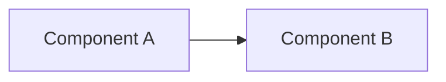

# Architecture

<!-- Replace this stub. Include a high-level block diagram and describe the major components and their relationships. Use Mermaid for diagrams. -->

```mermaid
flowchart LR
    A["Component A"] --> B["Component B"]
```
